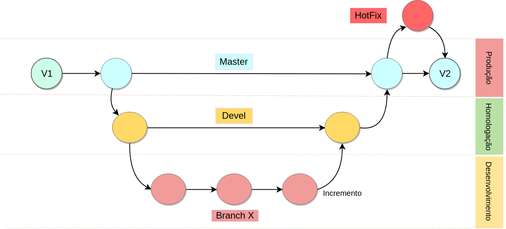

***

## Como contribuir?
Agradecemos pelo interesse em contribuir com o projeto! Para isso, basta seguir os passos abaixo:
* Fazer o _fork_ do repositório, caso seja um colaborador externo.
* Criar _issues_, em conformidade com o nosso [template](https://github.com/fga-eps-mds/Kalkuli/blob/master/.github/ISSUE_TEMPLATE/issue-template.md).
* Criar uma ou mais _branches_ para trabalhar nas _issues_ levantadas, de acordo com nossa [política de branches](#política-de-branches).
* Seguir nossa [política de commits](#política-de-commits) durante o desenvolvimento.
* Ao final, submeter um _pull request_, também de acordo com [nosso template](https://github.com/fga-eps-mds/Kalkuli/blob/master/PULL_REQUEST_TEMPLATE.md).
Simples assim!

## Política de _branches_
Segue-se o fluxo de trabalho descrito pelo [Gitflow](https://www.atlassian.com/git/tutorials/comparing-workflows/gitflow-workflow), representado pelo diagrama abaixo:





Dessa forma, existem as seguintes categorias de _branches_:

### *_master_*
_Branch_ de produção, com a versão estável mais atual do projeto. Bloqueada para commits e pushs, pode ser interagida apenas através de _pull requests_ provenientes da [_devel_](#devel), [_hotfix branches_](#hotfix-branches) ou [_release branches_](#release-branches).

### *_devel_*
_Branch de desenvolvimento_, agrupa o trabalho de outras _branches_ com o objetivo de se criar uma versão de _release_ para ser submetida à master. Também é bloqueada para commits e pushs, devendo ser modficada através de _pull requests_ provenientes das [_feature branches_](#feature-branches).

### *_Feature Branches_*
_Branches_ criadas a partir da _devel_, para o desenvolvimento de uma funcionalidade específica. Idealmente, uma _feature branch_ deve ser referente à uma issue cadastrada no repositório, para melhor acompanhamento e rastreamento do projeto. Ao final do desenvolvimento, deve-se submeter um _pull request_ visando a _devel_. Se as modificações forem aceitas com sucesso, a _branch_ deve ser apagada.
  #### *Nomenclatura*
  _Feature Branches_ devem seguir o padrão `x_nome_da_issue`, com x sendo o número da _issue_ correspondente no repositório.
  
### *_Hotfix Branches_*
_Branches_ criadas a partir da _master_, para a correção rápida de bugs em produção. Ao final, as atualizações submetidas devem ser integradas tanto à _master_ quanto à _devel_.
  #### *Nomenclatura*
  _Hotfix Branches_ devem seguir o padrão `hotfix_x_nome_da_issue`, com x sendo o número da _issue_ que identifica o bug a ser corrigido.
  
### *_Release Branches_* 
_Branches_ criadas a partir da _devel_, servem para a preparação de uma _release_ do projeto. Deve conter tarefas apenas relacionadas a essa _release_, como correção de bugs ou refino de alguma funcionalidade já implementada. Funcionalidades novas **não** devem ser desenvolvidas nessa _branch_. Com a _release_ preparada, deve-se integrar a branch à master.
  #### *Nomenclatura*
  _Release Branches_ devem seguir o padrão `release/numero_de_versao`, identificando a versão do produto que será entregue naquela _release_.
  
### Mantendo _branches_ atualizadas
Para um fluxo de trabalho sem grandes inconvenientes, recomenda-se manter as _branches_ pessoais de desenvolvimento (features, hotfixes) sempre atualizadas. Antes de se submeter um _pull request_, deve se garantir que a _branch_ possui todas as alterações mais recentes de sua _branch_ de origem. Para isso, deve se utilizar os seguintes comandos:
```
git checkout branch_de_trabalho

git pull --rebase branch_de_origem # devel para features, master para hotfixes

git push origin branch_de_trabalho
```


## Política de commits
Os commits devem possuir mensagens sucintas e descritivas, explicando as modificações realizadas. Devem ser escritos em inglês, no imperativo. Por exemplo:

``` 
  git commit -m "Add API routing for User service."
```

Ao invés de:
``` 
  git commit -m "Adding API routing for User service."
```
### Commits em pares
Ao se desenvolver funcionalidades utilizando a técnica de _pair programming_, deve se atribuir autoria a ambos os colaboradores. Para isso, deve se utilizar a tag _co-authored-by_ do Github, através dos seguintes passos:
* Após adicionar todos os arquivos modificados, executar o commit sem flags adicionais:
```
git commit
```
* Isso abrirá o editor de texto padrão configurado para o Git. Digite a mensagem de commit, e após **duas** linhas em branco, adicione a co-autoria. Exemplo:
```
Add repo policies


Co-authored-by: Felipe Hargreaves <fhargreaves00@gmail.com>
Co-authored-by: Mariana Picolo <mariananpicolo@gmail.com>
```

Dessa forma o commit será contabilizado pelo Github como sendo realizado pelos dois contribuidores, gerando um registro mais detalhado de participação.
