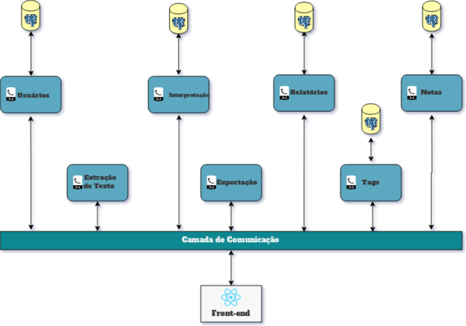
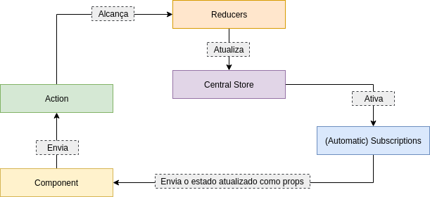
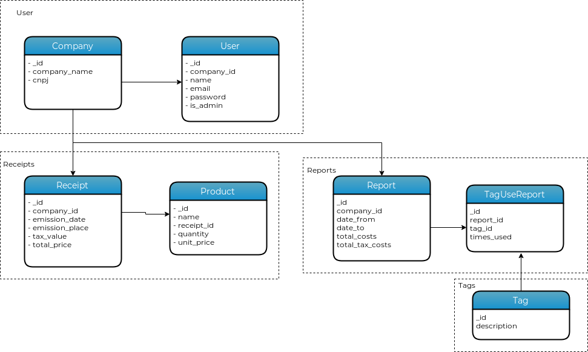

***

# Histórico de Revisão

|Data| Versão |Modificação|Autor|
|:---:|:---:|:---:|:--:|
| 04/09/2018 |   0.1  | Tópicos: 1.1, 1.2, 1.3, 1.4, 1.5| Lucas Dutra, Saleh Nazih |
| 06/09/2018 |   0.2  | Tópicos: 3, 4.1| Saleh Nazih |
| 07/09/2018 |   0.3  | Tópicos: 2| Lucas Dutra | 
| 07/09/2018 |   0.3.1  | Tópico: 1.4| Lucas Dutra, Saleh Nazih |
| 08/09/2018 |   0.4  | Tópicos: 4.2, 2.1, 2.2| Lucas Dutra, Saleh Nazih |

# 1. Introdução

## 1.1 Finalidade

&emsp;&emsp;Este documento contém uma apresentação geral a respeito da arquitetura utilizada no projeto Kalkuli e explicita como acontecerá a comunicação dos diversos serviços contidos no software como um todo. Sua intenção é capturar e transmitir as decisões significativas do ponto de vista da arquitetura que foram tomadas em relação ao sistema.

## 1.2 Escopo

&emsp;&emsp;O Kalkuli será uma aplicação responsável por escanear notas fiscais, com o intuito de extrair, tratar e exibir dados de uma maneira simples e intuitiva para o usuário. O documento terá por objetivo apresentar toda parte arquitetural do projeto, a fim de esclarecer características básicas do sistema.

## 1.3 Definições, Acrônimos e Abreviações

* NF - Notas fiscais 
* WSGI - Web Server Gateway Interface

## 1.4 Referências

>Universidade Federal do Paraná, FUNPAR. RUP - Especificação de Casos de Uso: Template base para construção do documento de arquitetura. Disponível em: <a href="https://goo.gl/gDTkMx"><https://goo.gl/gDTkMx></a>. Acesso em: 2 de setembro de 2018.

>Microsserviços em poucas palavras. ThoughtWorks. Disponível em: <a href="https://goo.gl/AQNy6p"><https://goo.gl/AQNy6p></a>. Acesso em: 7 de setembro de 2018.

>Rocha, B. C. What the Flask? Pt-1 Introdução ao desenvolvimento web com Python. PythonClub. Disponível em: <a href="https://goo.gl/SfqDYX"><https://goo.gl/SfqDYX></a>. Acesso em: 7 de setembro de 2018.

>Tutorial: Intro to React. What is React?. ReactJs. Disponível em: <a href="https://goo.gl/9CCQXK"><https://goo.gl/9CCQXK></a>. Acesso em: 7 de setembro de 2018.

>Read Me. Redux. Disponível em: <a hre="https://goo.gl/SgQiKb"><https://goo.gl/SgQiKb></a>. Acesso em: 7 de setembro de 2018 

# 2. Representação da Arquitetura

## 2.1 Representação arquitetural

## 2.2 Diagrama React-Redux

* React.js
&emsp;&emsp;React é uma biblioteca de JavaScript flexível, declarativa e eficiente para construção de interfaces para exibição ao usuário. O React permite a criação desde interfaces complexas até pequenos e isolados pedaços de código chamados “Componentes”. 

* Redux
&emsp;&emsp;Redux é um contêiner de estado preditivo para aplicações JavaScript. Ele ajuda a escrever aplicações que se comportam de forma constante,ou seja, que possui um processo claro e definido, de como sua aplicação pode mudar, em diferentes ecossistemas, e são facilmente testáveis.

* Flask
&emsp;&emsp;Flask é um micro-framework de python, possui toda a flexibilidade da linguagem python e provê um modelo simples para desenvolvimento web. É baseado em 3 pilares: Werkzeug, uma biblioteca para desenvolvimento de apps WSGI, Jinja2, um template engine escrito em Python e good intentions, que são alta qualidade na legibilidade, liberdade de estruturar o app na maneira que desejar, entre outros aspectos.

* Microsserviços
&emsp;&emsp;A arquitetura de microsserviços é uma abordagem que desmembra um aplicativo único em blocos de pequenos serviços independentes, cada um executando seu próprio processo e se comunicando, muitas vezes, em uma api através de métodos HTTP.
&emsp;&emsp;No software descrito neste documento a arquitetura de microsserviços será bastante utilizada. Os módulos serão:
    * Extração de texto, bloco responsável somente pela extração do texto proveniente das notas fiscais escaneadas; 
    * Interpretação, responsável pelo tratamento dos dados brutos que foram extraídos das notas; 
    * Tags, responsável por toda organização de etiquetas que o usuário vai atribuir a cada nota escaneada; 
    * Exportação, responsável por exportar os relatórios e as notas escaneadas pelo usuário para a extensão desejada;
    * Relatórios, responsável por usar os dados provenientes das notas para gerar relatórios de gastos, entre outros; 
    * Usuário, bloco responsável por toda interação do usuário, como login, registro; 
    * Notas,  será um serviço responsável por gerenciar todas as notas fiscais extraídas.

# 3. Metas e Restrições de Arquitetura

&emsp;&emsp;A aplicação deverá ser suportada pelos navegadores, Mozilla Firefox, Google Chrome,Opera e Microsoft Edge. Toda parte do front-end será construído utilizando React.Js, biblioteca javascript para criar interfaces para o usuário. A aplicação também contemplará Flask, framework construído em python que junto com a biblioteca OCRmyPDF irão realizar a extração de dados das notas.

&emsp;&emsp;Por fim, Docker será utilizado para facilitar o desenvolvimento em um ambiente isolado e construído especialmente para a equipe.

# 4. Visão de Implementação

## 4.1 Visão Geral

&emsp;&emsp;A aplicação se baseará na arquitetura de microsserviços. Com cada método executando pequenos serviços, em que cada serviço requisita ou processa dados. O importante dessa arquitetura é a sua implementação mais rápida e de fácil manutenção.

## 4.2 Pacotes de Design Significativos do Ponto de Vista da Arquitetura

* Front-End
&emsp;&emsp;O front será inteiramente construído com a biblioteca React, segue a estrutura de pacotes da aplicação:

## 4.3 Modelagem de Dados

# 5. Visão de Implantação