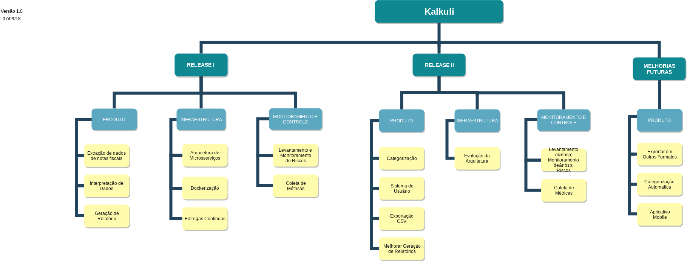

***
 

De acordo com o Guia PMBOK 5ª edição, a Estrutura Analítica do Projeto é “O processo de subdivisão das entregas e do trabalho do projeto em componentes menores e mais facilmente gerenciáveis.” 

Esta página contempla as versões da Estrutura Analítica do Projeto Kalkuli.
   

## Versão 1  

