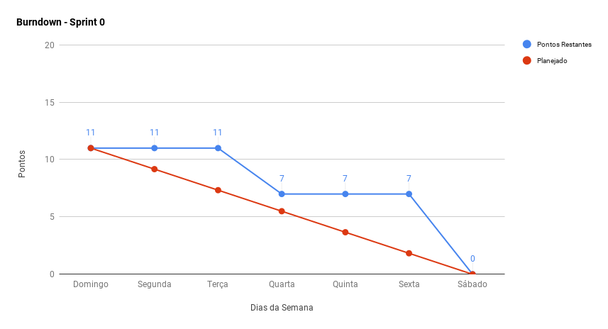
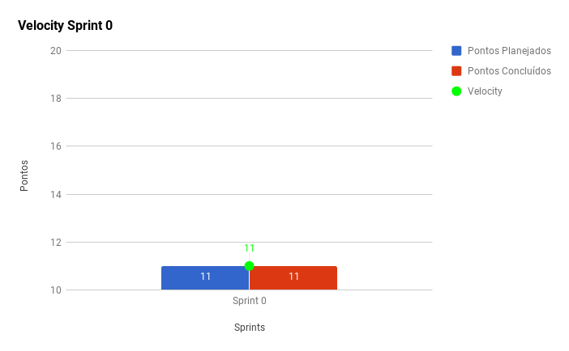

***

A <i>Sprint</i> 0 marcou a definição da proposta de produto, onde a ideia bruta foi oferecida à equipe de EPS. Para este semestre de EPS/MDS, a liberdade é maior, isso significa que a equipe, à partir da ideia inicial apresentada, adotará uma visão voltada ao produto, podendo definir o escopo, lapidando a proposta apresentada.

Por este motivo, a <i>sprint</i> correspondeu ao momento de escolha de proposta de projeto, e também do primeiro contato entre as equipes de EPS e MDS, não havendo escopo definido, tampouco <i>backlog</i> ou <i>roadmap</i> criados. Portanto, não existem métricas para essa fase inicial, pois a equipe de EPS optou por apenas utilizar pontuação para avaliar a produtividade da equipe quando houverem entregáveis executáveis do produto de <i>software</i>.

Durante a semana, na primeira reunião de alinhamento entre as equipes, o <a href="https://github.com/fga-eps-mds/Kalkuli/issues/3">plano de comunicação</a> foi iniciado. Nele constam horários de rituais, <i>dailies</i>, como a equipe se comunicará e trocará informações de forma geral. Está sujeito à altearções ao longo do semestre.  
Após conhecimento da proposta inicial, de extração de texto de PDFs no formato imagem, a equipe começou a pesquisar sobre OCR, e os resultados estão disponíveis na <a href="https://github.com/fga-eps-mds/Kalkuli/issues/13"><i>issue</i></a> correspondente.

## Fechamento da Sprint

|     _Issue_      |     _Status_    |     Pontos     |
|:--------------:|:---------------:|:-------------:|
|[Treinamento](https://github.com/fga-eps-mds/Kalkuli/issues/2) de _Git_| Concluída | 2 |
|[Treinamento](https://github.com/fga-eps-mds/Kalkuli/issues/1) de Metodologias Ágeis e _Scrum_| Concluída | 2 |
|[Pesquisa manipulação de PDFs](https://github.com/fga-eps-mds/Kalkuli/issues/14)| Concluída | 3 |
|[Definição do Plano de Comunicação](https://github.com/fga-eps-mds/Kalkuli/issues/3)| Concluída | 1 |
|[Pesquisa OCR](https://github.com/fga-eps-mds/Kalkuli/issues/13)| Concluída | 3 |
|[_Community Profile_](https://github.com/fga-eps-mds/Kalkuli/community) |Não Concluída |0 |
|[Template de _Issues_ e _Pull Requests_](https://github.com/fga-eps-mds/Kalkuli/pull/25)| Não Concluída | 0 |
|[Quadro de Interesses](https://github.com/fga-eps-mds/Kalkuli/issues/4)|Concluída| 0 |

Pontos Planejados Concluídos: 11     

> [Milestone Sprint 0](https://github.com/fga-eps-mds/Kalkuli/milestone/1?closed=1)

## _Burndown_    

## _Velocity_    

### Quadro de Conhecimento Inicial     

A dificuldade em adotar uma visão de produto na primeira <i>sprint</i> dificultou a elaboração do quadro de conhecimento com possíveis tecnologias que a equipe utilizaria.

A equipe de EPS elaborou um quadro de conhecimento incial, com tecnologias consideradas essenciais para o desenvolvimento, com ele foi possível ter um <i>overview</i> das capacidades da equipe de desenvolvimento e gerência, e servirá como referência inicial para rastrear a evolução técnica da equipe. 

.png "Sprint 0 - Quadro de Conhecimento")
