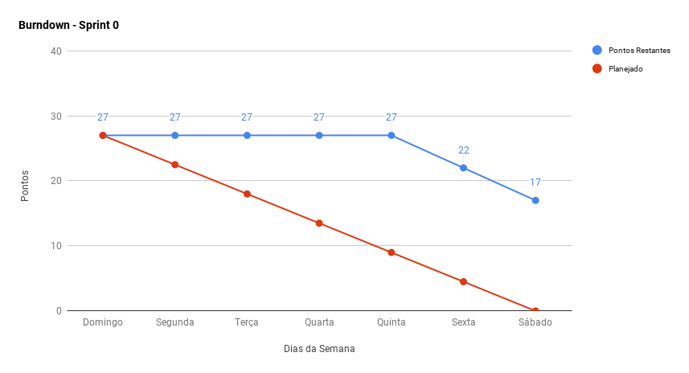
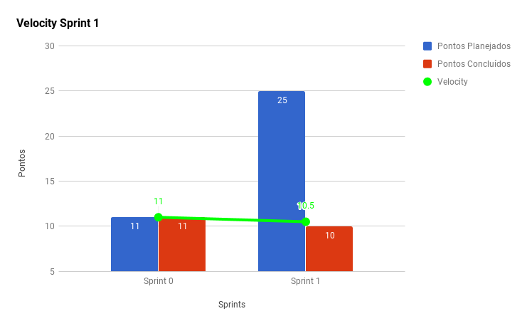
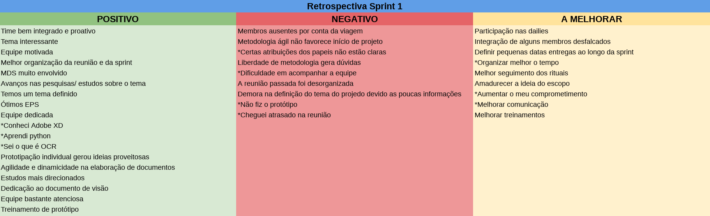

***

A <i>Sprint</i> 1 marcou o fechamento do escopo, esclarecimento quanto à requisitos de alto nível do produto, e concretizou o conhecimento dos papeis da equipe de EPS.

A equipe de EPS pôde apresentar e praticar os rituais com a equipe de MDS, já os executando de acordo com o <a href="https://github.com/fga-eps-mds/Kalkuli/issues/29#issuecomment-417827556">pré planejamento</a>.

## Fechamento da _Sprint_   

|     _Issue_      |     _Status_    |    Pontos   |
|:--------------:|:---------------:|:---------:
|[Fechar Escopo](https://github.com/fga-eps-mds/Kalkuli/issues/7)| Concluída | 0 |
|[Criar roadmap do Tech Leader](https://github.com/fga-eps-mds/2018.2-kalkuli/issues/21)| Concluída | 0 |
|[Treinamento de prototipação](https://github.com/fga-eps-mds/Kalkuli/issues/5)| Concluída | 2|
|[Criação de protótipos de baixa fidelidade](https://github.com/fga-eps-mds/Kalkuli/issues/28) | Concluída | 3 |
|[Documento de Visão](https://github.com/fga-eps-mds/Kalkuli/issues/26)| Concluída | 5 |
|[Criar as Políticas de Uso do Repositório](https://github.com/fga-eps-mds/Kalkuli/issues/9)| Não Concluída |2|
|[TAP](https://github.com/fga-eps-mds/Kalkuli/issues/12)| Não Concluída |5 |
|[Plano de Gerenciamento de Riscos](https://github.com/fga-eps-mds/Kalkuli/issues/9)| Não Concluída | 5 |  
|[EAP](https://github.com/fga-eps-mds/Kalkuli/issues/11)| Não Concluída | 5 |

Pontos Planejados Concluídos: 10     
Pontos de Dívida Concluídos:  0   
Pontos Não Agregados: 17   

> [_Milestone Sprint_ 1](https://github.com/fga-eps-mds/2018.2-Kalkuli/milestone/2?closed=1)   

## _Burndown_    

O <i>burndown</i> indica que as <i>issues</i> foram entregues tardiamente. A equipe ficou impossibilitada de prosseguir, uma vez que as <i>issues</i> alocadas para a <i>sprint</i> dependiam do escopo lapidado.
 

## _Velocity_   

## Retrospectiva

Primeira retrospectiva da equipe. Teve duração de 35 minutos. Para próximas retrospectivas, a expectativa é a de que o <i>timebox</i> se mantenha, dado que o desempenho e foco da equipe possibilitou finalizar o ritual em tempo menor do que o pré estabelecido.

   

   

_(Afirmações precedidas do asterisco são de cunho pessoal)._

### Registros de Presença nas _Dailies_   

Forma de manter o controle e tornar transparente a participação de membros do time nas <i>dailies</i>.

   

| Nome    |Segunda Feira      | Terça Feira      | Quarta Feira     | Quinta Feira      | Sexta Feira      |     
|:-----:  |:-----------------:|:----------------:|:----------------:|:-----------------:|:----------------:|
|Bernardo |         ✔         |         ✘        |         ✘        |         ✘         |         ✘        |
|Clarissa |         ✔         |         ✔        |         ✔        |         ✔         |         ✔        |
|Esio     |         ✔         |         ✔        |         ✔        |         ✔         |         ✔        |
|Felipe   |         ✔         |         ✔        |         ✔        |         ✔         |         ✔        |
|Jacó     |         ✔         |         ✔        |         ✔        |         ✔         |         ✘        |
|Lucas    |         ✔         |         ✔        |         ✔        |         ✔         |         ✔        |
|Mariana  |         ✔         |         ✔        |         ✔        |         ✔         |         ✔        |
|Pedro    |         ✔         |         ✘        |         ✘        |         ✘         |         ✘        |
|Saleh    |         ✔         |         ✔        |         ✔        |         ✔         |         ✔        |
|Youssef  |         ✔         |         ✔        |         ✘        |         ✔         |         ✔        |    

Os integrantes <a href="https://github.com/bernardohrl">Bernardo Henrique</a> (EPS), e <a href="https://github.com/Phe0">Pedro Féo</a> (MDS), estiveram ausentes durante a semana, porque estavam participando do ENEJ, Encontro Nacional de Empresas Juniores, em Ouro Preto.  

 

## Avaliação do _Scrum Master_    

A equipe de EPS conseguiu fechar o escopo até a data definida, e pôde delegar a criação do documento de visão à equipe de MDS, como também a criação de protótipos de baixa fidelidade. Entretanto, por dificuldades no entendimento e refino do escopo inicial acordado, não foi possível concluir o Termo de Abertura do Projeto, nem sua Estrutura Analítica. 

 

Nesse meio tempo, EPS já prepara a equipe de MDS para o início do projeto com treinamentos, e vivência dos rituais <i>scrum</i>.

