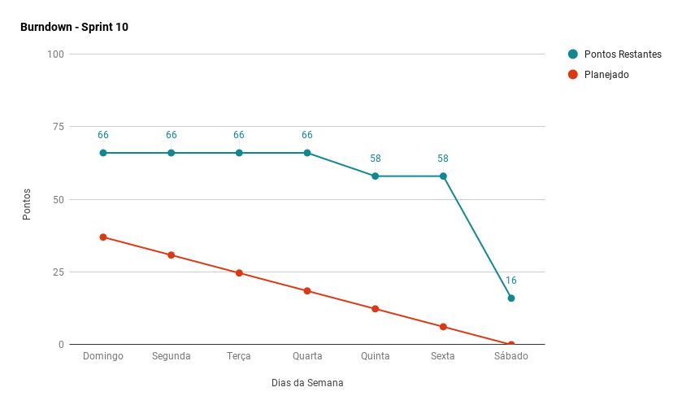
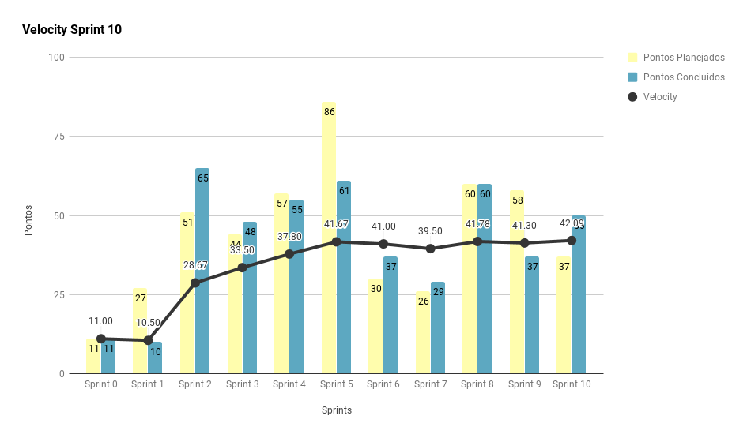
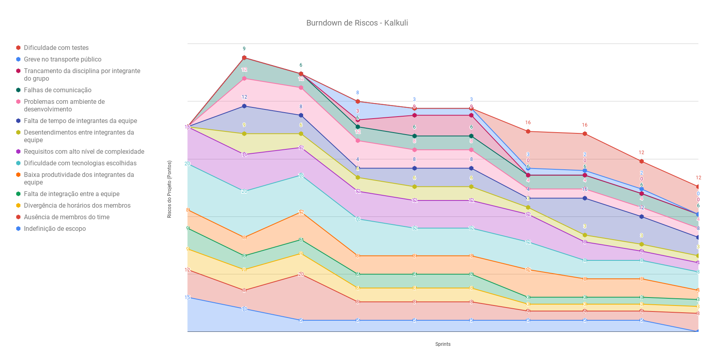
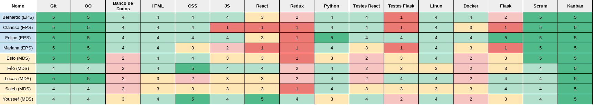
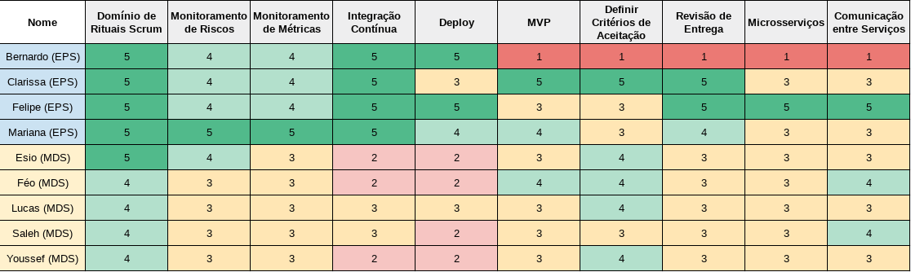

***    

<i>Sprint</i> que marca a redução do escopo do projeto, visando entrega de qualidade para a segunda <i>release</i> e a <a href="https://github.com/fga-eps-mds/2018.2-Kalkuli/issues/167#issuecomment-433780237" title="Comentário, Issue #167, Spike: Migrar Extraction ">correção do sistema de extração</a>.

## Fechamento da _Sprint_   

|     _Issue_      |     _Status_    |       Pontos       |
|:--------------:|:---------------:|:-------------:
|[US18 - Inserir Categoria em Nota](https://github.com/fga-eps-mds/2018.2-Kalkuli/issues/163) |Concluída |  8 |
|[Criar o Modelo de Maturidade DevOps](https://github.com/fga-eps-mds/2018.2-Kalkuli/issues/163) |Concluída |  8 |
|[Implementar Sistema de Background _Tasks_ para a Extração](https://github.com/fga-eps-mds/2018.2-Kalkuli/issues/163) |Concluída |  13 |
|[Criar Guia de Teste de Usabilidade](https://github.com/fga-eps-mds/2018.2-Kalkuli/issues/169)|Concluída | 8|
|[US01 - Inserir o Cadastro de Uma Empresa no Sistema](https://github.com/fga-eps-mds/2018.2-Kalkuli/issues/163) |Concluída |  13 |
|[US09 - Realizar _Login_](https://github.com/fga-eps-mds/2018.2-Kalkuli/issues/163) |Não Concluída |  8 |
|[Criar o EVM](https://github.com/fga-eps-mds/2018.2-Kalkuli/issues/124) |Não Concluída | 8 |  

Pontos Planejados Concluídos: 29    
Pontos de Dívida Concluídos: 21   
Pontos Não Agregados: 16  

> [_Milestone Sprint_ 10](https://github.com/fga-eps-mds/2018.2-Kalkuli/milestone/11?closed=1)

## _Burndown_    

As <i>issues</i> em sua maioria foram entregues ao final da <i>sprint</i>. Parte da equipe de desenvolvimento <a href="https://github.com/fga-eps-mds/2018.2-Kalkuli/issues/29#issuecomment-433591811" title="Planejamento da reunião de 20/10/2018 - Sprint 10">participou de um evento ligado à empresa junior</a>. Também influenciou a entrega tardia das <i>issues</i>, a complexidade alta das novas histórias de usuário.
 

## _Velocity_     

O <i>velocity</i> apresentou leve melhora, dado que a equipe planejou menos <i>issues</i> que nas <i>sprints</i> anteriores. 

   

A incidência do feriado no final da semana favoreceu a entrega das <i>issues</i> em sua maioria, com apenas o EVM e o <a href="https://github.com/fga-eps-mds/2018.2-Kalkuli/issues/175" title="US01 - Realizar Login"><i>login</i> da aplicação</a> pendentes.

 

## Riscos    

Não foram identificados riscos novos no decorrer da <i>sprint</i>. 

  

A redução gradual dos riscos mapeados para o projeto é perceptível, dado que a <i>sprint</i> 10 marca a reta final da disciplina e a equipe encontrou um ritmo saudável de trabalho.

 

## Retrospectiva

A retrospectiva aponta as dificuldades que a equipe de desenvolvimento enfrenta, como por exemplo <a href="https://github.com/fga-eps-mds/2018.2-Kalkuli/issues/175#issue-374859980" title="US09 - Realizar Login">criar o <i>login</i> da aplicação</a>, com histórias mais complexas na reta final do projeto. Entretanto, os pontos positivos e o <i>velocity</i> refletem, ainda que timidamente, o resgate dos ânimos pré <i>release</i>.

   

   

### _Sprint_ Anterior

Com relação aos pontos negativos apresentados na retrospectiva anterior, algumas medidas foram tomadas para que não se mostrassem novamente, são eles:

<table>
  <tr align="center">
    <th>Ponto Negativo</th>
    <th>Correção Adotada</th>
  </tr>
  <tr>
    <td>
Falta muita coisa para o término do projeto.
</td>
    <td>
      
Parte da <i>feature</i> de <a href="https://fga-eps-mds.github.io/2018.2-Kalkuli/docs/backlog#feature-02-manter-usuarios" title="Épico 02, Feature 04">controle de usuários vinculados</a> foi removida, dado o tempo curto até a entrega do projeto, e sua extensão.

    </td>
  </tr>
    <tr>
    <td>
 <a href="https://github.com/fga-eps-mds/2018.2-Kalkuli/issues/167#issuecomment-433780237" title="Comentário, Issue #167, Spike: Migrar Extraction ">Serviço de extração é um impedimento.</a>
</td>
    <td>
      
A solução foi contemplada na <i>issue</i> de <a href="https://github.com/fga-eps-mds/2018.2-Kalkuli/issues/177" title="Issue: Implementar Sistema de Background Tasks para a Extração">implentação de <i>background</i> tasks para a extração</a>.

    </td>
  </tr>
</table>

### Quadro de Conhecimento   

A equipe de desenvolvimento apresenta leve melhora em algumas das tecnologias adotadas, visto que estão em contato contante com estas. Também nota-se melhora dos conhecimentos referentes aos papeis de EPS.

   

### Registros de Presença nas _Dailies_    

<ul>
<li><i>Dailies</i> de segunda e sexta feira são realizadas por <i>hangouts</i>, às 21h30 e 20h, respectivamente.</li>
<li><i>Dailies</i> de quarta-feira são realizadas por <i>telegram</i>, às 12h.</li>
<li><i>Dailies</i> de terça e quinta feira são realizadas presencialmente, às 15h50.</li>

| Nome    |Segunda Feira      | Terça Feira      | Quarta Feira     | Quinta Feira      | Sexta Feira      |     
|:-----:  |:-----------------:|:----------------:|:----------------:|:-----------------:|:----------------:|
|Bernardo |         ✔         |         ✔        |         ✔        |         ✔         |         ✔        |
|Clarissa |         ✔         |         ✔        |         ✔        |         ✔         |         ✔        |
|Esio     |         ✔         |         ✔        |         ✔        |         ✔         |         ✔        |
|Felipe   |         ✔         |         ✔        |         ✔        |         ✔         |         ✔        |
|Lucas    |         ✔         |         ✔        |         ✔        |         ✔         |         ✔        |
|Mariana  |         ✔         |         ✔        |         ✔        |         ✔         |         ✔        |
|Pedro    |         ✔         |         ✔        |         ✔        |         ✔         |         ✔        |
|Saleh    |         ✔         |         ✔        |         ✔        |         ✔         |         ✔        |
|Youssef  |         ✔         |         ✔        |         ✔        |         ✔         |         ✔        |      

## Avaliação do _Scrum Master_  

 

 

 

 

  

 

