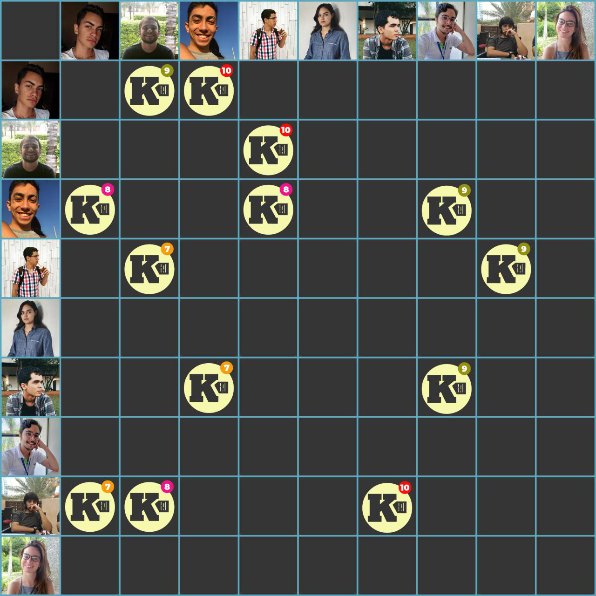

***    

<i>Sprint</i> destinada à criação do <a href="https://github.com/fga-eps-mds/2018.2-Kalkuli/issues/175" title="US01 - Realizar Login">sistema de autenticação da aplicação</a>, e da <a href="https://github.com/fga-eps-mds/2018.2-Kalkuli/issues/174" title="US18 - Inserir Categoria em Nota">categorização de notas salvas</a> para controle e monitoramento de gastos.

EPS fica responsável pela criação do  <a href="https://github.com/fga-eps-mds/2018.2-Kalkuli/issues/176" title="Criar o Modelo de Maturidade DevOps">modelo de maturidade <i>devOps</i></a>, e dos <a href="https://github.com/fga-eps-mds/2018.2-Kalkuli/issues/177" title="Implementar Sistema de Background Tasks para a Extração">ajustes no serviço de extração de dados das notas</a>, que vêm <a href="https://github.com/fga-eps-mds/2018.2-Kalkuli/issues/167#issuecomment-433780237" title="Comentário, Issue #167 ">enfretando problemas</a>.

Como dívidas vindas da <i>sprint</i> anterior, as <i>issues</i> de <a href="https://github.com/fga-eps-mds/2018.2-Kalkuli/issues/169" title="Issue: Criar Guia de Teste de Usabilidade">criação do guia de teste de usabilidade</a>, a <a href="https://github.com/fga-eps-mds/2018.2-Kalkuli/issues/124" title="Issue: Criar o EVM">criação do EVM</a> e o <a href="https://github.com/fga-eps-mds/2018.2-Kalkuli/issues/163" title="US01 - Inserir o Cadastro de Uma Empresa no Sistema">cadastro de empresa no sistema</a> encontram-se para ser quitadas.

## Tamanho da _Sprint_      
**Início:** 28/10/2018   
**Término:** 03/11/2018   

**Duração:** Sete dias   

## Pareamentos   
 

- Pedro Féo e Esio | [US01 - Inserir o Cadastro de Uma Empresa no Sistema](https://github.com/fga-eps-mds/2018.2-Kalkuli/issues/163)  
- Lucas Dutra e Youssef | [US18 - Inserir Categoria em Nota](https://github.com/fga-eps-mds/2018.2-Kalkuli/issues/174)   
- Lucas Dutra e Youssef | [US09 - Realizar _Login_](https://github.com/fga-eps-mds/2018.2-Kalkuli/issues/175)     
- Felipe e Saleh | [Implementar Sistema de Background _Tasks_ para a Extração](https://github.com/fga-eps-mds/2018.2-Kalkuli/issues/177)  

## Objetivos   

|     _Issue_      |    Pontos   |
|:--------------:|:---------:|
|[US18 - Inserir Categoria em Nota](https://github.com/fga-eps-mds/2018.2-Kalkuli/issues/174) | 8 |
|[US09 - Realizar _Login_](https://github.com/fga-eps-mds/2018.2-Kalkuli/issues/163) | 8 |
|[Criar o Modelo de Maturidade DevOps](https://github.com/fga-eps-mds/2018.2-Kalkuli/issues/176) | 8 |
|[Implementar Sistema de Background _Tasks_ para a Extração](https://github.com/fga-eps-mds/2018.2-Kalkuli/issues/177) | 13 |

<b>Total de pontos planejados: 37</b>  

### Dívida    

|     _Issue_      |    Pontos   |
|:--------------:|:---------:|
|[Criar Guia de Teste de Usabilidade](https://github.com/fga-eps-mds/2018.2-Kalkuli/issues/169)|8|
|[Criar o EVM](https://github.com/fga-eps-mds/2018.2-Kalkuli/issues/124) | 8 |
|[US01 - Inserir o Cadastro de Uma Empresa no Sistema](https://github.com/fga-eps-mds/2018.2-Kalkuli/issues/163) | 13 |

<b>Total: 29</b> 

***

 Total de pontos da <i>sprint</i>: 66 
  

> [_Sprint Backlog_](https://github.com/fga-eps-mds/2018.2-Kalkuli/milestone/11)  

## Papeis   

**Arquiteto:** [Felipe Hargreaves](https://github.com/Hargre)   
**DevOps:** [Bernardo Henrique](https://github.com/bernardohrl)  
**Product Manager:** [Clarissa Borges](https://github.com/clarissalimab)    
**Tech Lead:** [Mariana Pícolo](https://github.com/MarianaPicolo)   
**Equipe de Desenvolvimento:** 
- [Esio Gustavo](https://github.com/EsioFreitas)   
- [Lucas Dutra](https://github.com/lucasdutraf)   
- [Pedro Féo](https://github.com/Phe0)   
- [Saleh Nazih](https://github.com/devsalula)
- [Youssef Muhamad](https://github.com/youssef-md)   