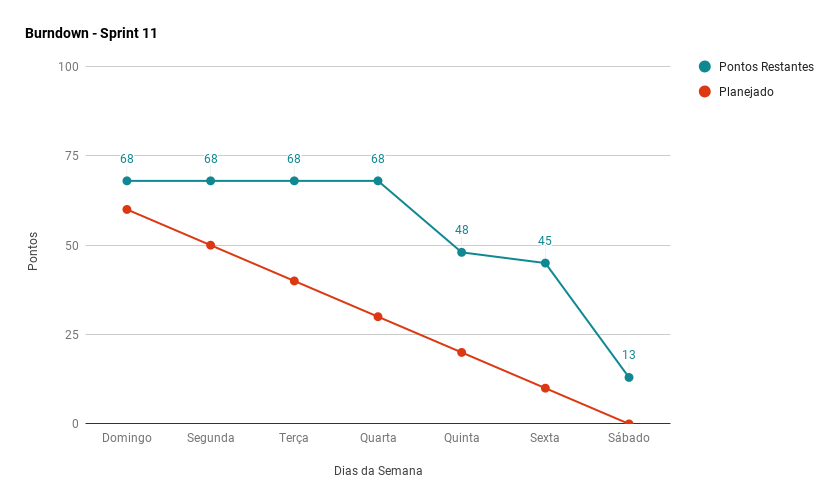
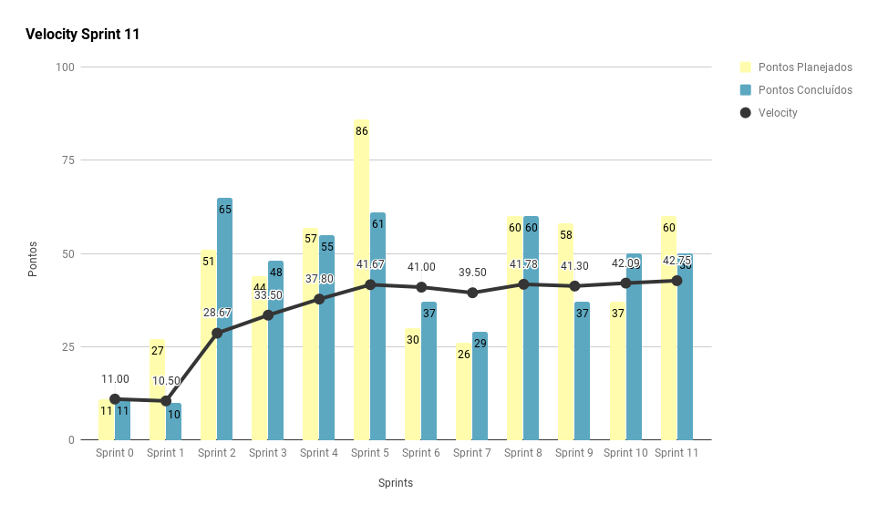
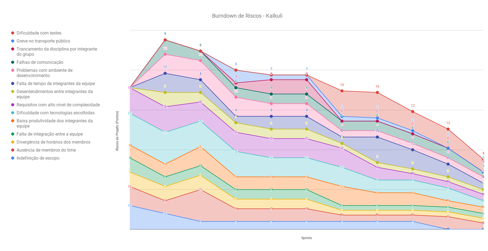
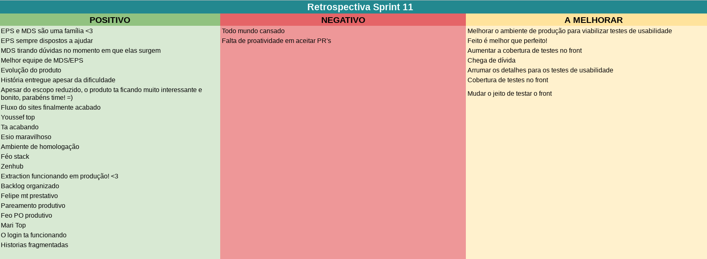
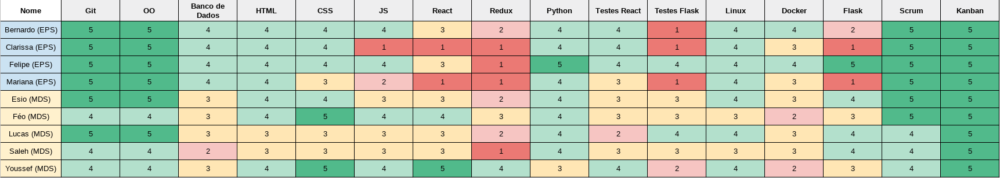
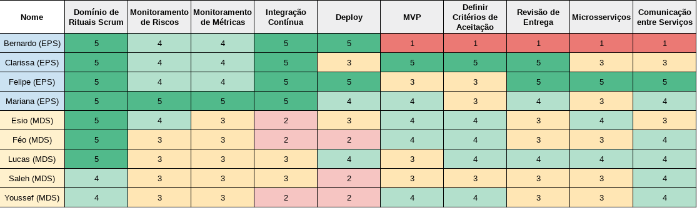

***    

<i>Sprint</i> que marca a entrada na etapa final do projeto, e o aumento de qualidade do produto através de melhoria do serviço de extração, criação dos ambientes de homologação, e novas histórias de usuário.

## Fechamento da _Sprint_   

|     _Issue_      |     _Status_    |       Pontos       |
|:--------------:|:---------------:|:-------------:
|[Criar ambiente de homologação: Serviço de Interpretação](https://github.com/fga-eps-mds/2018.2-Kalkuli/issues/186) | Concluída |  2 |
|[Criar ambiente de homologação: Serviço de Exportação](https://github.com/fga-eps-mds/2018.2-Kalkuli/issues/191) |Concluída |  2 |
|[Criar ambiente de homologação: _Gateway_](https://github.com/fga-eps-mds/2018.2-Kalkuli/issues/187) | Concluída |  2 |
|[Refatorar Serviço de Extração: Refatorar Código](https://github.com/fga-eps-mds/2018.2-Kalkuli/issues/184) | Concluída |  3 |
|[Criar ambiente de homologação: Serviço de Usuários](https://github.com/fga-eps-mds/2018.2-Kalkuli/issues/188) | Concluída |  3 |
|[Criar ambiente de homologação: Serviço de Notas](https://github.com/fga-eps-mds/2018.2-Kalkuli/issues/189) |Concluída |  3 |
|[Criar ambiente de homologação: Serviço de Relatórios](https://github.com/fga-eps-mds/2018.2-Kalkuli/issues/190) | Concluída |  3 |
|[Refatorar Serviço de Extração: Corrigir o _Deploy_](https://github.com/fga-eps-mds/2018.2-Kalkuli/issues/185) | Concluída |  5 |
|[Atualizar o _Backlog_](https://github.com/fga-eps-mds/2018.2-Kalkuli/issues/193) |Concluída |  5 |
|[US15 - Filtrar Notas por Título e Descrição](https://github.com/fga-eps-mds/2018.2-Kalkuli/issues/194) |Concluída |  8 |
|[US37 - Criar Categorias](https://github.com/fga-eps-mds/2018.2-Kalkuli/issues/195) |Concluída |  8 |
|[US09 - Realizar _Login_](https://github.com/fga-eps-mds/2018.2-Kalkuli/issues/163) |Concluída | 8 |
|[Corrigir os Fluxos da Aplicação](https://github.com/fga-eps-mds/2018.2-Kalkuli/issues/192) |Não Concluída |  13 |

Pontos Planejados Concluídos: 44    
Pontos de Dívida Concluídos: 8   
Pontos Não Agregados: 13    

> [_Milestone Sprint_ 11](https://github.com/fga-eps-mds/2018.2-Kalkuli/milestone/12?closed=1)

## _Burndown_    

## _Velocity_     

O <i>velocity</i> apresentou melhora, com a equipe quitando dívidas técnicas, e MDS entregando todas as histórias de usuário que ficou responsável. 

   

A capacidade de entrega da equipe vem apresentando melhora, visto que o projeto entrou na reta final, e a equipe se mostra engajada para a entrega do escopo em sua totalidade.

 

## Riscos    

Não foram identificados riscos novos no decorrer da <i>sprint</i>. 

  

Etapa final do projeto, e redução visível dos riscos mapeados, resultado do trabalho contínuo de monitoramento e controle, e das práticas adotadas já possuírem bons níveis de adesão pela equipe.

 

## Retrospectiva

Houve redução significativa dos pontos negativos. Os pontos levantados não refletem os riscos mapeados.

   

   

### _Sprint_ Anterior

Com relação aos pontos negativos apresentados na retrospectiva anterior, algumas medidas foram tomadas para que não se mostrassem novamente, são eles:

<table>
  <tr align="center">
    <th>Ponto Negativo</th>
    <th>Correção Adotada</th>
  </tr>
  <tr>
    <td>
Dificuldade em herdar dívidas.
</td>
    <td>
      <ul>
      
Permanência da mesma dupla de pareamento responsável pela <i>issue</i> que se tornou dívida e que será realocada para a <i>sprint</i> seguinte.

      </ul>
    </td>
  </tr>
</table>

### Quadro de Conhecimento   

   

### Registros de Presença nas _Dailies_    

<ul>
<li><i>Dailies</i> de segunda e sexta feira são realizadas por <i>hangouts</i>, às 21h30 e 20h, respectivamente.</li>
<li><i>Dailies</i> de quarta-feira são realizadas por <i>telegram</i>, às 12h.</li>
<li><i>Dailies</i> de terça e quinta feira são realizadas presencialmente, às 15h50.</li>

| Nome    |Segunda Feira      | Terça Feira      | Quarta Feira     | Quinta Feira      | Sexta Feira      |     
|:-----:  |:-----------------:|:----------------:|:----------------:|:-----------------:|:----------------:|
|Bernardo |         ✔         |         ✔        |         ✔        |         ✔         |         ✘        |
|Clarissa |         ✔         |         ✔        |         ✔        |         ✔         |         ✘        |
|Esio     |         ✔         |         ✔        |         ✔        |         ✔         |         ✔        |
|Felipe   |         ✔         |         ✘        |         ✔        |         ✔         |         ✔        |
|Lucas    |         ✔         |         ✔        |         ✔        |         ✔         |         ✔        |
|Mariana  |         ✔         |         ✔        |         ✔        |         ✔         |         ✔        |
|Pedro    |         ✔         |         ✔        |         ✔        |         ✔         |         ✔        |
|Saleh    |         ✔         |         ✔        |         ✔        |         ✔         |         ✔        |
|Youssef  |         ✔         |         ✘        |         ✔        |         ✔         |         ✔        |      

## Avaliação do _Scrum Master_  

 

 

 

 

  

 

