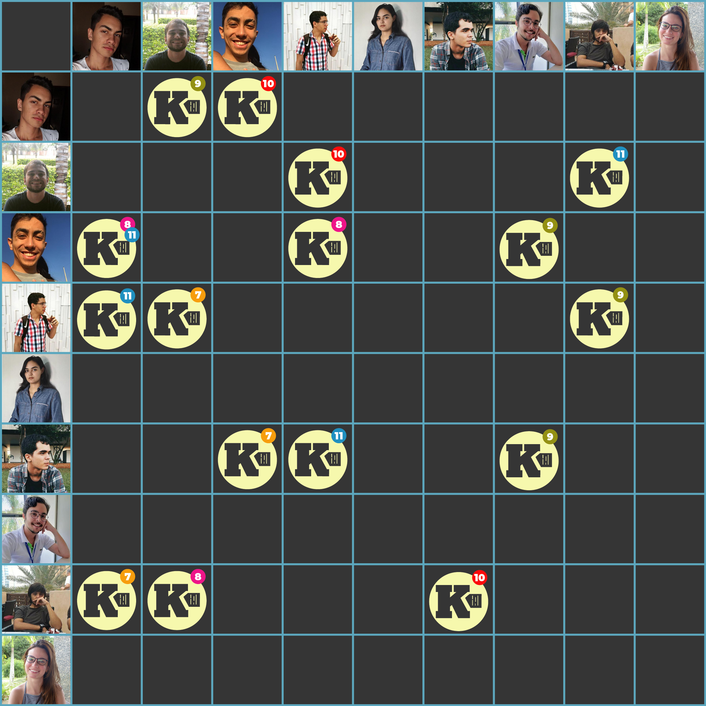

***    

<i>Sprint</i> que objetiva a <a href="https://github.com/fga-eps-mds/2018.2-Kalkuli/issues/195" title="US37 - Criar Categorias">categorização manual de notas pelo usuário</a>, a <a href="https://github.com/fga-eps-mds/2018.2-Kalkuli/issues/194" title="US15 - Filtrar Notas por Título e Descrição">filtragem por título e descrição</a>, a criação dos ambientes de homologação e o ajuste do  <a href="https://github.com/fga-eps-mds/2018.2-Kalkuli/issues/185" title="Refatorar Serviço de Extração: Corrigir o Deploy"><i>deploy</i> do serviço de extração</a>.

Como dívida vinda da <i>sprint</i> anterior, a <i>issue</i> de <a href="https://github.com/fga-eps-mds/2018.2-Kalkuli/issues/163" title="US09 - Realizar Login">realizar <i>login</i></a> fica para ser liquidada.

## Tamanho da _Sprint_      
**Início:** 04/11/2018   
**Término:** 10/11/2018   

**Duração:** Sete dias   

## Pareamentos   
 

- Pedro Féo e Saleh | [US15 - Filtrar Notas por Título e Descrição](https://github.com/fga-eps-mds/2018.2-Kalkuli/issues/194)
- Pedro Féo e Saleh | [US37 - Criar Categorias](https://github.com/fga-eps-mds/2018.2-Kalkuli/issues/195)
- Esio e Youssef | [Corrigir os Fluxos da Aplicação](https://github.com/fga-eps-mds/2018.2-Kalkuli/issues/192)
- Lucas Dutra e Youssef | [US09 - Realizar _Login_](https://github.com/fga-eps-mds/2018.2-Kalkuli/issues/163)     
- Felipe e Esio | [Refatorar Serviço de Extração: Refatorar Código](https://github.com/fga-eps-mds/2018.2-Kalkuli/issues/184)  

## Objetivos   

|     _Issue_      |    Pontos   |
|:--------------:|:---------:|
|[Refatorar Serviço de Extração: Refatorar Código](https://github.com/fga-eps-mds/2018.2-Kalkuli/issues/184) | 3 |
|[Refatorar Serviço de Extração: Corrigir o _Deploy_](https://github.com/fga-eps-mds/2018.2-Kalkuli/issues/185) | 5 |
|[Criar ambiente de homologação: Serviço de Interpretação](https://github.com/fga-eps-mds/2018.2-Kalkuli/issues/186) | 2 |
|[Criar ambiente de homologação: _Gateway_](https://github.com/fga-eps-mds/2018.2-Kalkuli/issues/187) | 2 |
|[Criar ambiente de homologação: Serviço de Usuários](https://github.com/fga-eps-mds/2018.2-Kalkuli/issues/188) | 3 |
|[Criar ambiente de homologação: Serviço de Notas](https://github.com/fga-eps-mds/2018.2-Kalkuli/issues/189) | 3 |
|[Criar ambiente de homologação: Serviço de Relatórios](https://github.com/fga-eps-mds/2018.2-Kalkuli/issues/190) | 3 |
|[Criar ambiente de homologação: Serviço de Exportação](https://github.com/fga-eps-mds/2018.2-Kalkuli/issues/191) | 2 |
|[Criar ambiente de homologação: _Front-end_](https://github.com/fga-eps-mds/2018.2-Kalkuli/issues/196) |3|
|[Corrigir os Fluxos da Aplicação](https://github.com/fga-eps-mds/2018.2-Kalkuli/issues/192) | 13 |
|[Atualizar o _Backlog_](https://github.com/fga-eps-mds/2018.2-Kalkuli/issues/193) | 5 |
|[US15 - Filtrar Notas por Título e Descrição](https://github.com/fga-eps-mds/2018.2-Kalkuli/issues/194) | 8 |
|[US37 - Criar Categorias](https://github.com/fga-eps-mds/2018.2-Kalkuli/issues/195) | 8 |

<b>Total de pontos planejados: 60</b>  

### Dívida    

|     _Issue_      |    Pontos   |
|:--------------:|:---------:|
|[US09 - Realizar _Login_](https://github.com/fga-eps-mds/2018.2-Kalkuli/issues/163) | 8 |

<b>Total: 8</b> 

***

 Total de pontos da <i>sprint</i>: 68 
  

> [_Sprint Backlog_](https://github.com/fga-eps-mds/2018.2-Kalkuli/milestone/12)  

## Papeis   

**Arquiteto:** [Felipe Hargreaves](https://github.com/Hargre)   
**DevOps:** [Bernardo Henrique](https://github.com/bernardohrl)  
**Product Manager:** [Clarissa Borges](https://github.com/clarissalimab) e [Pedro Féo](https://github.com/Phe0)     
**Tech Lead:** [Mariana Pícolo](https://github.com/MarianaPicolo)   
**Equipe de Desenvolvimento:** 
- [Esio Gustavo](https://github.com/EsioFreitas)   
- [Lucas Dutra](https://github.com/lucasdutraf)   
- [Pedro Féo](https://github.com/Phe0)   
- [Saleh Nazih](https://github.com/devsalula)
- [Youssef Muhamad](https://github.com/youssef-md)   