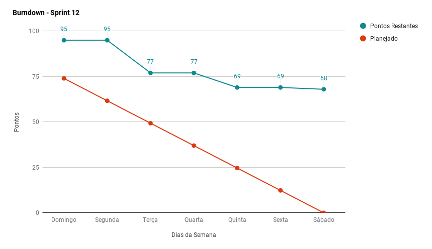
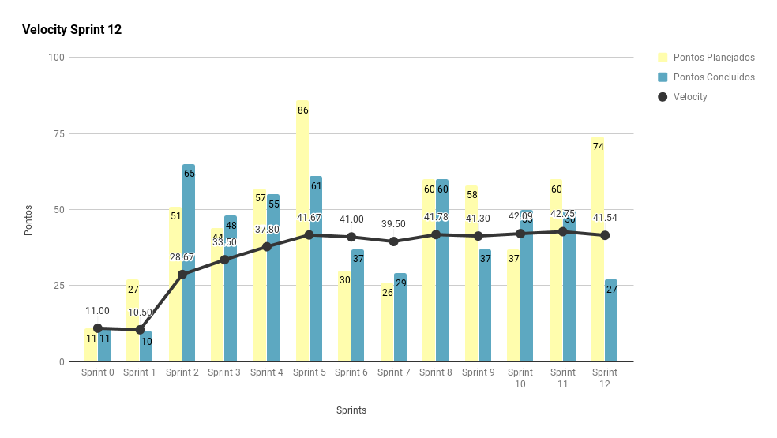
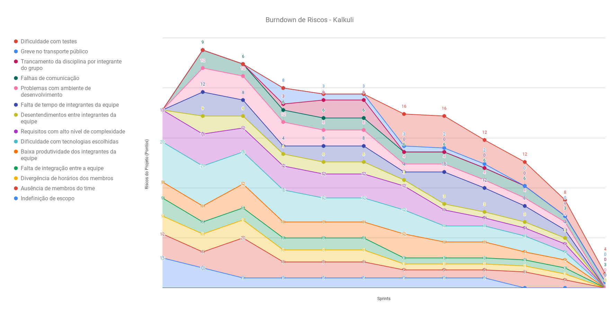
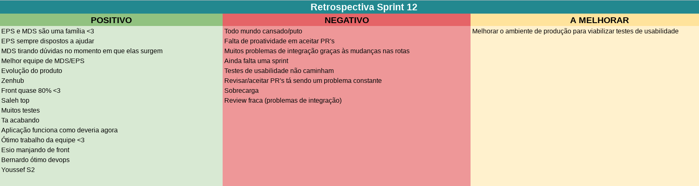
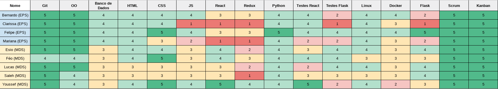
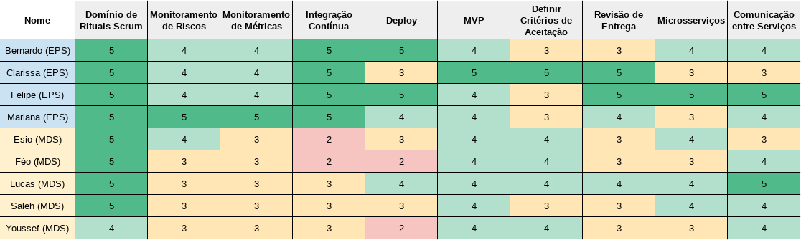

***    

<i>Sprint</i> com a segunda maior pontuação planejada da equipe, dado que o projeto está em sua fase final, foi necessário aumentar a carga de <i>issues</i> planejadas para a conclusão e correção das principais <i>features</i> da aplicação.

## Fechamento da _Sprint_   

|     _Issue_      |     _Status_    |       Pontos       |
|:--------------:|:---------------:|:-------------:
|[Criar _Script_ de Popular Banco](https://github.com/fga-eps-mds/2018.2-Kalkuli/issues/210) |Concluída |  1 |
|[US25 - Apagar Relatório](https://github.com/fga-eps-mds/2018.2-Kalkuli/issues/202) |Concluída |  2 |
|[Atualizar Guia do _Deploy_](https://github.com/fga-eps-mds/2018.2-Kalkuli/issues/208) | Concluída |  3 |
|[Criar o EVM](https://github.com/fga-eps-mds/2018.2-Kalkuli/issues/124) |Concluída | 8 |
|[Corrigir os Fluxos da Aplicação](https://github.com/fga-eps-mds/2018.2-Kalkuli/issues/192) | Concluída | 13 |
|[US38 - Editar Nota](https://github.com/fga-eps-mds/2018.2-Kalkuli/issues/203) |Não Concluída |  3 |
|[US22 - Gerar Relatório por Categoria](https://github.com/fga-eps-mds/2018.2-Kalkuli/issues/204) |Não Concluída |  5 |
|[Automatizar Sistema de Troca de Ambientes](https://github.com/fga-eps-mds/2018.2-Kalkuli/issues/209) |Não Concluída |  5 |
|[US27 - Gerar Gráfico de Gastos Totais](https://github.com/fga-eps-mds/2018.2-Kalkuli/issues/206) |Não Concluída |  8 |
|[Criar Sistema de Migrations](https://app.zenhub.com/workspace/o/fga-eps-mds/2018.2-kalkuli/issues/214)|Não Concluída| 8 |
|[US36 - Associar Notas à Empresa](https://github.com/fga-eps-mds/2018.2-Kalkuli/issues/205) |Não Concluída |  13 |
|[Aumentar a Cobertura de Testes no _Front-End_](https://github.com/fga-eps-mds/2018.2-Kalkuli/issues/206) |Não Concluída |  13 |
|[Realizar Testes de Usabilidade](https://github.com/fga-eps-mds/2018.2-Kalkuli/issues/211)|Não Concluída | 13 |

Pontos Planejados Concluídos: 6    
Pontos de Dívida Concluídos: 21   
Pontos Não Agregados: 68    

> [_Milestone Sprint_ 12](https://github.com/fga-eps-mds/2018.2-Kalkuli/milestone/13?closed=1)

## _Burndown_    

As <i>issues</i> foram iniciadas logo no começo da <i>sprint</i>. Esperava-se entrega de todas as <i>issues</i> planejadas, que, de fato, foram concluídas e respeitam os critérios de aceitação. Entretanto, com a aplicação crescendo cada vez mais, é necessário ajustar todas as rotas, tanto em homologação quanto em produção, e a equipe não conseguiu fazer os devidos ajustes em tempo hábil, logo, as <i>issues</i> se tornaram dívidas.
 

## _Velocity_     

 

## Riscos    

Não foram identificados riscos novos no decorrer da <i>sprint</i>. 

  

 

## Retrospectiva

A retrospectiva refletiu o problema da sprint: as dificuldades com a integração das histórias de usuário na aplicação, além do cansaço no final do projeto.

   

   

### Quadro de Conhecimento   

   

### Registros de Presença nas _Dailies_    

<ul>
<li><i>Dailies</i> de segunda e sexta feira são realizadas por <i>hangouts</i>, às 21h30 e 20h, respectivamente.</li>
<li><i>Dailies</i> de quarta-feira são realizadas por <i>telegram</i>, às 12h.</li>
<li><i>Dailies</i> de terça e quinta feira são realizadas presencialmente, às 15h50. (Com a ocorrência do feriado na quinta-feira, a <i>daily</i> foi realizada por <i>hangouts</i> às 21h30.)</li> 

| Nome    |Segunda Feira      | Terça Feira      | Quarta Feira     | Quinta Feira      | Sexta Feira      |     
|:-----:  |:-----------------:|:----------------:|:----------------:|:-----------------:|:----------------:|
|Bernardo |         ✘         |         ✔        |         ✘        |         ✘         |         ✔        |
|Clarissa |         ✔         |         ✔        |         ✘        |         ✔         |         ✔        |
|Esio     |         ✔         |         ✔        |         ✔        |         ✘         |         ✔        |
|Felipe   |         ✔         |         ✔        |         ✔        |         ✔         |         ✔        |
|Lucas    |         ✔         |         ✔        |         ✔        |         ✔         |         ✔        |
|Mariana  |         ✔         |         ✔        |         ✔        |         ✔         |         ✘        |
|Pedro    |         ✔         |         ✔        |         ✔        |         ✔         |         ✔        |
|Saleh    |         ✔         |         ✔        |         ✔        |         ✔         |         ✔        |
|Youssef  |         ✔         |         ✔        |         ✔        |         ✔         |         ✔        |      

## Avaliação do _Scrum Master_  

 
<i>Sprint</i> com níveis altíssimos de dívida e também com alta pontuação planejada visando entrega de qualidade ao final do projeto.

 
A equipe assumiu altos riscos planejando uma <i>sprint</i> com pontuação mais alta que o usual no fim do projeto. Isso ocorre porque o fluxo da aplicação ainda não era satisfatório para os usuários, e também porque ainda era esperado uma das <i>features</i> chave do projeto: a <a href="https://fga-eps-mds.github.io/2018.2-Kalkuli/docs/backlog#feature-06-gerac%C3%A3o-de-graficos" title="Feature 06 - Geração de Gráficos">geração de gráficos de gastos</a>.

 
O nível de dívidas foi alto porque a equipe se deparou com problemas no momento de juntar as histórias de usuário, já que existem dois ambientes com rotas diferentes, e a troca manual de todas as rotas do sistema para testes é trabalhosa, o que impediu a revisão em tempo hábil dentro da <i>sprint</i> corrente.

 
A qualidade de código no <i>front-end</i> ainda poderia ser melhorada, e para tanto, receberia mais uma <i>issue</i> para que a equipe de desenvolvimento pudesse polir o código reduzindo complexidade, duplicidade, e riscos de <i>bugs</i>, além de aumentar a cobertura de testes.

 
O produto final finalmente possui forma, resultado do empenho das equipes de EPS e MDS que, mesmo no final do semestre, ainda mantêm bom ritmo de entrega, e níveis ótimos de adesão às práticas ágeis.

  

