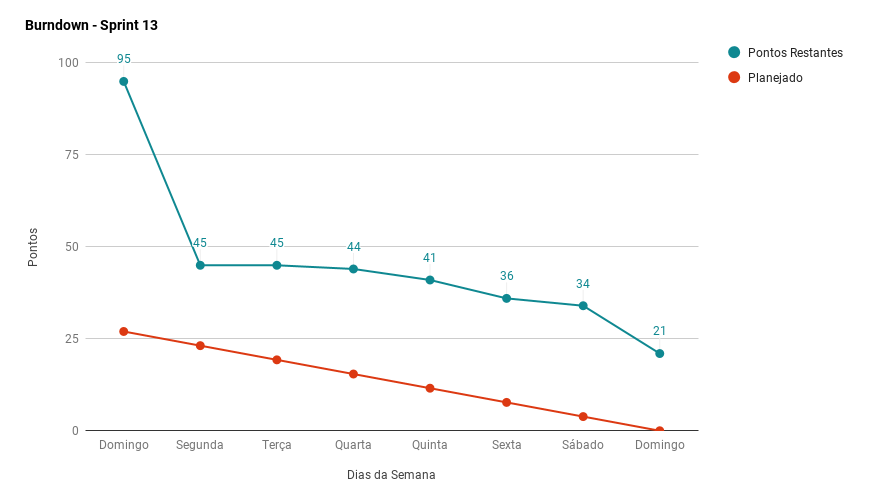
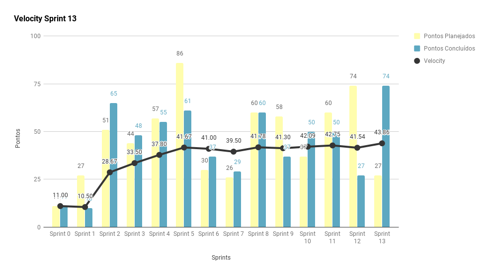
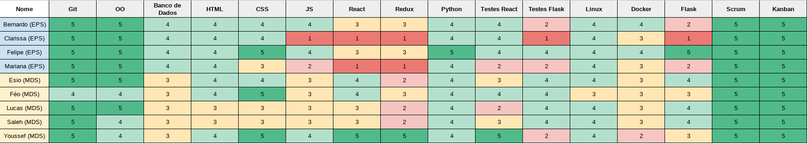
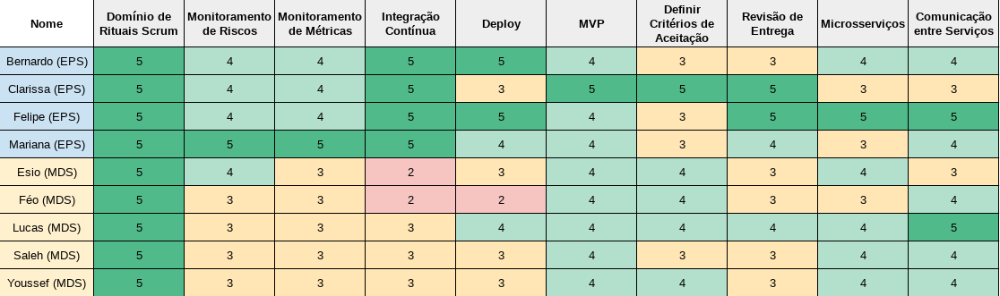

***    

<i>Sprint</i> final do projeto. Contempla o pagamento das dívidas da <i>sprint</i> anterior, e finaliza os fluxos da aplicação.

## Fechamento da _Sprint_   

|     _Issue_      |     _Status_    |       Pontos       |
|:--------------:|:---------------:|:-------------:|
|[Atualizar Documento de Arquitetura](https://github.com/fga-eps-mds/2018.2-Kalkuli/issues/219) | Concluída |   2 |
|[US39 - Fazer _Logout_ da Aplicação](https://github.com/fga-eps-mds/2018.2-Kalkuli/issues/220) | Concluída |  2 |
|[Ajustar Responsividade](https://github.com/fga-eps-mds/2018.2-Kalkuli/issues/221) |Não Concluída | 8 |
|[Atualizar Modelo de Maturidade](https://github.com/fga-eps-mds/2018.2-Kalkuli/issues/222) | Concluída |  1 |
|[Aumentar a Cobertura de Testes no _Front-End_](https://github.com/fga-eps-mds/2018.2-Kalkuli/issues/223) |Não Concluída | 8 |
|[Corrigir o Serviço de Relatórios](https://github.com/fga-eps-mds/2018.2-Kalkuli/issues/224) | Concluída | 3 |
|[Corrigir o Serviço de Exportação](https://github.com/fga-eps-mds/2018.2-Kalkuli/issues/225) | Concluída | 3 |
|[US38 - Editar Nota](https://github.com/fga-eps-mds/2018.2-Kalkuli/issues/203) | Concluída | 3 |
|[US22 - Gerar Relatório por Categoria](https://github.com/fga-eps-mds/2018.2-Kalkuli/issues/204) |Concluída | 5 |
|[Automatizar Sistema de Troca de Ambientes](https://github.com/fga-eps-mds/2018.2-Kalkuli/issues/209) | Concluída | 5 |
|[US27 - Gerar Gráfico de Gastos Totais](https://github.com/fga-eps-mds/2018.2-Kalkuli/issues/206) | Concluída | 8 |
|[Criar Sistema de Migrations](https://app.zenhub.com/workspace/o/fga-eps-mds/2018.2-kalkuli/issues/214)| Concluída | 8 |
|[US36 - Associar Notas à Empresa](https://github.com/fga-eps-mds/2018.2-Kalkuli/issues/205) | Concluída | 13 |
|[Realizar Testes de Usabilidade](https://github.com/fga-eps-mds/2018.2-Kalkuli/issues/211)|Não Concluída | 13 |

Pontos Planejados Concluídos: xx    
Pontos de Dívida Concluídos: x   
Pontos Não Agregados: x    

> [_Milestone Sprint_ 13](https://github.com/fga-eps-mds/2018.2-Kalkuli/milestone/14?closed=1)

## _Burndown_    

 

## _Velocity_     

 

## Riscos    

 

## Retrospectiva

A última retrospectiva da equipe originou o <a href="https://fga-eps-mds.github.io/2018.2-Kalkuli/docs/postmortem" title="Post Mortem - Kalkuli"><i>post mortem</i> do projeto</a>.

### Quadro de Conhecimento Final  

   

### Registros de Presença nas _Dailies_    

<ul>
<li><i>Dailies</i> de segunda e sexta feira são realizadas por <i>hangouts</i>, às 21h30 e 20h, respectivamente.</li>
<li><i>Dailies</i> de quarta-feira são realizadas por <i>telegram</i>, às 12h.</li>
<li><i>Dailies</i> de terça e quinta feira são realizadas presencialmente, às 15h50.</li>

| Nome    |Segunda Feira      | Terça Feira      | Quarta Feira     | Quinta Feira      | Sexta Feira      |     
|:-----:  |:-----------------:|:----------------:|:----------------:|:-----------------:|:----------------:|
|Bernardo |         ✘         |         ✔        |         ✘        |         ✔         |         ✔        |
|Clarissa |         ✘         |         ✔        |         ✔        |         ✔         |         ✘        |
|Esio     |         ✔         |         ✔        |         ✔        |         ✔         |         ✔        |
|Felipe   |         ✔         |         ✔        |         ✔        |         ✔         |         ✔        |
|Lucas    |         ✔         |         ✔        |         ✔        |         ✔         |         ✔        |
|Mariana  |         ✔         |         ✘        |         ✔        |         ✔         |         ✔        |
|Pedro    |         ✔         |         ✔        |         ✔        |         ✔         |         ✔        |
|Saleh    |         ✔         |         ✔        |         ✔        |         ✔         |         ✔        |
|Youssef  |         ✔         |         ✔        |         ✔        |         ✔         |         ✔        |      

## Avaliação do _Scrum Master_  

 
<i>Sprint</i> final do projeto, onde a equipe novamente assume altos riscos com a dívida técnica alta, ainda que o problema tenha sido apenas em integração das histórias de usuário, poderia comprometer a execução das histórias planejadas.

 
Apesar da alta pontuação oriunda de dívidas, a equipe foi capaz de liquidá-las e também finalizar a maioria das <i>issues</i> planejadas para a finalização e refino do fluxo da aplicação.

 
Os riscos mapeados para o projeto foram mitigados com sucesso, refletindo nas entregas de qualidade. A equipe finaliza o projeto com ótimos níveis de adesão às práticas ágeis.

