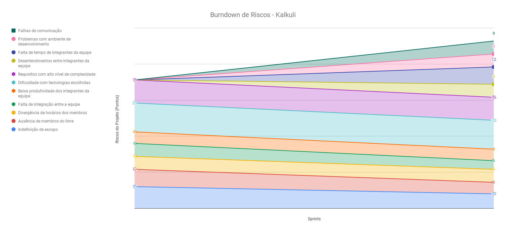
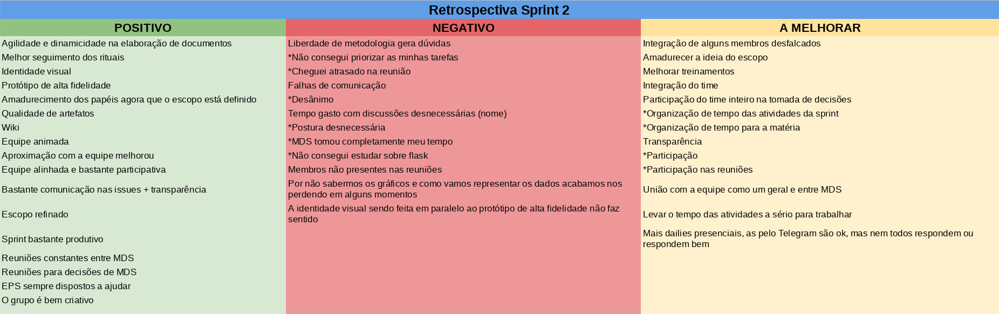
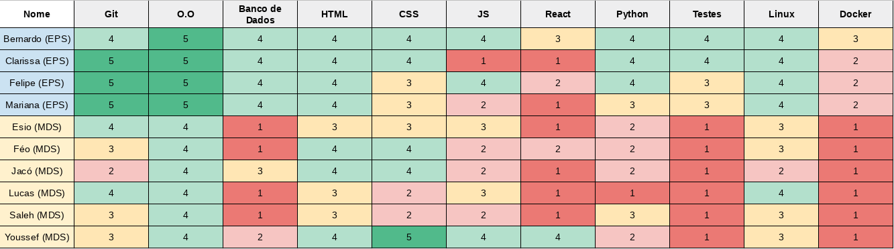

***    

<i>Sprint</i> que marca o fechamento do escopo, a escolha de tecnologias, o amadurecimento da ideia de produto, e a criação de seu <a href="https://docs.google.com/spreadsheets/d/1jOOtXSgxs4OZE-kTbZ6oTa4Jjy1Ix0aCNGvWIttggRk/edit#gid=0"><i>backlog</i></a> completo.

## Fechamento da _Sprint_    

A equipe se mostrou proativa e conseguiu entregar praticamente tudo o que foi planejado, inclusive a dívida vinda da <i>sprint</i> anterior. Provavelmente o feriado no final da semana tenha ajudado a aumentar as entregas. Isso favorece o início da construção do <i>software</i>, para que a equipe comece a entregar executáveis.

Durante o <i>review</i>, a equipe de MDS apresentou o protótipo de alta fidelidade, que precisará de ajustes para se adequar à identidade visual, também completa durante a <i>sprint</i>. MDS, juntamente com o arquiteto, apresentou a versão inicial do documento de arquitetura, que também soferá ajustes. O <i>devOps</i> <a href="https://github.com/bernardohrl/lets-docker">instruiu</a> a equipe para utilizar <i>docker</i>.

|     _Issue_      |     _Status_    |
|:--------------:|:---------------:|
|[Definir Política de _Branches_ e _Commits_](https://github.com/fga-eps-mds/PDF2Knowledge/issues/10)| Concluída |
|[Finalizar o Community Profile do Repositório](https://github.com/fga-eps-mds/PDF2Knowledge/issues/15)| Concluída |
|[Elaborar Quadro de Conhecimento](https://github.com/fga-eps-mds/PDF2Knowledge/issues/40)| Concluída |
|[Subir _Wiki_ ](https://github.com/fga-eps-mds/PDF2Knowledge/issues/33)| Concluída |
|[Refinar o Documento de Visão](https://github.com/fga-eps-mds/PDF2Knowledge/issues/31)| Concluída |
|[Iniciar _Roadmap_ do Arquiteto](https://github.com/fga-eps-mds/PDF2Knowledge/issues/20)| Concluída |
|[Protótipos de Alta Fidelidade](https://github.com/fga-eps-mds/PDF2Knowledge/issues/23) | Concluída |
|[Definir Identidade Visual](https://github.com/fga-eps-mds/PDF2Knowledge/issues/22) | Concluída |
|[Iniciar o Documento de Arquitetura](https://github.com/fga-eps-mds/PDF2Knowledge/issues/27) | Concluída |
|[Estudar Sobre Notas Fiscais](https://github.com/fga-eps-mds/PDF2Knowledge/issues/32)| Concluída |
|[Pesquisa de Possível Público Alvo](https://github.com/fga-eps-mds/PDF2Knowledge/issues/37) | Concluída |
|[Fazer _Canvas_](https://github.com/fga-eps-mds/PDF2Knowledge/issues/38)| Concluída |
|[_Burndown_ de Riscos](https://github.com/fga-eps-mds/PDF2Knowledge/issues/9)| Concluída |
|[Estudar _Docker_ e Preparar um Treinamento](https://github.com/fga-eps-mds/PDF2Knowledge/issues/39)| Concluída |
|[Elaborar EAP](https://github.com/fga-eps-mds/PDF2Knowledge/issues/11)| Concluída |
|[Elaborar TAP](https://github.com/fga-eps-mds/PDF2Knowledge/issues/12)| Concluída |
|[Iniciar _Roadmap_ do _Product Manager_](https://github.com/fga-eps-mds/PDF2Knowledge/issues/34)| Concluída | 
|[Iniciar _Roadmap_ do _DevOps_](https://github.com/fga-eps-mds/PDF2Knowledge/issues/35)| Concluída |
|[Definir Backlog do Produto](https://github.com/fga-eps-mds/PDF2Knowledge/issues/36) | Concluída | 
|[Iniciar _Roadmap_ do produto](https://github.com/fga-eps-mds/PDF2Knowledge/issues/8)| Não Concluída |   

---    

> [Milestone Sprint 2](https://github.com/fga-eps-mds/PDF2Knowledge/milestone/3?closed=1)

## Riscos

 

## Retrospectiva     

A retrospectiva consumiu muito tempo, visto que foram expostos pontos críticos a respeito da relação interna do grupo de MDS, e falhas de comunicação, que foram extensamente discutidos. Foram apresentados como pontos negativos, e pontos a melhorar.

 

    

_(Afirmações precedidas do asterisco são de cunho pessoal)._
 

### _Sprint_ Anterior

Com relação aos pontos negativos apresentados na retrospectiva anterior, algumas medidas foram tomadas para que não se mostrassem novamente, são eles:

<table>
  <tr>
    <th>Ponto Negativo</th>
    <th>Correção Adotada</th>
  </tr>
  <tr>
    <td>A reunião passada foi desorganizada.</td>
    <td>Criação de <a href="https://github.com/fga-eps-mds/2018.2-Kalkuli/issues/29"><i>issue</i></a> que expõe o pré-planejamento dos rituais com o que será abordado, e estimativa de duração.</td>
  </tr>
  <tr>
    <td>Demora na definição do tema do projedo devido as poucas informações.</td>
    <td>A <i>Product Manager</i> criou um <a href="https://github.com/fga-eps-mds/2018.2-Kalkuli/issues/37">questionário</a> para coletar informações e estabelecer o foco do produto.</td>
  </tr>
</table>

### Quadro de Conhecimento   

As tecnologias que serão utilizadas no projeto foram definidas, e o quadro de conhecimento pôde ser criado. Favorecerá o rastreio da evolução técnica da equipe.

### Registros de Presença nas _Dailies_    

| Nome    |Segunda Feira      | Terça Feira      | Quarta Feira     | Quinta Feira      | Sexta Feira      |     
|:-----:  |:-----------------:|:----------------:|:----------------:|:-----------------:|:----------------:|
|Bernardo |         ✔         |         ✔        |         ✔        |          ✘        |          ✘       |
|Clarissa |         ✔         |         ✔        |         ✔        |         ✔         |         ✔        |
|Esio     |         ✔         |         ✔        |         ✔        |         ✔         |         ✔        |
|Felipe   |         ✔         |         ✔        |         ✔        |         ✔         |          ✘       |
|Jacó     |          ✘        |         ✔        |         ✘        |         ✔         |         ✔        |
|Lucas    |         ✔         |         ✔        |         ✔        |         ✔         |         ✔        |
|Mariana  |         ✔         |         ✔        |         ✔        |         ✔         |         ✔        |
|Pedro    |         ✔         |         ✔        |         ✔        |         ✘         |         ✔        |
|Saleh    |         ✔         |         ✔        |         ✔        |         ✔         |         ✔        |
|Youssef  |          ✘        |         ✔        |         ✔        |         ✔         |         ✔        |
 

