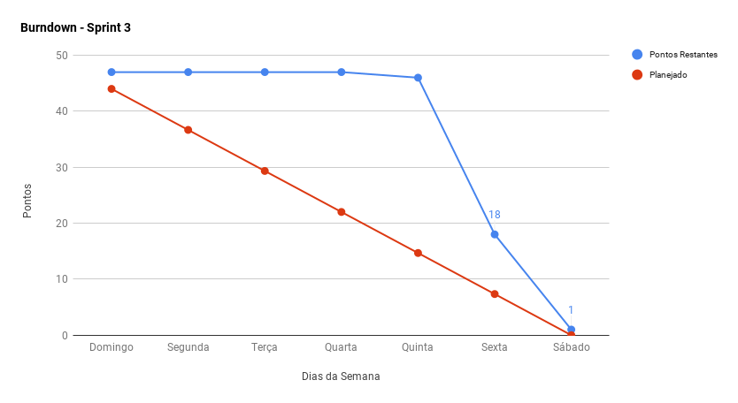
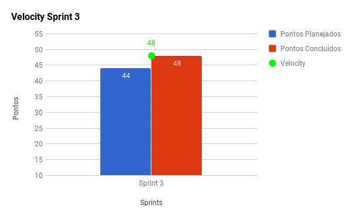
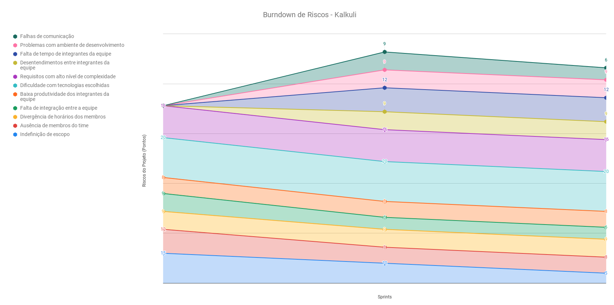
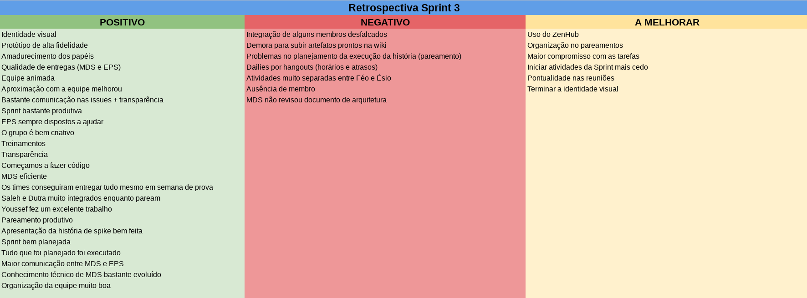
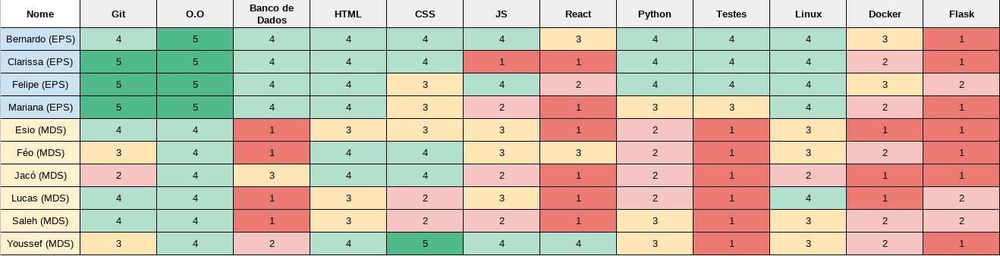

***    

<i>Sprint</i> que marca as primeiras entregas de <i>software</i>, a <i>dockerização</i> dos repositórios do projeto, a formalização de métricas e indicadores que serão utilizados buscando qualidade, e a finalização da parte arquitetural do projeto.

## Fechamento da _Sprint_     

|     _Issue_      |     _Status_    |       Pontos       |
|:--------------:|:---------------:|:-------------:
|[US19 - Fazer o upload de uma nota fiscal ](https://github.com/fga-eps-mds/2018.2-Kalkuli/issues/46) |Concluída |13 |
|[US16 - Pesquisar o padrão de notas fiscais](https://github.com/fga-eps-mds/2018.2-Kalkuli/issues/49)|Concluída| 8|
|[Refatorar Protótipo](https://github.com/fga-eps-mds/2018.2-Kalkuli/issues/50) |Concluída | 2|
|[Refinar Documento de Arquitetura](https://github.com/fga-eps-mds/2018.2-Kalkuli/issues/51) |Concluída | 1|
|[Criar Organização](https://github.com/fga-eps-mds/2018.2-Kalkuli/issues/52) | Concluída |0|
|[Criar Repositórios _Dockerizados_](https://github.com/fga-eps-mds/2018.2-Kalkuli/issues/53)|Concluída | 3|
|[Estimar Custos](https://github.com/fga-eps-mds/2018.2-Kalkuli/issues/54)|Concluída | 3|
|[Elaborar o Diagrama de Dados](https://github.com/fga-eps-mds/2018.2-Kalkuli/issues/55)|Concluída | 2|
|[Criar o Documento de Resultados da _Sprint_ 2](https://github.com/fga-eps-mds/2018.2-Kalkuli/issues/56)|Concluída | 0 |
|[Criar o Documento de Planejamento da _Sprint_ 3](https://github.com/fga-eps-mds/2018.2-Kalkuli/issues/57)|Concluída | 0|  
|[Criar o Plano de Medição](https://github.com/fga-eps-mds/2018.2-Kalkuli/issues/58)|Concluída | 2|  
|[Refatorar TAP](https://github.com/fga-eps-mds/2018.2-Kalkuli/issues/59)|Concluída | 1|  
|[Treinamento de Flask](https://github.com/fga-eps-mds/2018.2-kalkuli/issues/64)|Concluída | 2 |
|[Iniciar _Roadmap_ do produto](https://github.com/fga-eps-mds/PDF2Knowledge/issues/8) |Concluída | 3 |
|[US31 - Criar interface gráfica para realizar upload de notas fiscais](https://github.com/fga-eps-mds/2018.2-Kalkuli/issues/48) |Concluída| 8 |    
|[Refatorar _Canvas_](https://github.com/fga-eps-mds/2018.2-Kalkuli/issues/60)| Não Concluída |1| 

Pontos Planejados Concluídos: 45     
Pontos de Dívida Concluídos:  3    
Pontos Não Agregados: 1   

> [_Milestone Sprint_ 3](https://github.com/fga-eps-mds/2018.2-Kalkuli/milestone/4?closed=1)

## _Burndown_    

O <i>burndown</i> indica que as <i>issues</i> foram entregues tardiamente. Quase toda a equipe de desenvolvimento <a href="https://github.com/fga-eps-mds/2018.2-Kalkuli/issues/29#issuecomment-417966373" title="Quadro de Provas de Integrantes da Equipe">estava atarefada com outras disciplinas</a>, e as provas só acabaram no final da <i>sprint</i> (quinta feira).
 

## _Velocity_     

Após o fechamento do escopo na <i>sprint</i> anterior, foi possível alocar mais histórias, e concluir a dívida relacionada ao escopo.
   

O <i>velocity</i> aumenta à medida que a equipe ganha maturidade, permitindo o aumento gradual da pontuação total das próximas <i>sprints</i>.
   

## Riscos    

Baseado no desempenho da equipe durante a semana, a probabilidade dos riscos existentes foram determinados para a próxima <i>sprint</i>. Os pontos foram definidos com a participação de toda a equipe, após a retrospectiva. Objetivo é tornar o monitoramento de riscos transparente para toda a equipe, e que seja possível com que todos visualizem sua evolução.

  

 

## Retrospectiva

Pontos positivos aumentaram em comparação com a <a href="https://fga-eps-mds.github.io/2018.2-Kalkuli/docs/rsprint2#retrospectiva" title="Retrospectiva Sprint 2"><i>sprint</i> anterior</a>. Novos pontos negativos foram apontados, contudo, alguns deles refletem apenas dois riscos já mapeados, e os outros pontos negativos refletiram acontecimentos isolados.

   

   

### _Sprint_ Anterior

Medidas tomadas para que pontos negativos elencados na semana anterior não se mostrassem novamente:

<table>
  <tr align="center">
    <th>Ponto Negativo/Melhorar</th>
    <th>Correção Adotada</th>
  </tr>
  <tr align="left">
    <td> Mais <i>dailies</i> presenciais, as pelo <i>Telegram</i> são ok, mas nem todos respondem ou respondem bem   </td>
    <td><i>Dailies</i> de segunda e sexta serão realizadas via <i>hangouts</i>, e não mais por <i>telegram</i>. Terão duração de 20 minutos e começarão às 21h30.</td>
  </tr>
  <tr align="left">
    <td>
    <ul> 
     <li>Falhas de comunicação</li>
     <li>Membros não presentes nas reuniões</li>
     <li>Participação do time inteiro na tomada de decisões</li>
     <li>União com a equipe como um geral e entre MDS</li>
    </ul>
    </td>
    <td align='center'>
A equipe expôs pontos que se conectam com três riscos: falha de comunicação, desentendimentos entre integrantes da equipe e integração do time. As medidas acordadas envolvem maior eficiência na comunicação, através de <i>dailies</i> mais focadas e maior envolvimento com membros desfalcados, através de adaptação de horários para que todos possam participar de todas a decisões que serão tomadas. Com relação aos desentendimentos, a retrospectiva teve duração maior que o usual para que os pontos levantados fossem discutidos. A postura em relação ao time deve ser de respeito.
</td>
  </tr>
</table>

### Quadro de Conhecimento   

### Registros de Presença nas _Dailies_    

| Nome    |Segunda Feira      | Terça Feira      | Quarta Feira     | Quinta Feira      | Sexta Feira      |     
|:-----:  |:-----------------:|:----------------:|:----------------:|:-----------------:|:----------------:|
|Bernardo |         ✔         |         ✔        |         ✔        |         ✔         |         ✘        |
|Clarissa |         ✔         |         ✔        |         ✔        |         ✔         |         ✘        |
|Esio     |         ✔         |         ✔        |         ✔        |         ✔         |         ✘        |
|Felipe   |         ✔         |         ✔        |         ✔        |         ✔         |         ✔        |
|Jacó     |         ✔         |         ✔        |         ✔        |         ✔         |         ✔        |
|Lucas    |         ✔         |         ✔        |         ✔        |         ✔         |         ✔        |
|Mariana  |         ✔         |         ✘        |         ✔        |         ✔         |         ✔        |
|Pedro    |         ✔         |         ✔        |         ✔        |         ✔         |         ✔        |
|Saleh    |         ✔         |         ✔        |         ✔        |         ✔         |         ✔        |
|Youssef  |         ✔         |         ✔        |         ✔        |         ✔         |         ✔        |    

## Avaliação do _Scrum Master_     

A equipe se mostra mais uma vez proativa, onde, mesmo numa semana caótica para a equipe de desenvolvimento, as histórias que eram de responsabilidade deles foram entregues. EPS, buscando qualidade, prepara repositórios para integrações contínuas, e rebusca o escopo, reduzindo seu risco de indefinição.
  

O <i>burndown</i> reflete a entrega tardia das <i>issues</i>, dado o cenário em que a <i>sprint</i> aconteceu. Para as próximas <i>sprints</i>, é esperado que o <i>burndown</i> reflita a quiema uniforme dos pontos, que, nessa <i>sprint</i>, foi atípica. Apesar da semana da <i>sprint</i> ter colidido com a semana mais cheia para a equipe (provas), praticamente todas as <i>issues</i> foram entregues, mostrando que a equipe está motivada e é produtiva.
 

Durante a <i>sprint</i>, uma nova <i>issue</i> foi adicionada, visando a capacitação da equipe de desenvolvimento e a mitigação do risco de dificuldade com tecnologias adotadas. <a href="https://github.com/fga-eps-mds/2018.2-Kalkuli/issues/64" title="Realizar treinamento de Flask">(<i>Flask</i>)</a>  

 

Não foram identificados riscos novos no decorrer da <i>sprint</i>.
Entretanto, um dos riscos já mapeados se mostrou bastante: ausência de membros do time. A medida de prevenção adotada se resumiu na busca de horários convenientes para que o integrante ausente participasse, e o trabalho de mitigação do risco de falhas de comunicação favoreceria sua participação objetiva.
 

Em comparação com a <i>sprint</i> anterior, foi possível perceber a melhora da comunicação entre a equipe, fazendo com que o risco de falha de comunicação diminua. A escrita do <i>backlog</i> do produto completo com a participação total da equipe, esclareceu pontas soltas no escopo, favorecendo a diminuição do risco de indefinição de escopo.

A dificuldade com tecnologias ainda é um risco com probabilidade alta, dado que nem todos os membros da equipe entraram em contato com as tecnologias durante a <i>sprint</i>.

 

O final da <i>sprint</i> marca acertos e erros por parte das equipes de MDS e EPS. Erros como MDS começar tardiamente as <i>issues</i>, e EPS por revisá-las tardiamente, entre falhas como atrasos nas reuniões, principalmente nas <i>dailies</i>, sobrecarga de membro por conta de ausência do parceiro, e falta de atenção com as <i>pipelines</i> do <i>ZenHub</i>. Dentre os pontos positivos, vale destacar a comunicação da equipe, o empenho em entregar as tarefas mesmo numa semana caótica, os treinamentos de qualidade, e os planejamentos rápidos e eficientes.

 