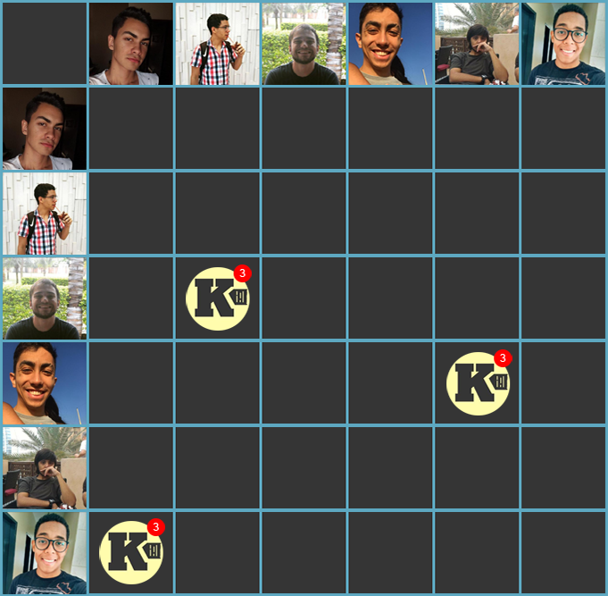

***    

Início dos pareamentos, criação da <a href="https://github.com/Kalkuli">organização</a> do projeto, preparo de ambientes, e criação de containers para desenvolvimento.

Buscando aumentar a qualidade do projeto, essa <i>sprint</i> também almeja <i>dockerizar</i> os repositórios, para, na <i>sprint</i> 4, preparar as integrações contínuas. Faz parte da proposta de melhoria contínua, e contempla os papeis do <i>DevOps</i> e do <i>Scrum Master</i>.

Da <i>sprint</i> anterior, a <i>issue</i> de <a href="https://github.com/fga-eps-mds/PDF2Knowledge/issues/8">criar o <i>roadmap</i> do produto</a> ficou como dívida para ser liquidada.

## Tamanho da _Sprint_      
**Início:** 09/09/2018   
**Término:** 15/09/2018   

**Duração:** Sete dias   

## Pareamentos   
 

- Pedro Féo e Ésio | [US16](https://github.com/fga-eps-mds/2018.2-Kalkuli/issues/49)
- Lucas Dutra e Saleh | [US19](https://github.com/fga-eps-mds/2018.2-Kalkuli/issues/46)
- Youssef e Jacó | [US31](https://github.com/fga-eps-mds/2018.2-Kalkuli/issues/48)

## Objetivos   

|     _Issue_      |    Pontos   |
|:--------------:|:---------:|
|[US19 - Fazer o upload de uma nota fiscal ](https://github.com/fga-eps-mds/2018.2-Kalkuli/issues/46) | 13 |
|[US31 - Criar interface gráfica para realizar upload de notas fiscais](https://github.com/fga-eps-mds/2018.2-Kalkuli/issues/48) | 8 |    
|[US16 - Pesquisar o padrão de notas fiscais](https://github.com/fga-eps-mds/2018.2-Kalkuli/issues/49)| 8|
|[Refatorar Protótipo](https://github.com/fga-eps-mds/2018.2-Kalkuli/issues/50) |2|
|[Refinar Documento de Arquitetura](https://github.com/fga-eps-mds/2018.2-Kalkuli/issues/51) |1|
|[Criar Organização](https://github.com/fga-eps-mds/2018.2-Kalkuli/issues/52)  |0|
|[Criar Repositórios _Dockerizados_](https://github.com/fga-eps-mds/2018.2-Kalkuli/issues/53)|3|
|[Estimar Custos](https://github.com/fga-eps-mds/2018.2-Kalkuli/issues/54)|3|
|[Elaborar o Diagrama de Dados](https://github.com/fga-eps-mds/2018.2-Kalkuli/issues/55) |2|
|[Criar o Documento de Resultados da _Sprint_ 2](https://github.com/fga-eps-mds/2018.2-Kalkuli/issues/56)|0 |
|[Criar o Documento de Planejamento da _Sprint_ 3](https://github.com/fga-eps-mds/2018.2-Kalkuli/issues/57)|0|  
|[Criar o Plano de Medição](https://github.com/fga-eps-mds/2018.2-Kalkuli/issues/58)|2|  
|[Refatorar TAP](https://github.com/fga-eps-mds/2018.2-Kalkuli/issues/59)|1|  
|[Refatorar _Canvas_](https://github.com/fga-eps-mds/2018.2-Kalkuli/issues/60)|1|

<b>Total de pontos planejados: 44</b>  

### Dívida    

|     _Issue_      |    Pontos   |
|:--------------:|:---------:|
|[Iniciar _Roadmap_ do produto](https://github.com/fga-eps-mds/PDF2Knowledge/issues/8) | 3 |

<b>Total: 47</b> 

### _Issues_ Acrescentadas Durante a _Sprint_  

|     _Issue_      |    Pontos   |
|:--------------:|:---------:|
|[Treinamento de Flask](https://github.com/fga-eps-mds/2018.2-kalkuli/issues/64)| 2 |   

***

 Total de pontos da <i>sprint</i>: 49 
  

> [_Sprint_ _Backlog_](https://github.com/fga-eps-mds/2018.2-Kalkuli/milestone/4)  

## Papeis

**Arquiteto:** [Felipe Hargreaves](https://github.com/Hargre)   
**DevOps:** [Bernardo Henrique](https://github.com/bernardohrl)  
**Product Manager:** [Clarissa Borges](https://github.com/clarissalimab)    
**Tech Leader:** [Mariana Pícolo](https://github.com/MarianaPicolo)   
**Equipe de Desenvolvimento:** 
- [Esio Gustavo](https://github.com/EsioFreitas)   
- [Jacó Apolinário](https://github.com/Jacoapolinario)   
- [Lucas Dutra](https://github.com/lucasdutraf)   
- [Pedro Féo](https://github.com/Phe0)   
- [Saleh Nazih](https://github.com/devsalula)
- [Youssef Muhamad](https://github.com/youssef-md)   