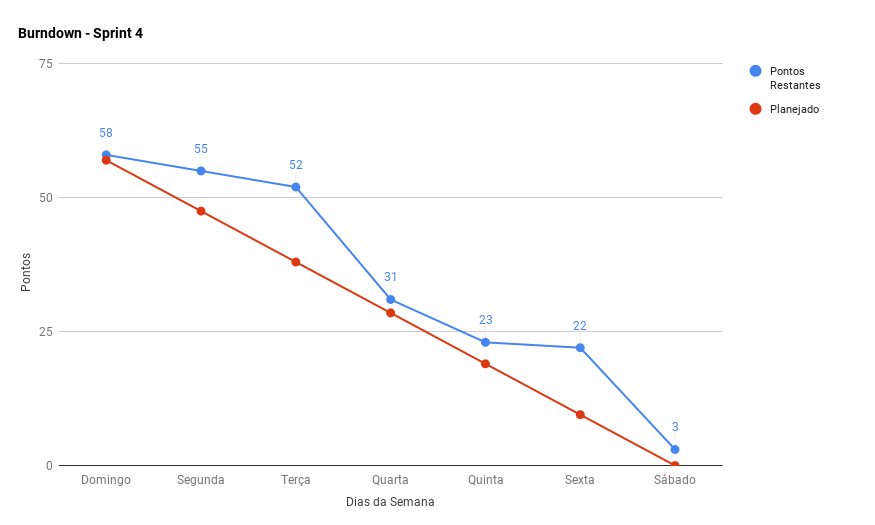
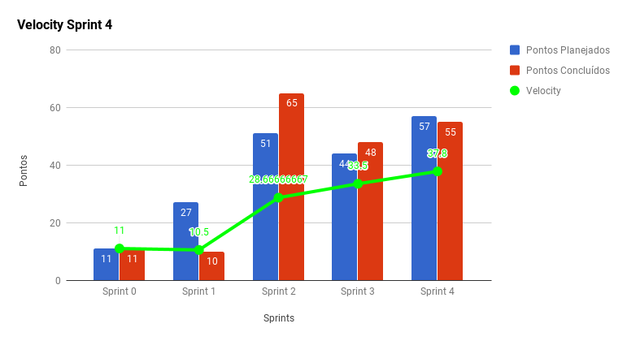
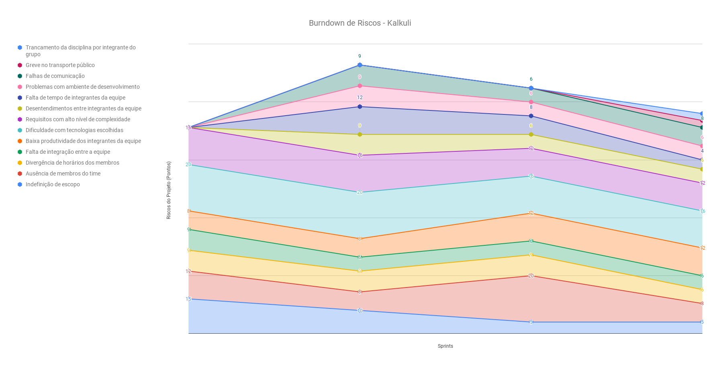
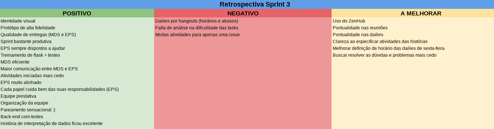
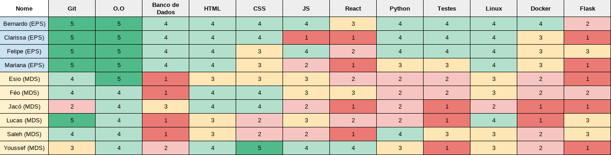

***    

- fechamento da sprint
   - quadro de pŕaticas ágeis em desenvolvimento de softwar
   - retrospectiva
        - medidas adotadas para correção de erros apontados na sprint anterior
- metricas de qualidade de codigo     

<i>Sprint</i> que simboliza a busca do aumento de qualidade através da adição de integrações contínuas e ambientes de testes em todos os repositórios, como também a entrega do <i>core</i> da aplicação, a intepretação dos dados de notas fiscais.

## Fechamento da _Sprint_   

|     _Issue_      |     _Status_    |       Pontos       |
|:--------------:|:---------------:|:-------------:
|[US13 - Listar notas fiscais ](https://github.com/fga-eps-mds/2018.2-Kalkuli/issues/72) |Concluída | 8 |
|[US17 - Interpretar dados de notas fiscais ](https://github.com/fga-eps-mds/2018.2-Kalkuli/issues/73) |Concluída | 21 |
|[US32 - Armazenar notas fiscais no sistema ](https://github.com/fga-eps-mds/2018.2-Kalkuli/issues/74) |Concluída | 8 |
|[Configurar o _Code Climate_ ](https://github.com/fga-eps-mds/2018.2-Kalkuli/issues/75) |Concluída | 3 |
|[Configurar as Integrações Contínuas ](https://github.com/fga-eps-mds/2018.2-Kalkuli/issues/76) |Concluída | 5 |
|[Refatorar EAP ](https://github.com/fga-eps-mds/2018.2-Kalkuli/issues/77) |Concluída | 3 |
|[Elaborar a Matriz de Avaliação de Valor ](https://github.com/fga-eps-mds/2018.2-Kalkuli/issues/78) |Não Concluída | 3 |

Pontos Planejados Concluídos: 54    
Pontos de Dívida Concluídos:  1   
Pontos Não Agregados: 3 

> [Milestone Sprint X](https://github.com/fga-eps-mds/2018.2-Kalkuli/milestone/4?closed=1)

## _Burndown_    

O <i>burndown</i> indica que as <i>issues</i> entregues tinham pontuações altas, representando alta complexidade e valor para o produto. 

 
Foi apontado na retrospectiva da <i>sprint</i> anterior, que as histórias foram começadas tardiamente. Nesta <i>sprint</i> esperava-se que as entregas começassem a partir de terça-feira, dado que toda a  <a href="https://github.com/fga-eps-mds/2018.2-Kalkuli/issues/29#issuecomment-420445456" title="Quadro de Provas de Integrantes da Equipe">equipe de desenvolvimento teria provas</a> nesta data. A equipe de EPS também teria provas na semana da <i>sprint</i>, contudo, foi capaz de entregar suas <i>issues</i> porque as começou com antecedência.

## _Velocity_     

A pontuação planejada em relação à <i>sprint</i> anterior aumentou, evidenciando a busca pela produtividade máxima.

O empenho e a capacidade da equipe em finalizar as <i>issues</i> reflete a incidência de poucas dívidas, e resulta no aumento gradual da pontuação da <i>sprint</i>.

   

## Riscos    

  

 

## Retrospectiva

texto

   

   

### _Sprint_ Anterior

Com relação aos pontos negativos apresentados na retrospectiva anterior, algumas medidas foram tomadas para que não se mostrassem novamente, são eles:

<table>
  <tr>
    <th>Ponto Negativo</th>
    <th>Correção Adotada</th>
  </tr>
  <tr>
    <td></td>
    <td></td>
  </tr>
  <tr>
    <td></td>
    <td></td>
  </tr>
</table>

### Quadro de Conhecimento   

texto

### Registros de Presença nas _Dailies_    

<i>Dailies</i> de segunda e sexta feira são feitas por <i>hangouts</i>, às 21h30.

| Nome    |Segunda Feira      | Terça Feira      | Quarta Feira     | Quinta Feira      | Sexta Feira      |     
|:-----:  |:-----------------:|:----------------:|:----------------:|:-----------------:|:----------------:|
|Bernardo |         ✔         |         ✔        |         ✘        |         ✔         |         ✔        |
|Clarissa |         ✔         |         ✔        |         ✔        |         ✔         |         ✔        |
|Esio     |         ✔         |         ✔        |         ✔        |         ✔         |         ✔        |
|Felipe   |         ✔         |         ✔        |         ✔        |         ✔         |         ✔        |
|Jacó     |         ✔         |         ✔        |         ✔        |         ✔         |         ✔        |
|Lucas    |         ✔         |         ✔        |         ✔        |         ✔         |         ✘        |
|Mariana  |         ✔         |         ✘        |         ✔        |         ✔         |         ✔        |
|Pedro    |         ✔         |         ✔        |         ✘        |         ✔         |         ✔        |
|Saleh    |         ✔         |         ✔        |         ✔        |         ✔         |         ✔        |
|Youssef  |         ✘         |         ✔        |         ✘        |         ✔         |         ✔        |      

## Avaliação do _Scrum Master_  

As duplas de pareamento eram diferentes da <i>sprint</i> anterior, para facilitar a troca de conhecimento, em razão de as duplas foram definidas levando em consideração o conhecimento de cada integrante nas tecnologias, e o objetivo foi de balancear o nível de conhecimento. Portanto, esperava-se que as issues fossem entregues mais rapidamente.

