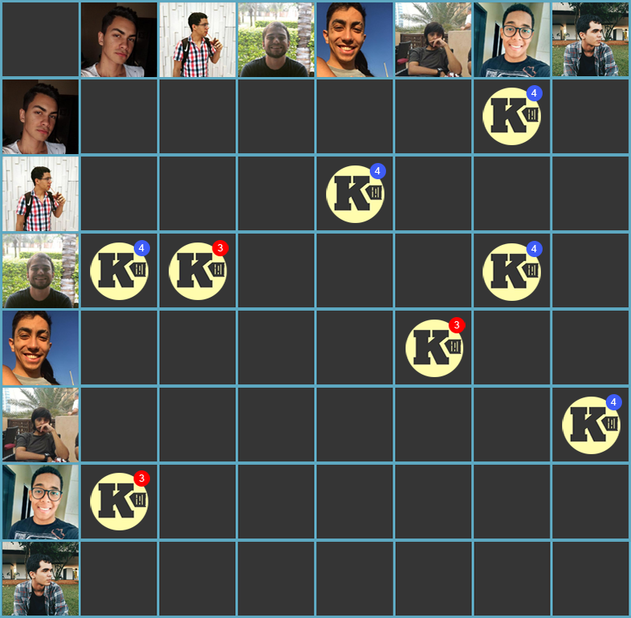

***    

<i>Sprint</i> de incremento do produto com as histórias de interpretação dos dados, listagem e armazenamento de notas fiscais. Início do pareamento entre EPS e MDS.

Busca de melhoria contínua através da configuração dos ambientes de testes, da adição de integração contínua nos repositórios, adição e configuração de ferramenta para monitorar a qualidade do código. Objetivos mapeados no <a href="https://fga-eps-mds.github.io/2018.2-Kalkuli/docs/roadmap" title="Roadmap do Produto, Release I."><i>roadmap</i></a>.    

Da <i>sprint</i> anterior, a <i>issue</i> de <a href="https://github.com/fga-eps-mds/2018.2-Kalkuli/issues/60"> Refatorar o <i>Canvas</i></a> ficou como dívida para ser liquidada.

## Tamanho da _Sprint_      
**Início:** 16/09/2018   
**Término:** 22/09/2018   

**Duração:** Sete dias   

## Pareamentos   
 

- Lucas Dutra e Ésio | [US13](https://github.com/fga-eps-mds/2018.2-Kalkuli/issues/72)
- Felipe Hargreaves e Saleh | [US17](https://github.com/fga-eps-mds/2018.2-Kalkuli/issues/73)
- Pedro Féo, Youssef e Jacó | [US32](https://github.com/fga-eps-mds/2018.2-Kalkuli/issues/74)

## Objetivos   

|     _Issue_      |    Pontos   |
|:--------------:|:---------:|
|[US13 - Listar notas fiscais ](https://github.com/fga-eps-mds/2018.2-Kalkuli/issues/72) | 8 |
|[US17 - Interpretar dados de notas fiscais ](https://github.com/fga-eps-mds/2018.2-Kalkuli/issues/73) | 21 |
|[US32 - Armazenar notas fiscais no sistema ](https://github.com/fga-eps-mds/2018.2-Kalkuli/issues/74) | 8 |
|[Configurar o _Code Climate_ ](https://github.com/fga-eps-mds/2018.2-Kalkuli/issues/75) | 3 |
|[Configurar as Integrações Contínuas ](https://github.com/fga-eps-mds/2018.2-Kalkuli/issues/76) | 5 |
|[Refatorar EAP ](https://github.com/fga-eps-mds/2018.2-Kalkuli/issues/77) | 3 |
|[Elaborar a Matriz de Avaliação de Valor ](https://github.com/fga-eps-mds/2018.2-Kalkuli/issues/78) | 3 |

<b>Total de pontos planejados: 51</b>  

### Dívida    

|     _Issue_      |    Pontos   |
|:--------------:|:---------:|
|[Refatorar Canvas](https://github.com/fga-eps-mds/2018.2-Kalkuli/issues/60) | 1 |

<b>Total: 52</b> 

### _Issues_ Acrescentadas Durante a _Sprint_  

|     _Issue_      |    Pontos   |
|:--------------:|:---------:|
|[Configurar Ambiente de Testes](https://github.com/fga-eps-mds/2018.2-Kalkuli/issues/81)| 3 |
|[Configurar Bancos de Dados dos Serviços](https://github.com/fga-eps-mds/2018.2-Kalkuli/issues/80)| 3 |   

***

 Total de pontos da <i>sprint</i>: 57 
  

> [_Sprint_ _Backlog_](https://github.com/fga-eps-mds/2018.2-Kalkuli/milestone/5)  

## Papeis

**Arquiteto:** [Felipe Hargreaves](https://github.com/Hargre)   
**DevOps:** [Bernardo Henrique](https://github.com/bernardohrl)  
**Product Manager:** [Clarissa Borges](https://github.com/clarissalimab)    
**Tech Leader:** [Mariana Pícolo](https://github.com/MarianaPicolo)   
**Equipe de Desenvolvimento:** 
- [Esio Gustavo](https://github.com/EsioFreitas)   
- [Jacó Apolinário](https://github.com/Jacoapolinario)   
- [Lucas Dutra](https://github.com/lucasdutraf)   
- [Pedro Féo](https://github.com/Phe0)   
- [Saleh Nazih](https://github.com/devsalula)
- [Youssef Muhamad](https://github.com/youssef-md)   