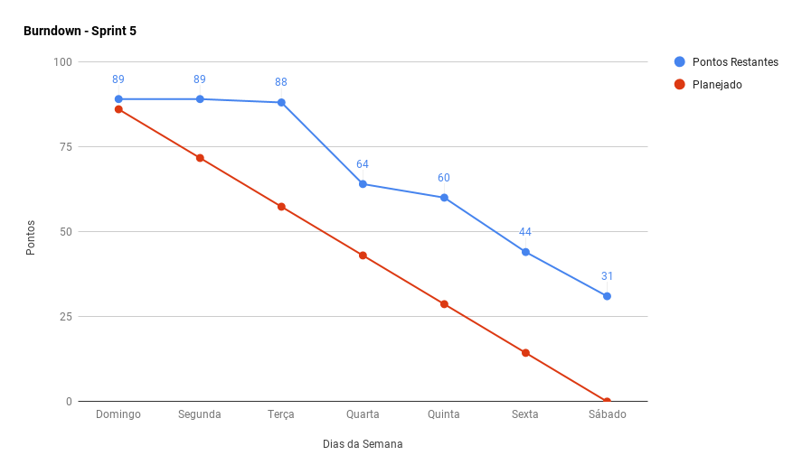
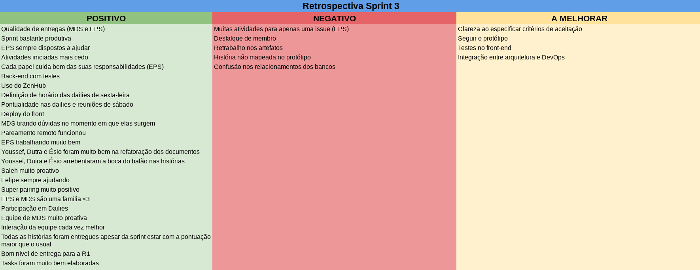
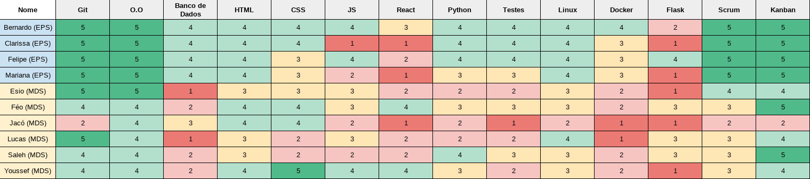

***    

<i>Sprint</i> que consolida a primeira versão funcional do <i>software</i>, alcançando, parcialmente, o planejado para a primeira <i>release</i>.

## Fechamento da _Sprint_   

|     _Issue_      |     _Status_    |       Pontos       |
|:--------------:|:---------------:|:-------------:
|[US10 - Editar Envio de Uma Nota](https://github.com/fga-eps-mds/2018.2-Kalkuli/issues/91) |Concluída | 5 |  
|[US14 - Visualizar Uma Nota Detalhadamente](https://github.com/fga-eps-mds/2018.2-Kalkuli/issues/92) |Concluída | 8 |
|[US19 - Fazer o upload de uma nota fiscal ](https://github.com/fga-eps-mds/2018.2-Kalkuli/issues/46) |Concluída |3 |
|[US20 - Gerar Relatório de Notas Fiscais em Um Período Selecionado](https://github.com/fga-eps-mds/2018.2-Kalkuli/issues/94) | Concluída | 13 |
|[Atualizar _Readmes_](https://github.com/fga-eps-mds/2018.2-Kalkuli/issues/100) |Concluída | 1 |  
|[Refatorar Documento de Visão](https://github.com/fga-eps-mds/2018.2-Kalkuli/issues/95) |Concluída | 2 |
|[Corrigir _Layouts_ da _Wiki_](https://github.com/fga-eps-mds/2018.2-Kalkuli/issues/99) |Concluída | 2|  
|[Refatorar Documento de Arquitetura](https://github.com/fga-eps-mds/2018.2-Kalkuli/issues/96) |Concluída | 3 |  
|[Elaborar a Matriz de Avaliação de Valor ](https://github.com/fga-eps-mds/2018.2-Kalkuli/issues/78) |Concluída | 3 |
|[Pontuar _Sprints_ Anteriores](https://github.com/fga-eps-mds/2018.2-Kalkuli/issues/98) |Concluída | 8 |  
|[Unir _Back-end_ e _Front-end_](https://github.com/fga-eps-mds/2018.2-Kalkuli/issues/101) |Concluída | 13 |  
|[Organizar Resultados da Elicitação de Requisitos](https://github.com/fga-eps-mds/2018.2-Kalkuli/issues/102) |Não Concluída | 5 | 
|[US34 - Acessar Página Principal](https://github.com/fga-eps-mds/2018.2-Kalkuli/issues/105) |Não Concluída | 5 |
|[Adicionar _Deploy_ Contínuo ](https://github.com/fga-eps-mds/2018.2-Kalkuli/issues/97) |Não Concluída | 21 |  

Pontos Planejados Concluídos: 58    
Pontos de Dívida Concluídos:  3   
Pontos Não Agregados: 31  

> [_Milestone Sprint_ 5](https://github.com/fga-eps-mds/2018.2-Kalkuli/milestone/6?closed=1)

## _Burndown_    

O <i>burndown</i> indica que as <i>issues</i> começaram a ser entregues no meio da <i>sprint</i>. Com o advento da Semana Universitária, mais pontos foram planejados, entretanto, nem todas as <i>issues</i> foram entregues, em virtude de dificuldades técnicas.
 

## _Velocity_     

Apesar de algumas das <i>issues</i> alocadas para a <i>sprint</i> não terem sido finalizadas, percebe-se melhora no <i>velocity</i> da equipe, evidencando sua capacidade de entrega máxima até o momento. 

   

## Riscos    

Não foram identificados riscos novos no decorrer da <i>sprint</i>.

  

 

## Retrospectiva

A equipe continua exibindo poucos pontos negativos na retrospectiva, entretanto, um deles se conecta à um dos riscos mapeados. O ponto negativo "Muitas atividades para apenas uma <i>issue</i> (EPS)", traz à tona o ponto negativo de "requisitos com alto nível de complexidade", onde EPS não percebeu a possibilidade de diminuição da <i>issue</i> em <i>issues</i> menores, com menor carga.

   

   

### _Sprint_ Anterior

Poucos pontos negativos se mostraram na <i>sprint</i> anterior:

<table>
  <tr align="center">
    <th>Ponto Negativo</th>
    <th>Correção Adotada</th>
  </tr>
  <tr align="center">
    <td><i>Dailies</i> por hangouts (horários e atrasos)</td>
    <td>
    Discussão sobre o melhor horário e ferramenta para realização de dailies. 
       
    <ul>
      <li><i>Daily</i> de segunda-feira será realizada por <i>hangouts</i>, às 21h30;</li>
      <li><i>Daily</i> de quarta-feira será realizada por <i>telegram</i>, às 12h;</li>
      <li><i>Daily</i> de sexta-feira será realizada por <i>hangouts</i>, às 20h00;</li>
    </ul>
    </td>
  </tr>
  <tr>
    <td align="center">Muitas atividades para apenas uma <i>issue</i></td>
    <td>Apresentar as <i>issues</i> planejadas à equipe no planejamento de <i>sprint</i>, e discutir a possibilidade de redução destas.</td>
  </tr>
</table>

### Quadro de Conhecimento   

Foram adicionadas as metodologias adotadas pela equipe: <i>Scrum</i> e <i>Kanban</i>
ideia de visualizar a evolução do conhecimento de MDS nos princípios ágeis.

### Registros de Presença nas _Dailies_    

<i>Dailies</i> de segunda e sexta-feira são feitas por <i>hangouts</i>, às 21h30 e 20h00, respectivamente. As <i>dailies</i> de terça-feira e quinta-feira, são realizadas às 15h50, presencialmente, mas por ocorrência da Semana Universitária, foram realizadas via <i>hangouts</i>, às 21h30.

| Nome    |Segunda Feira      | Terça Feira      | Quarta Feira     | Quinta Feira      | Sexta Feira      |     
|:-----:  |:-----------------:|:----------------:|:----------------:|:-----------------:|:----------------:|
|Bernardo |         ✔         |         ✔        |         ✔        |         ✔         |         ✘        |
|Clarissa |         ✘         |         ✔        |         ✔        |         ✔         |         ✔        |
|Esio     |         ✔         |         ✔        |         ✘        |         ✔         |         ✔        |
|Felipe   |         ✔         |         ✔        |         ✔        |         ✔         |         ✔        |
|Jacó     |         ✘         |         ✘        |         ✔        |         ✔         |         ✘        |
|Lucas    |         ✔         |         ✔        |         ✘        |         ✔         |         ✔        |
|Mariana  |         ✔         |         ✔        |         ✔        |         ✔         |         ✔        |
|Pedro    |         ✔         |         ✔        |         ✔        |         ✔         |         ✔        |
|Saleh    |         ✔         |         ✔        |         ✔        |         ✘         |         ✔        |
|Youssef  |         ✔         |         ✔        |         ✘        |         ✔         |         ✔        |      

## Avaliação do _Scrum Master_    

<i>Sprint</i> com a maior pontuação planejada até o momento. A ocorrência da Semana Universitária permitiu o aumento de pontos, dado que a equipe não teve aulas, e nem se matriculou em atividades extracurriculares.

Apesar da <i>sprint</i> atípica, é possível perceber que a capacidade de entrega da equipe cresce progressivamente. As pontuações das próximas <i>sprints</i> estarão restritas aos valores refetidos pelo <i>velocity</i>.

A equipe de desenvolvimento foi capaz de entregar as histórias planejadas, com o <i>back-end</i> testado. Ao final da <i>sprint</i>, EPS percebeu a falta de granularização em uma das <i>issues</i> que era responsável, o <a href="https://github.com/fga-eps-mds/2018.2-Kalkuli/issues/97" title="Issue: Adicionar Deploy Contínuo">deploy contínuo</a>, pois era possível fragmentá-la, evitando sobrecarga no <i>DevOps</i>, e por fim, não contrair uma dívida técnica tão alta.

O risco de requisitos com alto nível de complexidade se mostra novamente durante a <i>sprint</i>, dessa vez refletindo uma <i>issue</i> de responsabilidade de EPS, onde não foi percebida a possibilidade de granularização desta. A resposta ao risco vem na revisão das <i>issues</i> planejadas, não apenas nas histórias de usuário e técnicas, como também as atribuições de projeto endereçadas à equipe de EPS.

As <i>dailies</i> de segunda, quarta e sexta-feira, ponto constante de busca de melhoria, tanto em qualidade quanto horários, apresentou melhora significativa, com maior participação da equipe e também diminuição de atrasos. As <i>dailies</i> remotas da equipe têm um ponto forte, que se mostra cada vez mais: quando um membro expõe uma dificuldade, alguém da equipe se manifesta para ajudar, dando início a uma nova sessão remota, onde as dúvidas e/ou dificuldades serão sanadas, contribuindo para a redução dos riscos de falhas de comunicação e de dificuldade com tecnologias escolhidas.

O final da <i>Sprint</i> 5 mostra uma equipe cada vez mais unida e engajada, que começa as <i>issues</i> e expõe dúvidas cada vez mais brevemente, evidenciando a busca por produtividade máxima.

