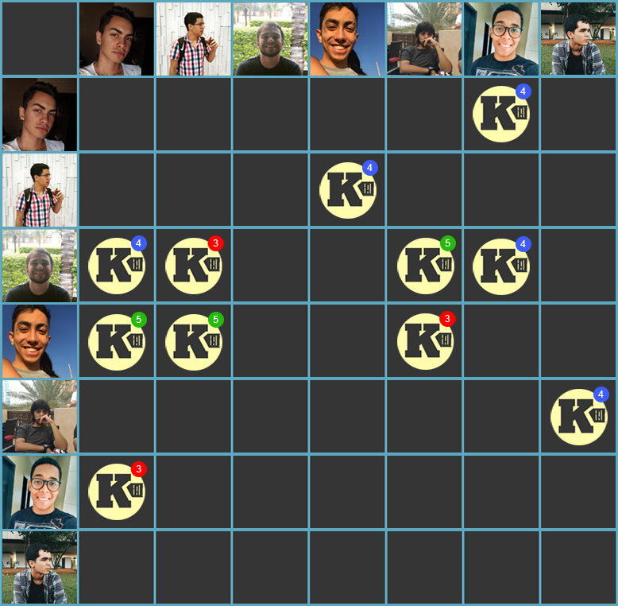

***    

<i>Sprint</i> planejada visando a finalização do <i>core</i> da aplicação, através das <i>issues</i> de editar envio de nota, e de visualização detalhada. Junção dos serviços de <i>front-end</i> e do <i>back-end</i> da aplicação. Busca de melhoria contínua através da adição do <i>deploy</i> contínuo no projeto.

<i>Sprint</i> com a maior pontuação planejada da equipe até o presente momento. Com o acontecimento da semana universitária, foi possível planejar mais, visando entrega de qualidade para a primeira <i>release</i>.

Como dívida da <i>sprint</i> anterior, a <i>issue</i> de criação da <a href="https://github.com/fga-eps-mds/2018.2-Kalkuli/issues/78" title="Issue: Elaborar a Matriz de Avaliação de Valor">Matriz de Avaliação de Valor</a> fica para ser liquidada.

## Tamanho da _Sprint_      
**Início:** 23/09/2018   
**Término:** 29/09/2018   

**Duração:** Sete dias   

## Pareamentos   
 

- Youssef, Lucas Dutra e Ésio | [US10](https://github.com/fga-eps-mds/2018.2-Kalkuli/issues/91)   
- Youssef, Lucas Dutra e Ésio | [US14](https://github.com/fga-eps-mds/2018.2-Kalkuli/issues/92)   
- Saleh e Pedro Féo | [US20](https://github.com/fga-eps-mds/2018.2-Kalkuli/issues/94)     

## Objetivos  

|     _Issue_      |    Pontos   |
|:--------------:|:---------:|
|[US10 - Editar Envio de Uma Nota](https://github.com/fga-eps-mds/2018.2-Kalkuli/issues/91) | 5 |  
|[US14 - Visualizar Uma Nota Detalhadamente](https://github.com/fga-eps-mds/2018.2-Kalkuli/issues/92) | 8 |
|[US20 - Gerar Relatório de Notas Fiscais em Um Período Selecionado](https://github.com/fga-eps-mds/2018.2-Kalkuli/issues/94) | 13 |
|[US34 - Acessar Pagina Principal](https://github.com/fga-eps-mds/2018.2-Kalkuli/issues/105) | 5 |
|[Refatorar Documento de Visão](https://github.com/fga-eps-mds/2018.2-Kalkuli/issues/95) | 2 |
|[Refatorar Documento de Arquitetura](https://github.com/fga-eps-mds/2018.2-Kalkuli/issues/96) | 3 |  
|[Adicionar _Deploy_ Contínuo ](https://github.com/fga-eps-mds/2018.2-Kalkuli/issues/97) | 21 |  
|[Pontuar _Sprints_ Anteriores](https://github.com/fga-eps-mds/2018.2-Kalkuli/issues/98) | 8 |  
|[Corrigir _Layouts_ da _Wiki_](https://github.com/fga-eps-mds/2018.2-Kalkuli/issues/99) | 2|  
|[Atualizar _Readmes_](https://github.com/fga-eps-mds/2018.2-Kalkuli/issues/100) | 1 |  
|[Unir _Back-end_ e _Front-end_](https://github.com/fga-eps-mds/2018.2-Kalkuli/issues/101) | 13 |  
|[Organizar Resultados da Elicitação de Requisitos](https://github.com/fga-eps-mds/2018.2-Kalkuli/issues/102) | 5 |  

<b>Total de pontos planejados: 86</b>  

### Dívida    

|     _Issue_      |    Pontos   |
|:--------------:|:---------:|
|[Elaborar a Matriz de Avaliação de Valor ](https://github.com/fga-eps-mds/2018.2-Kalkuli/issues/78) | 3 |

<b>Total: 89</b> 

***

 Total de pontos da <i>sprint</i>: 89 
  

> [_Sprint_ _Backlog_](https://github.com/fga-eps-mds/2018.2-Kalkuli/milestone/6)  

## Papeis

**Arquiteto:** [Felipe Hargreaves](https://github.com/Hargre)   
**DevOps:** [Bernardo Henrique](https://github.com/bernardohrl)  
**Product Manager:** [Clarissa Borges](https://github.com/clarissalimab)    
**Tech Leader:** [Mariana Pícolo](https://github.com/MarianaPicolo)   
**Equipe de Desenvolvimento:** 
- [Esio Gustavo](https://github.com/EsioFreitas)   
- [Jacó Apolinário](https://github.com/Jacoapolinario)   
- [Lucas Dutra](https://github.com/lucasdutraf)   
- [Pedro Féo](https://github.com/Phe0)   
- [Saleh Nazih](https://github.com/devsalula)
- [Youssef Muhamad](https://github.com/youssef-md)   