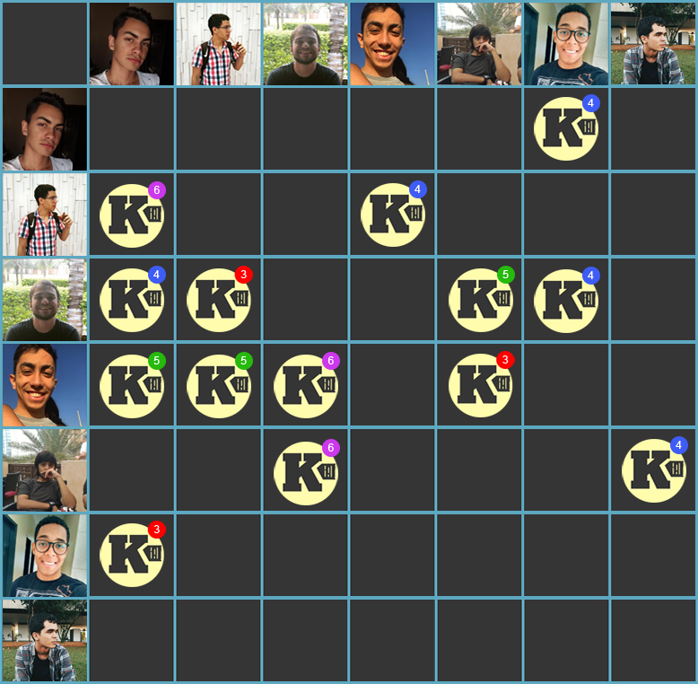

***    

<i>Sprint</i> reservada para ajustes nos artefatos e no produto para a primeira <i>release</i>.

Como dívidas vindas da <i>sprint</i> anterior, as <i>issues</i> de <a href="https://github.com/fga-eps-mds/2018.2-Kalkuli/issues/97" title="Issue: Adicionar Deploy Contínuo">adição do <i>deploy</i> contínuo</a>, <a href="https://github.com/fga-eps-mds/2018.2-Kalkuli/issues/105" title="Issue: US34 - Acessar Página Principal">acessar a página principal</a> e a <a href="https://github.com/fga-eps-mds/2018.2-Kalkuli/issues/102" title="Organizar Resultados da Elicitação de Requisitos">organização dos resultados da elicitação de requisitos</a> ficam para ser liquidadas.

## Tamanho da _Sprint_      
**Início:** 30/09/2018   
**Término:** 06/10/2018   

**Duração:** Sete dias   

## Pareamentos   
 

- Lucas Dutra, Pedro Féo, e Saleh | [US33](https://github.com/fga-eps-mds/2018.2-Kalkuli/issues/126)
- Lucas Dutra, Pedro Féo, e Saleh | [Evoluir US 10](https://github.com/fga-eps-mds/2018.2-Kalkuli/issues/119)
- Youssef e Ésio | [Evoluir US20](https://github.com/fga-eps-mds/2018.2-Kalkuli/issues/120)
- Youssef e Ésio | [US34](https://github.com/fga-eps-mds/2018.2-Kalkuli/issues/105)

## Objetivos  

|     _Issue_      |    Pontos   |
|:--------------:|:---------:|
|[Evoluir US 20](https://github.com/fga-eps-mds/2018.2-Kalkuli/issues/120) | 1 |
|[Complementar Documento de Arquitetura](https://github.com/fga-eps-mds/2018.2-Kalkuli/issues/122) | 1 |
|[Evoluir US 10](https://github.com/fga-eps-mds/2018.2-Kalkuli/issues/119) | 2 |
|[Evoluir TAP](https://github.com/fga-eps-mds/2018.2-Kalkuli/issues/123) | 2 |
|[Evoluir Identidade Visual](https://github.com/fga-eps-mds/2018.2-Kalkuli/issues/121) | 3 |
|[Criar o EVM](https://github.com/fga-eps-mds/2018.2-Kalkuli/issues/124) | 8 |
|[US33 - Gerar Relatório por Período Definido](https://github.com/fga-eps-mds/2018.2-Kalkuli/issues/126) | 13 |  
|[Criar a Release do Projeto](https://github.com/fga-eps-mds/2018.2-Kalkuli/issues/125) | 0 |

<b>Total de pontos planejados: 30</b>  

### Dívida    

|     _Issue_      |    Pontos   |
|:--------------:|:---------:|
|[US34 - Acessar Pagina Principal](https://github.com/fga-eps-mds/2018.2-Kalkuli/issues/105) | 5 |
|[Organizar Resultados da Elicitação de Requisitos](https://github.com/fga-eps-mds/2018.2-Kalkuli/issues/102) | 5 |
|[Adicionar _Deploy_ Contínuo ](https://github.com/fga-eps-mds/2018.2-Kalkuli/issues/97) | 21 |

<b>Total: 31</b> 

***

 Total de pontos da <i>sprint</i>: 61 
  

> [_Sprint_ _Backlog_](https://github.com/fga-eps-mds/2018.2-Kalkuli/milestone/5)  

## Papeis

**Arquiteto:** [Felipe Hargreaves](https://github.com/Hargre)   
**DevOps:** [Bernardo Henrique](https://github.com/bernardohrl)  
**Product Manager:** [Clarissa Borges](https://github.com/clarissalimab)    
**Tech Leader:** [Mariana Pícolo](https://github.com/MarianaPicolo)   
**Equipe de Desenvolvimento:** 
- [Esio Gustavo](https://github.com/EsioFreitas)   
- [Jacó Apolinário](https://github.com/Jacoapolinario)   
- [Lucas Dutra](https://github.com/lucasdutraf)   
- [Pedro Féo](https://github.com/Phe0)   
- [Saleh Nazih](https://github.com/devsalula)
- [Youssef Muhamad](https://github.com/youssef-md)   