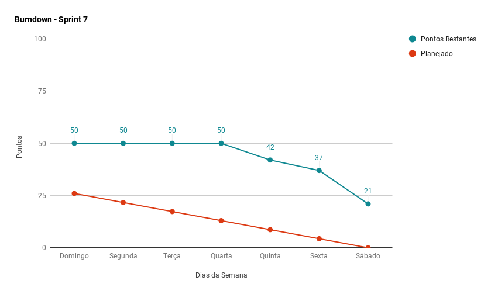
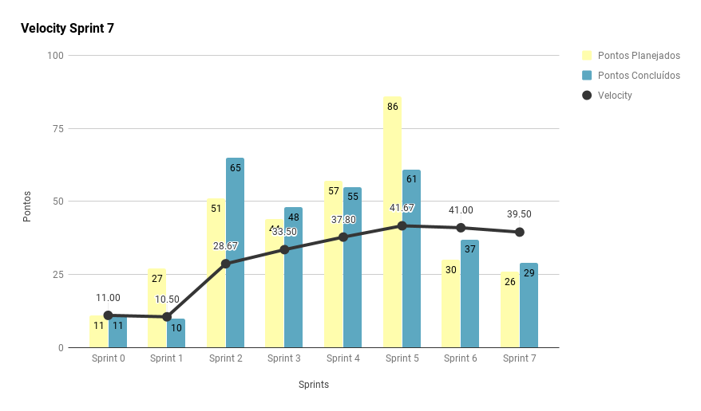
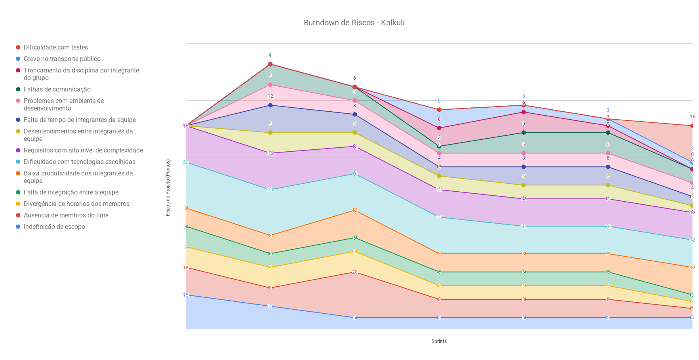
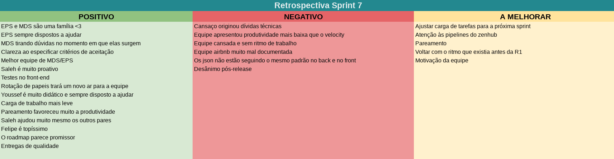
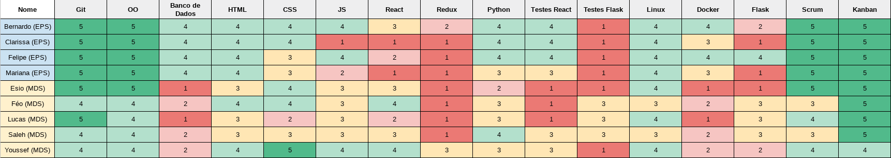

***    

<i>Sprint</i> reservada para pagamento das dívidas técnicas oriundas da <a href="https://fga-eps-mds.github.io/2018.2-Kalkuli/docs/rsprint6#fechamento-da-sprint" title="Fechamento da Sprint #6"><i>sprint</i> anterior</a>, e principalmente, para a recuperação da equipe pós <a href="https://fga-eps-mds.github.io/2018.2-Kalkuli/docs/release" title="Kalkuli, Release I"><i>release</i></a>.      

## Fechamento da _Sprint_   

|     _Issue_      |     _Status_    |       Pontos       |
|:--------------:|:---------------:|:-------------:
|[Unir _Back-end_ e _Front-end_ ](https://github.com/fga-eps-mds/2018.2-Kalkuli/issues/142) |Concluída | 5 |  
|[Criar o _Roadmap_ da _Release_ II](https://github.com/fga-eps-mds/2018.2-Kalkuli/issues/144) |Concluída | 5 |   
|[Aumentar Cobertura de Testes no _Front-end_ ](https://github.com/fga-eps-mds/2018.2-Kalkuli/issues/141) | Concluída | 8 |  
|[Estabilizar Ambientes de Produção ](https://github.com/fga-eps-mds/2018.2-Kalkuli/issues/143) |Concluída | 8 |  
|[Evoluir US 20](https://github.com/fga-eps-mds/2018.2-Kalkuli/issues/120) |Concluída | 1 |
|[Evoluir TAP](https://github.com/fga-eps-mds/2018.2-Kalkuli/issues/123) |Concluída | 2 |
|[Criar o EVM](https://github.com/fga-eps-mds/2018.2-Kalkuli/issues/124) |Não Concluída | 8 |
|[US33 - Gerar Relatório por Período Definido](https://github.com/fga-eps-mds/2018.2-Kalkuli/issues/126) |Não Concluída | 13 |

Pontos Planejados Concluídos: 26    
Pontos de Dívida Concluídos: 3   
Pontos Não Agregados: 21  

> [_Milestone Sprint_ 7](https://github.com/fga-eps-mds/2018.2-Kalkuli/milestone/8?closed=1)

## _Burndown_    

O <i>burndown</i> indica que as <i>issues</i> foram concluídas tardiamente. Também era esperado que fossem entregues tardiamente em razão de um feriado na sexta-feira (12/10).
 

## _Velocity_     

Percebe-se uma leve queda no <i>velocity</i>, que evidencia, novamente, a capacidade de entrega da equipe até o momento por volta de 40 pontos por <i>sprint</i>.

   

## Riscos    

A mudança do <a href="https://fga-eps-mds.github.io/2018.2-Kalkuli/docs/defpronto#release-ii" title="Definição de Pronto, Release II">critério de pronto</a> torna a entrega de testes obrigatória para a finalização de uma história, e origina um novo risco: dificuldade com testes.

  

 

## Retrospectiva

Os pontos negativos apresentados, em sua maioria, evidenciam o cansaço da equipe, mesmo com as <i>issues</i> sendo entregues. A ocorrência do feriado favoreceu a recuperação parcial da equipe que está sem ritmo de trabalho desde a <i>release</i>.

   

   

### _Sprint_ Anterior

A equipe apresentou poucos pontos negativos na <a href="https://fga-eps-mds.github.io/2018.2-Kalkuli/docs/rsprint6#retrospectiva" title="Retrospectiva Sprint #6">retrospectiva da <i>sprint</i> anterior</a>. Vale ressaltar que o contexto em que a <i>sprint</i> ocorreu favoreceu o aparecimento destes pontos negativos (<i>release I</i>). Apesar disso, foram considerados ao planejar a <i>sprint</i> seguinte.

<table>
  <tr align="center">
    <th>Ponto Negativo</th>
    <th>Correção Adotada</th>
  </tr>
  <tr>
    <td>Pareamento é mais produtivo que <i>superpairing</i></td>
    <td>
Após o trancamento da disciplina por um membro da equipe de desenvolvimento, esta agora se encontra em número ímpar.
 
A solução adotada foi a adição de um membro da equipe de EPS, favorecendo o aumento de histórias planejadas para a <i>sprint</i>.
</td>
  </tr>
  <tr>
    <td>Planejamento inferior ao usual</td>
    <td>
Erro por parte do <i>Scrum Master</i> ao definir uma pontuação alta e com carga desproporcional na <i>sprint</i> da <i>release</i>. 
A solução adotada foi planejar a <i>sprint</i> seguinte com menor carga para as equipes de EPS e MDS, visando a recuperação total da equipe.
</td>
  </tr>
</table>

### Quadro de Conhecimento   

Conhecimento nas tecnologias aumenta, dado o contato constante da equipe de desenvolvimento, e sua evolução a cada <i>sprint</i>. Vale ressaltar o aumento principalmente em <i>ReactJS</i>.

### Registros de Presença nas _Dailies_    

<ul>
<li><i>Dailies</i> de segunda e sexta feira são realizadas por <i>hangouts</i>, às 21h30.</li>
<li><i>Dailies</i> de quarta-feira são realizadas por <i>telegram</i>, às 12h.</li>
<li><i>Dailies</i> de terça e quinta feira são realizadas presencialmente, às 15h50.</li>

| Nome    |Segunda Feira      | Terça Feira      | Quarta Feira     |   Quinta Feira    | Sexta Feira      |     
|:-----:  |:-----------------:|:----------------:|:----------------:|:-----------------:|:----------------:|
|Bernardo |         ✔         |         ✘        |         ✔        |         ✔         |         ✘        |
|Clarissa |         ✘         |         ✔        |         ✔        |         ✔         |         ✔        |
|Esio     |         ✘         |         ✔        |         ✔        |         ✔         |         ✔        |
|Felipe   |         ✔         |         ✔        |         ✔        |         ✔         |         ✔        |
|Lucas    |         ✔         |         ✔        |         ✔        |         ✔         |         ✘        |
|Mariana  |         ✔         |         ✔        |         ✔        |         ✔         |         ✔        |
|Pedro    |         ✔         |         ✔        |         ✔        |         ✔         |         ✔        |
|Saleh    |         ✔         |         ✔        |         ✔        |         ✔         |         ✔        |
|Youssef  |         ✔         |         ✔        |         ✔        |         ✔         |         ✔        |      

## Avaliação do _Scrum Master_  

<i>Sprint</i> planejada visando a recuperação da equipe pós <i>release</i>, sem novas histórias de usuário. A equipe vinha se queixando de cansaço durante e após a <i>sprint</i> da <i>release</i>, portanto, ao planjear a <i>sprint</i> atual, o objetivo foi de recuperar a equipe, buscando os ânimos pré <i>release</i>.

Ainda com rendimento abaixo do esperado, a equipe foi capaz de entregar a maioria das <i>issues</i>, e as que não foram entregues foram resultado de dificuldades técnicas, principalmente o EVM.

Um novo risco foi mapeado, dado que o critério de pronto mudou, e os testes no <i>front-end</i> ainda são motivo de dificuldades constantes dentro da equipe de desenvolvimento, muito se deve por conta da complexidade superior aos testes no <i>back-end</i>.

A equipe continua harmoniosa, as <i>dailies</i> têm bons níveis de participação, e as <i>issues</i> continuam sendo entregues com qualidade, mesmo com o cansaço de meio de semestre. 

O empenho de MDS e EPS em entregar o melhor produto possível e também absorver o maior nível de conhecimento possível fica explícito, onde os papeis estão bem articulados, e erros vindos de <i>sprints</i> anteriores são constantemente trabalhados, a fim de atingir níveis cada vez maiores de produtividade saudável. 

