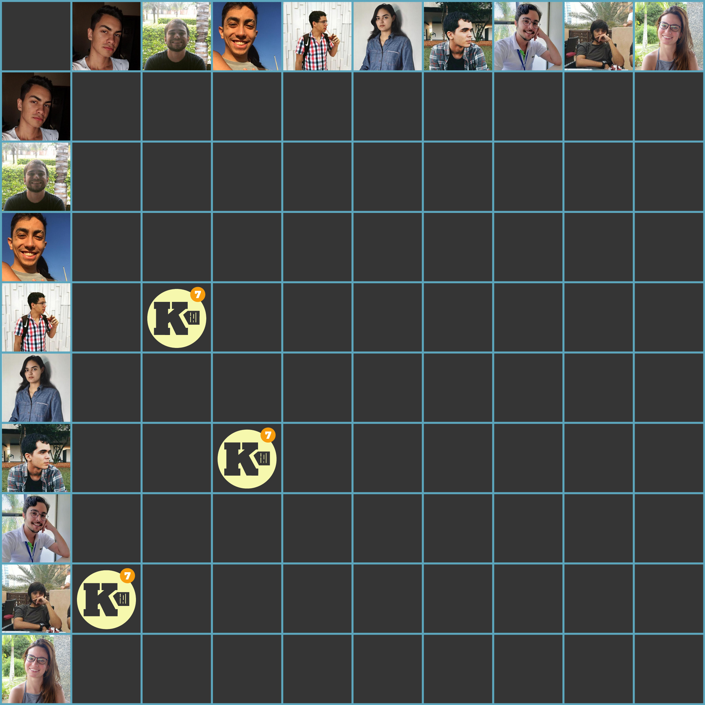

***    

<i>Sprint</i> reservada para quitação de dívidas técnicas oriundas da <i>sprint</i> da <i>release</i>, aumento de qualidade através de testes no <i>front-end</i>, e criação do <i>roadmap</i> do produto para a segunda entrega.

## Tamanho da _Sprint_      
**Início:** 07/10/2018   
**Término:** 13/10/2018   

**Duração:** Sete dias   

## Pareamentos   
 

- Youssef e Saleh | [Aumentar Cobertura de Testes no _Front-end_](https://github.com/fga-eps-mds/2018.2-Kalkuli/issues/141)    
- Youssef e Saleh | [Evoluir US20](https://github.com/fga-eps-mds/2018.2-Kalkuli/issues/120)   
- Felipe e Lucas Dutra | [Unir _Back-end_ e _Front-end_](https://github.com/fga-eps-mds/2018.2-Kalkuli/issues/142)   
- Pedro Féo e Ésio | [US33](https://github.com/fga-eps-mds/2018.2-Kalkuli/issues/126)   

## Objetivos   

|     _Issue_      |    Pontos   |
|:--------------:|:---------:|
|[Aumentar Cobertura de Testes no _Front-end_ ](https://github.com/fga-eps-mds/2018.2-Kalkuli/issues/141) | 8 |  
|[Unir _Back-end_ e _Front-end_ ](https://github.com/fga-eps-mds/2018.2-Kalkuli/issues/142) | 5 |  
|[Estabilizar Ambientes de Produção ](https://github.com/fga-eps-mds/2018.2-Kalkuli/issues/143) | 8 |  
|[Criar o _Roadmap_ da _Release_ II](https://github.com/fga-eps-mds/2018.2-Kalkuli/issues/144) | 5 |   

<b>Total de pontos planejados: 26</b>  

### Dívida    

|     _Issue_      |    Pontos   |
|:--------------:|:---------:|
|[US33 - Gerar Relatório por Período Definido](https://github.com/fga-eps-mds/2018.2-Kalkuli/issues/126) | 13 |
|[Evoluir US 20](https://github.com/fga-eps-mds/2018.2-Kalkuli/issues/120) | 1 |
|[Criar o EVM](https://github.com/fga-eps-mds/2018.2-Kalkuli/issues/124) | 8 |
|[Evoluir TAP](https://github.com/fga-eps-mds/2018.2-Kalkuli/issues/123) | 2 |

<b>Total: 24</b> 

***

 Total de pontos da <i>sprint</i>: 50 
  

> [_Sprint_ _Backlog_](https://github.com/fga-eps-mds/2018.2-Kalkuli/milestone/8)  

## Papeis   

**Arquiteto:** [Felipe Hargreaves](https://github.com/Hargre)   
**DevOps:** [Bernardo Henrique](https://github.com/bernardohrl)  
**Product Manager:** [Clarissa Borges](https://github.com/clarissalimab)    
**Tech Leader:** [Mariana Pícolo](https://github.com/MarianaPicolo)   
**Equipe de Desenvolvimento:** 
- [Esio Gustavo](https://github.com/EsioFreitas)   
- [Lucas Dutra](https://github.com/lucasdutraf)   
- [Pedro Féo](https://github.com/Phe0)   
- [Saleh Nazih](https://github.com/devsalula)
- [Youssef Muhamad](https://github.com/youssef-md)   