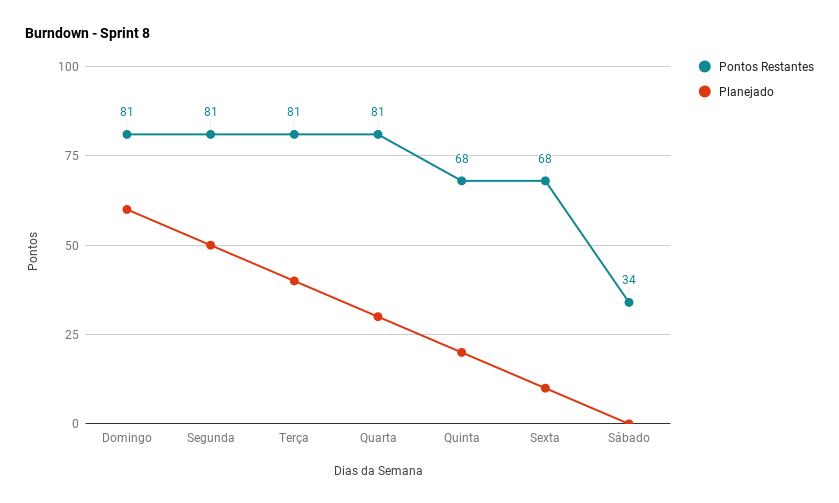
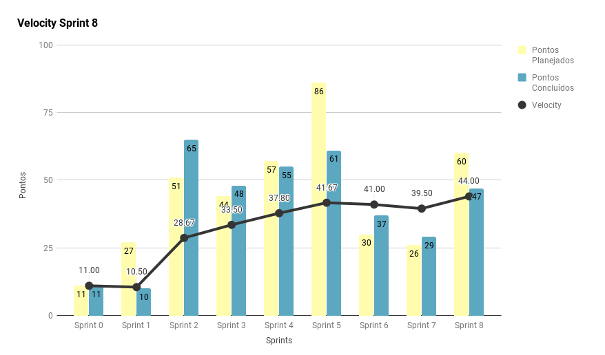
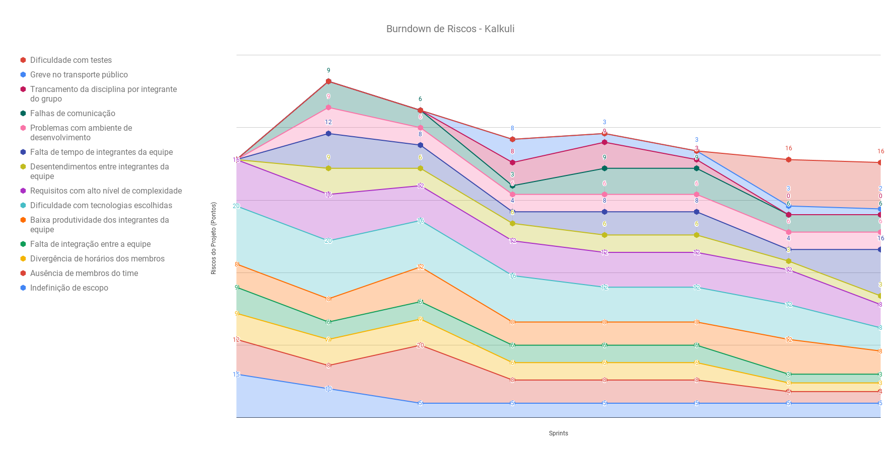
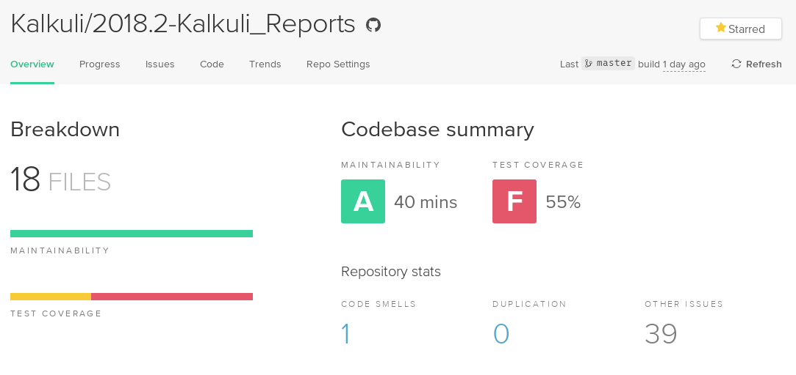
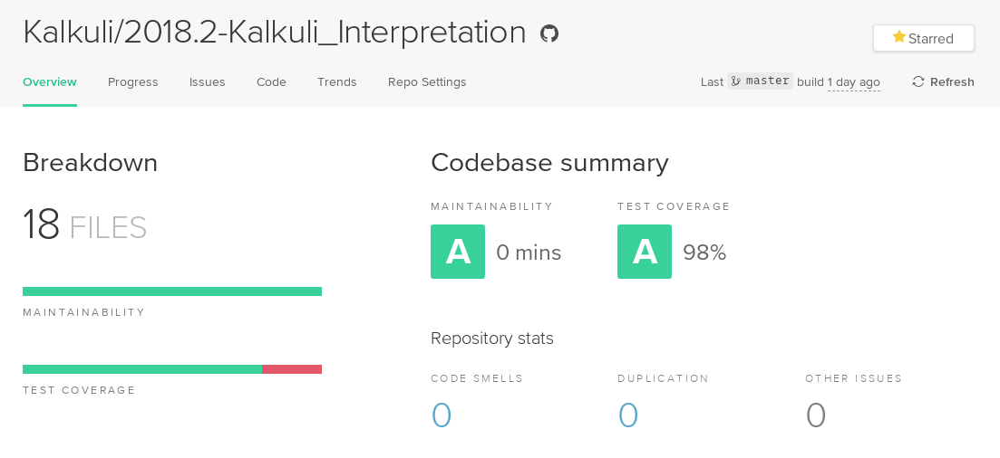
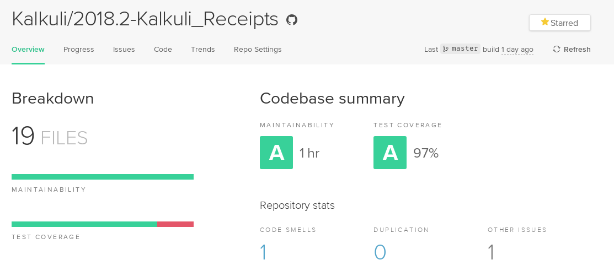
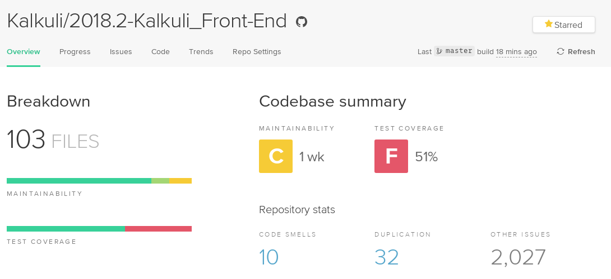
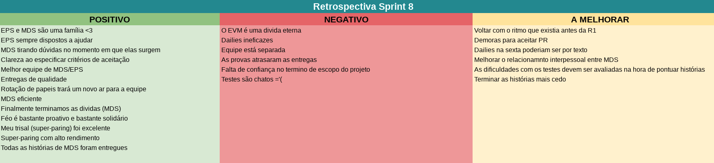
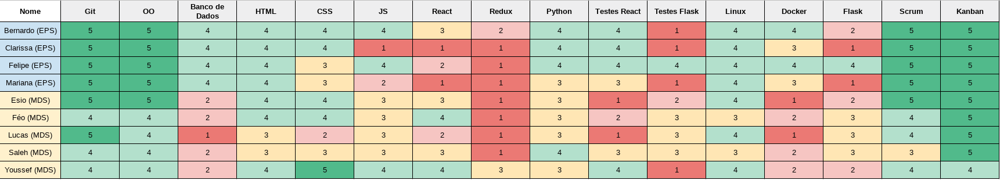
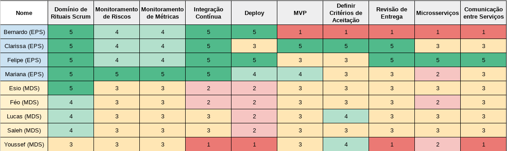

***    

<i>Sprint</i> que marca a recuperação da equipe, com o ritmo pré <i>release</i> sendo restabelecido, e novas histórias de usuário entregues.

## Fechamento da _Sprint_   

|     _Issue_      |     _Status_    |       Pontos       |
|:--------------:|:---------------:|:-------------:
|[US12 - Excluir Nota do Sistema](https://github.com/fga-eps-mds/2018.2-Kalkuli/issues/142) | Concluída | 2 |
|[US23 - Visualizar Lista de Relatórios](https://github.com/fga-eps-mds/2018.2-Kalkuli/issues/152) | Concluída |  3 | 
|[US35 - Inserir Descrição e Título na Nota](https://github.com/fga-eps-mds/2018.2-Kalkuli/issues/151) | Concluída |  8 |  
|[US24 - Visualizar um Relatório em Detalhes](https://github.com/fga-eps-mds/2018.2-Kalkuli/issues/153) | Concluída |  8 |  
|[_Spike_: Estudar _Serverless_](https://github.com/fga-eps-mds/2018.2-Kalkuli/issues/157) | Concluída |  13 | 
|[Spike: Migrar _Deploy_ do Serviço _Extraction_](https://github.com/fga-eps-mds/2018.2-Kalkuli/issues/155) |Concluída |  13 |  
|[Fazer o Plano de Projeto](https://github.com/fga-eps-mds/2018.2-Kalkuli/issues/156) |Não Concluída |  13 |   
|[US33 - Gerar Relatório por Período Definido](https://github.com/fga-eps-mds/2018.2-Kalkuli/issues/126) | Concluída | 13 |
|[Criar o EVM](https://github.com/fga-eps-mds/2018.2-Kalkuli/issues/124) |Não Concluída | 8 |  

Pontos Planejados Concluídos: 47    
Pontos de Dívida Concluídos: 13   
Pontos Não Agregados: 34  

> [_Milestone Sprint_ 8](https://github.com/fga-eps-mds/2018.2-Kalkuli/milestone/9?closed=1)

## _Burndown_    

As <i>issues</i> foram entregues ao final da <i>sprint</i>. Toda a equipe de desenvolvimento <a href="https://github.com/fga-eps-mds/2018.2-Kalkuli/issues/29#issuecomment-429435411" title="Quadro de Provas de Integrantes da Equipe (MDS)">estava atarefada com outra disciplina (EDA I)</a>, e a prova ocorreu ao final da <i>sprint</i> (quinta feira). Isso influenciou a entrega tardia das histórias de usuário, visto que além do código da história concluído, agora é necessário testar <i>back-end</i> e <i>front-end</i>.
 

## _Velocity_     

O <i>velocity</i> apresentou melhora, com a equipe quitando dívidas técnicas, e MDS entregando todas as histórias de usuário que ficou responsável. 

   

EPS, por sua vez, ainda deixa dívidas técnicas por dificuldade em compreender os encargos relacionados às <i>issues</i>, como por exemplo o cálculo do valor da <i>sprint</i> no EVM, e a criação do plano de implantação, que incialmente foi interpretado como plano de projeto, oriundo do PMBOK.

 

## Riscos    

Não foram identificados riscos novos no decorrer da <i>sprint</i>. 

  

Para a próxima <i>sprint</i>, o risco de "falta de tempo" aumenta, visto que as equipes de MDS e EPS, terão <a href="https://github.com/fga-eps-mds/2018.2-Kalkuli/issues/29#issuecomment-431466883" title="Quadro de Provas de Integrantes da Equipe: Sprint #9">provas de disciplinas</a> durante a semana.

 

## Indicadores de Qualidade do Código   

Dos sete serviços planejados para o <i>software</i>, apenas dois foram trabalhados durante a <i>sprint</i>: <a href="https://github.com/Kalkuli/2018.2-Kalkuli_Receipts" title="Serviço de Apresentação de Notas">notas</a> e <a href="https://github.com/Kalkuli/2018.2-Kalkuli_Reports" title="Serviço de Geração de Relatórios">relatórios</a>.

<a href="https://github.com/Kalkuli/2018.2-Kalkuli_Gateway" title="API Gateway para o Kalkuli"><i>Gateway</i></a> e <a href="https://github.com/Kalkuli/2018.2-Kalkuli_Front-End" title="Front-end"><i>front-end</i></a> também sofreram alterações durante a <i>sprint</i>.

  

### Cobertura, Manutenibilidade e Duplicação   

Análises fornecidas pelo <i>Code Climate</i>.

  

<table>
  <tr align="center">
    <th>Serviço</th>
    <th><i>Status</i></th>
  </tr>
  <tr>
    <td><a href="https://github.com/Kalkuli/2018.2-Kalkuli_Extraction" title="Serviço de Extração de Texto de Notas Fiscais">Extração de texto</a></td>
    <td>
      Testes não implementados.
    </td>
  </tr>
  <tr>
    <tr>
    <td><a href="https://github.com/Kalkuli/2018.2-Kalkuli_Gateway" title="Camada de comunicação entre os microsserviços e o Front-End do sistema"><i>Gateway</i></a></td>
    <td>
      Testes não implementados.
    </td>
  </tr>
    <tr>
    <td><a href="https://github.com/Kalkuli/2018.2-Kalkuli_Tags" title="Serviço de Tageamento de Notas">Tags</a></td>
    <td>
    Serviço ainda não implementado.
    </td>
  </tr>
      <tr>
    <td><a href="https://github.com/Kalkuli/2018.2-Kalkuli_Users" title="Serviço de Gerenciamento de Usuários">Usuários</a></td>
    <td>
    Serviço ainda não implementado.
    </td>
  </tr>
    <tr>
    <td><a href="https://github.com/Kalkuli/2018.2-Kalkuli_Export" title="Serviço de Exportação de Relatórios">Exportação</a></td>
    <td>
    Serviço ainda não implementado.
    </td>
  </tr>
    <tr>
    <td><a href="https://github.com/Kalkuli/2018.2-Kalkuli_Reports" title="Serviço de Geração de Relatórios">Relatórios</a></td>
    <td>
    
    </td>
  </tr>
    <tr>
    <td><a href="https://github.com/Kalkuli/2018.2-Kalkuli_Interpretation" title="Serviço de Interpretação de Dados de Notas Fiscais">Interpretação</a></td>
    <td>
    
    </td>
  </tr>
    <tr>
    <td><a href="https://github.com/Kalkuli/2018.2-Kalkuli_Receipts" title="Serviço de Apresentação de Notas">Notas</a></td>
    <td>
    
    </td>
  </tr>
    <td><a href="https://github.com/Kalkuli/2018.2-Kalkuli_Front-End" title="Interface de comunicação com o usuário"><i>Front-end</i></a></td>
    <td>
      
    </td>
  </tr>
</table>

## Retrospectiva

Os pontos negativos exibidos na <i>sprint</i> anterior deram lugar à novos, entretanto, apenas um deles se conecta a um dos riscos já mapeados: "<i>dailies</i> ineficazes" podem refletir em falhas de comunicação.

   

   

### _Sprint_ Anterior

Com relação aos pontos negativos apresentados na retrospectiva anterior, algumas medidas foram tomadas para que não se mostrassem novamente, são eles:

<table>
  <tr align="center">
    <th>Ponto Negativo</th>
    <th>Correção Adotada</th>
  </tr>
  <tr>
    <td>
Equipe apresentou produtividade mais baixa que o velocity.
 
Equipe cansada e sem ritmo de trabalho.
</td>
    <td>
      <ul>
      <li>Respeitar as provas que parte da equipe teria na semana, reduzindo a carga;</li>
      <li>As duplas de pareamento agora foram escolhidas entre MDS e não mais por EPS;</li>
      </ul>
    </td>
  </tr>
</table>

### Quadro de Conhecimento   

A equipe de desenvolvimento apresenta leve melhora em algumas das tecnologias adotadas, visto que estão em contato contante com estas. Entretanto, percebe-se que os testes ainda são motivo de preocupação na equipe, principalmente no <i>front-end</i>.

   

O quadro de conhecimento foi atualizado com as responsabilidades de EPS, visto que agora os papeis rotacionam.

### Registros de Presença nas _Dailies_    

<ul>
<li><i>Dailies</i> de segunda e sexta feira são realizadas por <i>hangouts</i>, às 21h30 e 20h, respectivamente.</li>
<li><i>Dailies</i> de quarta-feira são realizadas por <i>telegram</i>, às 12h.</li>
<li><i>Dailies</i> de terça e quinta feira são realizadas presencialmente, às 15h50.</li>

| Nome    |Segunda Feira      | Terça Feira      | Quarta Feira     | Quinta Feira      | Sexta Feira      |     
|:-----:  |:-----------------:|:----------------:|:----------------:|:-----------------:|:----------------:|
|Bernardo |         ✔         |         ✔        |         ✔        |         ✔         |         ✔        |
|Clarissa |         ✔         |         ✔        |         ✔        |         ✔         |         ✘        |
|Esio     |         ✔         |         ✔        |         ✔        |         ✔         |         ✔        |
|Felipe   |         ✔         |         ✔        |         ✔        |         ✔         |         ✘        |
|Lucas    |         ✔         |         ✔        |         ✔        |         ✔         |         ✔        |
|Mariana  |         ✔         |         ✔        |         ✔        |         ✔         |         ✔        |
|Pedro    |         ✔         |         ✔        |         ✔        |         ✔         |         ✔        |
|Saleh    |         ✔         |         ✔        |         ✔        |         ✔         |         ✔        |
|Youssef  |         ✔         |         ✔        |         ✔        |         ✔         |         ✔        |      

## Avaliação do _Scrum Master_  

Aos poucos, a equipe recupera os ânimos pré <i>release</i>. As entregas continuam seguindo o alto nível estabelecido pela equipe desde o começo do projeto, ainda que a incidência de dívidas esteja alta. 

As <i>issues</i> que são dívida, em sua maioria, são atribuições de EPS, que enfrenta dificuldades em lidar com tecnologias/artefatos que nunca tiveram contato, e não consegue concluí-las em tempo hábil.

Um dos pontos negativos percebidos durante a <i>sprint</i> é a demora por parte de EPS em aceitar os <i>pull requests</i>, causando atraso ainda maior na finalização das histórias estavam em <i>revisão</i>. Para que o problema não se repita, agora MDS também têm o poder de revisar e aceitar <i>pull requests</i>.

O <i>burndown</i> ainda é insatisfatório, mas dado o contexto em que o projeto é concebido, durante um semestre, com outras disciplinas em paralelo, a equipe não conseguiria queimar os pontos uniformemente, visto que as histórias de usuário estão cada vez mais complexas e requerem <a href="https://fga-eps-mds.github.io/2018.2-Kalkuli/docs/defpronto#release-ii" title="Definição de Pronto, Release II">muitas atividades para serem dadas como concluídas</a>, ainda que estejam granularizadas o máximo possível.

  

A equipe encontrou um ritmo saudável de trabalho, e os riscos diminuem à medida que o projeto avança. Os riscos de maior incidência, até o momento, estão controlados.

