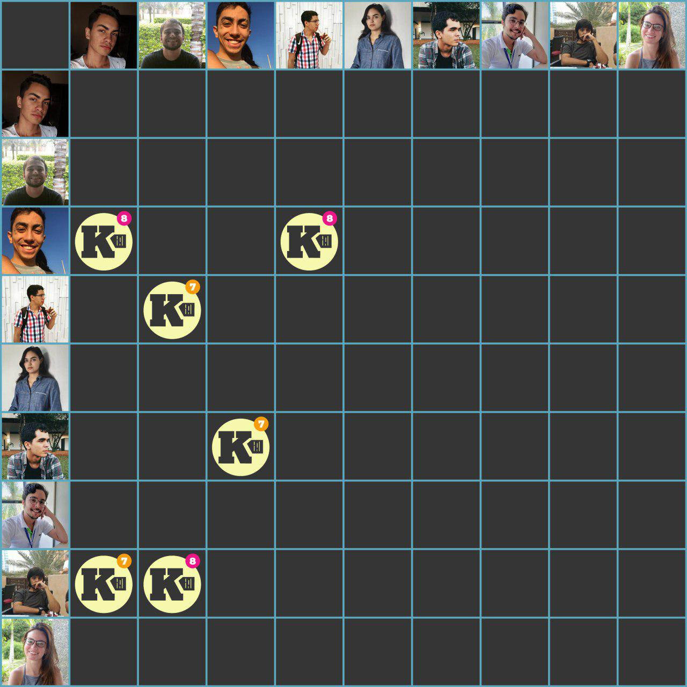

***    

<i>Sprint</i> planejada visando a completude da <i>feature</i> de notas, e de novas histórias do épico de relatórios.

Para EPS,  estão a <a href="https://github.com/fga-eps-mds/2018.2-Kalkuli/issues/155" title="Issue: Migrar Deploy do Serviço de Extração">migração do deploy do serviço de extração</a>, a <a href="https://github.com/fga-eps-mds/2018.2-Kalkuli/issues/156" title="Issue: Fazer o Plano de Projeto">criação do plano de projeto</a>, e a busca de melhoria através do estudo do <a href="https://github.com/fga-eps-mds/2018.2-Kalkuli/issues/157" title="Issue: Spike: Estudar Serverless">serviço de computação sem servidor</a> fornecido pela <i>Amazon</i>.

Como dívidas vindas da <i>sprint</i> anterior, as <i>issues</i> de <a href="https://github.com/fga-eps-mds/2018.2-Kalkuli/issues/126" title="Issue: Gerar Relatório por Período Definido">gerar relatório por período definido</a>, e <a href="https://github.com/fga-eps-mds/2018.2-Kalkuli/issues/124" title="Issue: Criar o EVM">a criação do EVM</a>, encontram-se para ser quitadas.

## Tamanho da _Sprint_      
**Início:** 14/10/2018   
**Término:** 20/10/2018   

**Duração:** Sete dias   

## Pareamentos   
 

- Youssef, Esio e Lucas Dutra | [US12 - Excluir Nota do Sistema](https://github.com/fga-eps-mds/2018.2-Kalkuli/issues/154)  
- Youssef, Esio e Lucas Dutra | [US35 - Inserir Descrição e Título na Nota](https://github.com/fga-eps-mds/2018.2-Kalkuli/issues/151)    
- Pedro Féo e Saleh | [US23 - Visualizar Lista de Relatórios](https://github.com/fga-eps-mds/2018.2-Kalkuli/issues/152)   
- Pedro Féo e Saleh | [US24 - Visualizar um Relatório em Detalhes](https://github.com/fga-eps-mds/2018.2-Kalkuli/issues/153)   

## Objetivos   

|     _Issue_      |    Pontos   |
|:--------------:|:---------:|
|[US12 - Excluir Nota do Sistema](https://github.com/fga-eps-mds/2018.2-Kalkuli/issues/142) | 2 |
|[US23 - Visualizar Lista de Relatórios](https://github.com/fga-eps-mds/2018.2-Kalkuli/issues/152) | 3 | 
|[US35 - Inserir Descrição e Título na Nota](https://github.com/fga-eps-mds/2018.2-Kalkuli/issues/151) | 8 |  
|[US24 - Visualizar um Relatório em Detalhes](https://github.com/fga-eps-mds/2018.2-Kalkuli/issues/153) | 8 |  
|[Migrar _Deploy_ do Serviço _Extraction_](https://github.com/fga-eps-mds/2018.2-Kalkuli/issues/155) | 13 |  
|[Fazer o Plano de Projeto](https://github.com/fga-eps-mds/2018.2-Kalkuli/issues/156) | 13 |   
|[_Spike_: Estudar _Serverless_](https://github.com/fga-eps-mds/2018.2-Kalkuli/issues/157) | 13 |   

<b>Total de pontos planejados: 60</b>  

### Dívida    

|     _Issue_      |    Pontos   |
|:--------------:|:---------:|
|[Criar o EVM](https://github.com/fga-eps-mds/2018.2-Kalkuli/issues/124) | 8 |
|[US33 - Gerar Relatório por Período Definido](https://github.com/fga-eps-mds/2018.2-Kalkuli/issues/126) | 13 |

<b>Total: 21</b> 

***

 Total de pontos da <i>sprint</i>: 81 
  

> [_Sprint_ _Backlog_](https://github.com/fga-eps-mds/2018.2-Kalkuli/milestone/9)  

## Papeis   

Papeis ainda se mantêm os mesmos, visto que estão estabilizando.

**Arquiteto:** [Felipe Hargreaves](https://github.com/Hargre)   
**DevOps:** [Bernardo Henrique](https://github.com/bernardohrl)  
**Product Manager:** [Clarissa Borges](https://github.com/clarissalimab)    
**Tech Leader:** [Mariana Pícolo](https://github.com/MarianaPicolo)   
**Equipe de Desenvolvimento:** 
- [Esio Gustavo](https://github.com/EsioFreitas)   
- [Lucas Dutra](https://github.com/lucasdutraf)   
- [Pedro Féo](https://github.com/Phe0)   
- [Saleh Nazih](https://github.com/devsalula)
- [Youssef Muhamad](https://github.com/youssef-md)   