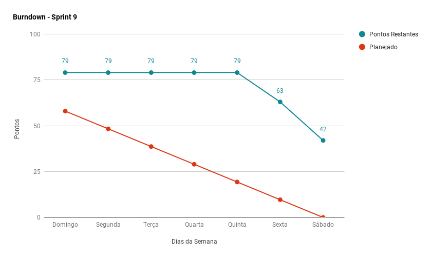
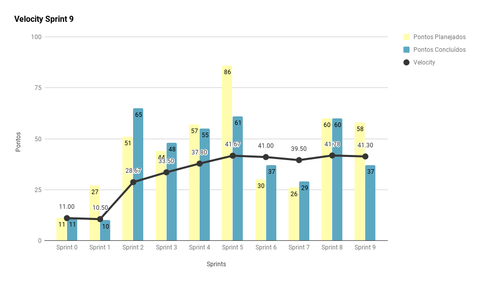
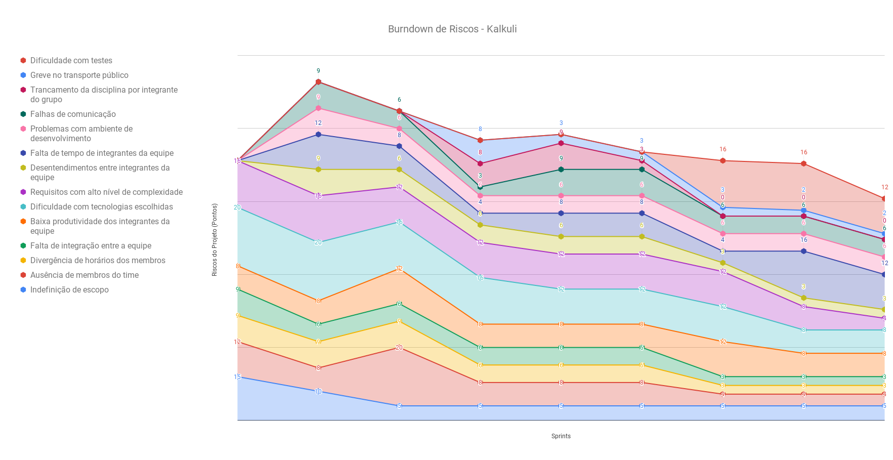
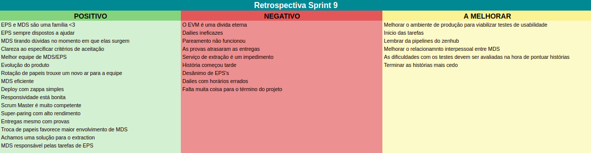
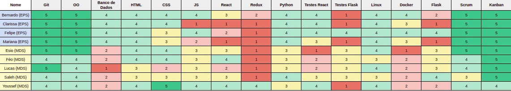
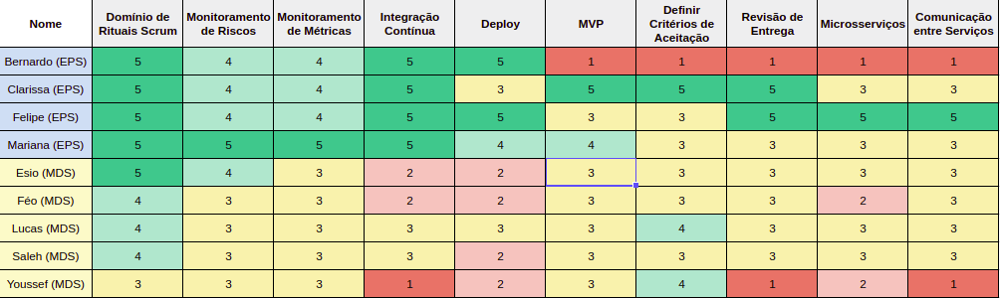

***    

<i>Sprint</i> que marca o começo da rotatividade de membros da equipe de MDS dentro dos papéis de EPS, entregas de novas histórias de usuário e responsividade da aplicação. 

## Fechamento da _Sprint_   

|     _Issue_      |     _Status_    |       Pontos       |
|:--------------:|:---------------:|:-------------:
|[US29 - Exportar Relatório em .csv](https://github.com/fga-eps-mds/2018.2-Kalkuli/issues/164)|    Concluída | 5 |
|[Melhorar Responsividade do Site](https://github.com/fga-eps-mds/2018.2-Kalkuli/issues/165)| Concluída | 8 |
|[Migrar _Deploy_ do Serviço _Interpretation_](https://github.com/fga-eps-mds/2018.2-Kalkuli/issues/168)| Concluída | 8 |
|[Migrar _Deploy_ do Serviço _Gateway_](https://github.com/fga-eps-mds/2018.2-Kalkuli/issues/166)| Concluída | 8 |
|[Spike: Migrar _Deploy_ do Serviço _Extraction_](https://github.com/fga-eps-mds/2018.2-Kalkuli/issues/167)| Concluída | 8 |
|[Criar Guia de Teste de Usabilidade](https://github.com/fga-eps-mds/2018.2-Kalkuli/issues/169)| Não Concluída | 8 |
|[Criar o EVM](https://github.com/fga-eps-mds/2018.2-Kalkuli/issues/124)| Não Concluída | 8 |
|[Fazer o Plano de Implantação](https://github.com/fga-eps-mds/2018.2-Kalkuli/issues/156)| Não Concluída | 13 |
[US01 - Inserir o Cadastro de Uma Empresa no Sistema](https://github.com/fga-eps-mds/2018.2-Kalkuli/issues/163)| Não Concluída | 13 |

Pontos Planejados Concluídos: 37    
Pontos de Dívida Concluídos: 0   
Pontos Não Agregados: 42  

> [_Milestone Sprint_ 9](https://github.com/fga-eps-mds/2018.2-Kalkuli/milestone/10?closed=1)

## _Burndown_    

Nem todas as <i>issues</i> foram entregues ao final da <i>sprint</i>. O motivo disso foi que toda a equipe <a href="https://github.com/fga-eps-mds/2018.2-Kalkuli/issues/29#issuecomment-431466883" title="Quadro de Provas de Integrantes da Equipe">estava atarefada com outras disciplinas. MDS teve provas de EDA I e MD II, enquanto EPS teve de DAS</a>. E como as provas de MDS ocorreram no começo da <i>sprint</i> (segunda e terça-feira), isso impactou nas entregas tardias das histórias de usuário visto que, além do código da história concluído, é necessário testar <i>back-end</i> e <i>front-end</i>.
 

## _Velocity_     

Praticamente todas as <i>issues</i> planejadas foram entregues, com exceção da <a href="https://github.com/fga-eps-mds/2018.2-Kalkuli/issues/163">US01 - Inserir o Cadastro de Uma Empresa no Sistema</a> que acabou tendo uma complexidade maior para a dupla responsável.

A queda do <i>velocity</i> se justifica pela <i>sprint</i> incomum, isso é, a equipe teve diversas de provas de outras matérias. No entanto, ele ainda se manteve em volta da capacidade de entrega, em 40 pontos por <i>sprint</i>. 

   

## Riscos    

Não foram identificados riscos novos no decorrer da <i>sprint</i>. 

  

Para próxima <i>sprint</i>, o risco de "falta de tempo", mesmo menor, permanece alto. O motivo disso acontecer é que a equipe está no último mês de aulas e isso faz com que as outras matérias tomem mais tempo do que o normal.

 

## Retrospectiva

O pontos negativos apresentados, em sua maioria, refletem o peso do final de semestre para toda equipe. No entanto, com profissionalismo, a equipe consegue continuar motivada e fazer entregas de qualidade, evidenciado pelos pontos positivos. 

   

   

### _Sprint_ Anterior

Com relação aos pontos negativos apresentados na retrospectiva anterior, algumas medidas foram tomadas para que não se mostrassem novamente, são eles:

<table>
  <tr align="center">
    <th>Ponto Negativo</th>
    <th>Correção Adotada</th>
  </tr>
  <tr>
    <td>
Falta de confiança no término do escopo do projeto.
</td>
    <td>
      
Parte da <i>feature</i> de <a href="https://fga-eps-mds.github.io/2018.2-Kalkuli/docs/backlog#feature-02-manter-usuarios" title="Épico 02, Feature 04">controle de usuários vinculados</a> foi removida, dado o tempo curto até a entrega do projeto.

    </td>
  </tr>
</table>

### Quadro de Conhecimento   

A equipe de desenvolvimento apresenta leve melhora em algumas das tecnologias adotadas, visto que estão em contato constante com estas. Entretanto, mesmo que os testes no front-end ainda sejam motivo de preocupação para equipe, ela segue em evolução.

   

### Registros de Presença nas _Dailies_    

<ul>
<li><i>Dailies</i> de segunda e sexta feira são realizadas por <i>hangouts</i>, às 21h30</li>
<li><i>Dailies</i> de quarta-feira são realizadas por <i>telegram</i>, às 12h.</li>
<li><i>Dailies</i> de terça e quinta feira são realizadas presencialmente, às 15h50.</li>

| Nome    |Segunda Feira      | Terça Feira      | Quarta Feira     | Quinta Feira      | Sexta Feira      |     
|:-----:  |:-----------------:|:----------------:|:----------------:|:-----------------:|:----------------:|
|Bernardo |         ✘         |         ✔        |         ✔        |         ✔         |         ✔        |
|Clarissa |         ✔         |         ✔        |         ✔        |         ✔         |         ✘        |
|Esio     |         ✔         |         ✔        |         ✔        |         ✔         |         ✔        |
|Felipe   |         ✔         |         ✔        |         ✔        |         ✔         |         ✔        |
|Lucas    |         ✔         |         ✔        |         ✔        |         ✔         |         ✔        |
|Mariana  |         ✔         |         ✔        |         ✔        |         ✔         |         ✘        |
|Pedro    |         ✔         |         ✔        |         ✔        |         ✔         |         ✔        |
|Saleh    |         ✔         |         ✔        |         ✔        |         ✔         |         ✔        |
|Youssef  |         ✔         |         ✔        |         ✔        |         ✔         |         ✔        |      

## Avaliação do _Scrum Master_  

<i>Sprint</i> marcada pelo começo da rotatividade de papéis de EPS entre MDS e pela queda de produtividade da equipe causada pelo grande número de provas durante a semana. Além disso, foram entregues novas histórias de usuário e migrações de serviços. No entanto, a incidência de dívidas continua.

A equipe continua harmoniosa e as <i>issues</i> continuam sendo entregues com qualidade, mesmo com o cansaço do fim de semestre. No entanto, os rituais foram problemáticos. Isso é evidenciado pela falta de experiência do <i>Scrum Master</i> (<a href="https://github.com/EsioFreitas">Ésio Freitas</a>) em conduzí-los.

  

Por fim, foi tomada a decisão de diminuir o escopo, pois o atual poderia comprometer a entrega do MVP no fim da segunda <i>release</i>. Por isso, a <i>feature</i> de cadastro de usuários vinculados à uma empresa foi removida.

 