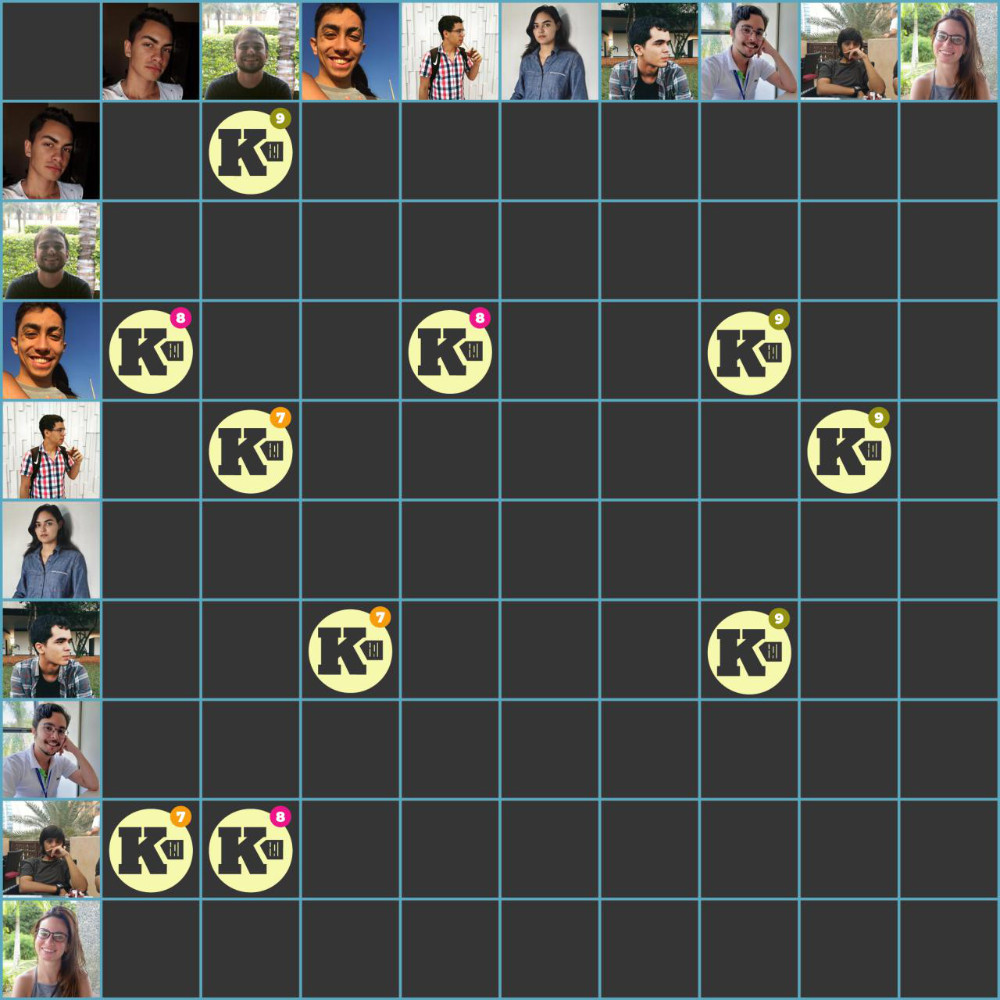

***    

<i>Sprint</i> planejada visando a migração dos serviços de extração, interpretação e <i>gateway</i> para a Amazon AWS, e do cadastro de empresa no sistema. Também para esta <i>sprint</i>, estão planejadas a <a href="https://github.com/fga-eps-mds/2018.2-Kalkuli/issues/169" title="Issue: Guia de Teste de Usabilidade">criação da guia de teste de usabilidade</a> e a <a href="https://github.com/fga-eps-mds/2018.2-Kalkuli/issues/165" title="Issue: Melhorar Responsividade do Site">melhora da responsividade</a>.

Como dívidas vindas da <i>sprint</i> anterior, as <i>issues</i> de <a href="https://github.com/fga-eps-mds/2018.2-Kalkuli/issues/156" title="Issue: Criar Plano de Implantação">criação do plano de implantação</a>, e <a href="https://github.com/fga-eps-mds/2018.2-Kalkuli/issues/124" title="Issue: Criar o EVM">a criação do EVM</a>, encontram-se para ser quitadas.

## Tamanho da _Sprint_      
**Início:** 21/10/2018   
**Término:** 27/10/2018   

**Duração:** Sete dias   

## Pareamentos   
 

- Saleh e Esio | [US01 - Inserir o Cadastro de Uma Empresa no Sistema](https://github.com/fga-eps-mds/2018.2-Kalkuli/issues/163)   
- Saleh e Esio | [US29 - Exportar relatório em .csv](https://github.com/fga-eps-mds/2018.2-Kalkuli/issues/164)   
- Youssef e Pedro Féo | [Melhorar Responsividade do Site](https://github.com/fga-eps-mds/2018.2-Kalkuli/issues/165)     
- Felipe, Bernardo e Lucas Dutra | [Migrar _Gateway_](https://github.com/fga-eps-mds/2018.2-Kalkuli/issues/166)  

## Objetivos   

|     _Issue_      |    Pontos   |
|:--------------:|:---------:|
|[US01 - Inserir o Cadastro de Uma Empresa no Sistema](https://github.com/fga-eps-mds/2018.2-Kalkuli/issues/163) | 13 |
|[US29 - Exportar relatório em .csv](https://github.com/fga-eps-mds/2018.2-Kalkuli/issues/164) | 5 |
|[Melhorar Responsividade do Site](https://github.com/fga-eps-mds/2018.2-Kalkuli/issues/165) | 8 |
|[Migrar _Gateway_](https://github.com/fga-eps-mds/2018.2-Kalkuli/issues/166) | 8 |
|[Migrar _Extraction_](https://github.com/fga-eps-mds/2018.2-Kalkuli/issues/167) | 8 |
|[Migrar _Interpretation_](https://github.com/fga-eps-mds/2018.2-Kalkuli/issues/168) | 8 |
|[Criar Guia de Teste de Usabilidade](https://github.com/fga-eps-mds/2018.2-Kalkuli/issues/169)|8|

<b>Total de pontos planejados: 58</b>  

### Dívida    

|     _Issue_      |    Pontos   |
|:--------------:|:---------:|
|[Criar o Plano de Implantação](https://github.com/fga-eps-mds/2018.2-Kalkuli/issues/156) | 13 |
|[Criar o EVM](https://github.com/fga-eps-mds/2018.2-Kalkuli/issues/124) | 8 |

<b>Total: 21</b> 

***

 Total de pontos da <i>sprint</i>: 79 
  

> [_Sprint_ _Backlog_](https://github.com/fga-eps-mds/2018.2-Kalkuli/milestone/10)  

## Papeis   

Primeira rotação de papel: <i>Tech Lead</i> (Mariana e Esio).

**Arquiteto:** [Felipe Hargreaves](https://github.com/Hargre)   
**DevOps:** [Bernardo Henrique](https://github.com/bernardohrl)  
**Product Manager:** [Clarissa Borges](https://github.com/clarissalimab)    
**Tech Lead:** [Mariana Pícolo](https://github.com/MarianaPicolo) e [Esio Gustavo](https://github.com/EsioFreitas)   
**Equipe de Desenvolvimento:** 
- [Esio Gustavo](https://github.com/EsioFreitas)   
- [Lucas Dutra](https://github.com/lucasdutraf)   
- [Pedro Féo](https://github.com/Phe0)   
- [Saleh Nazih](https://github.com/devsalula)
- [Youssef Muhamad](https://github.com/youssef-md)   