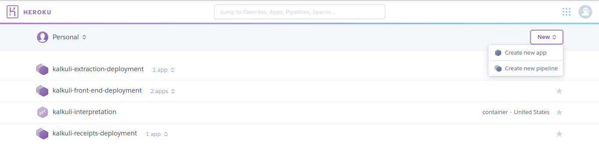
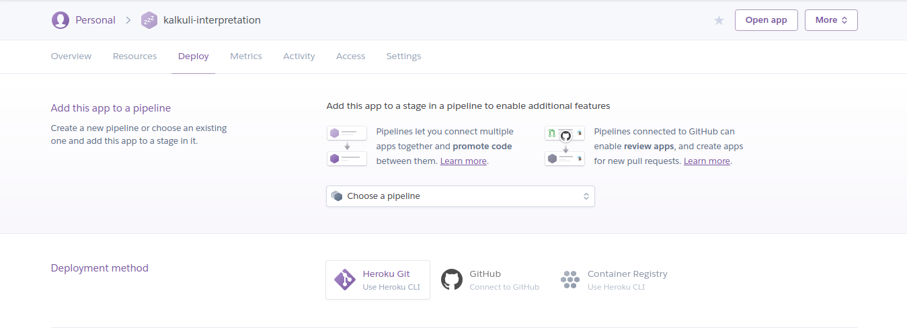
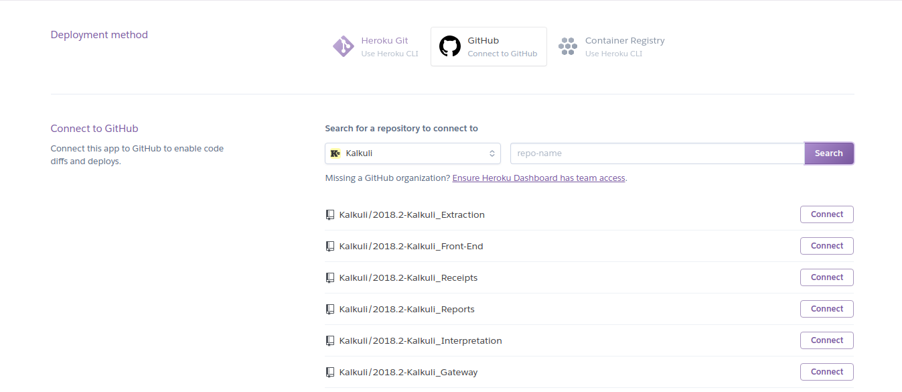
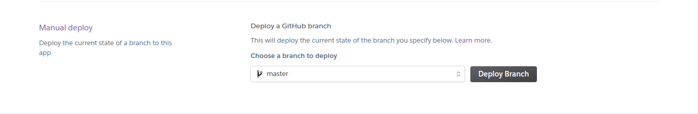

***   

## Introdução

O deploy do projeto é separado em três diferentes frentes, cada uma com suas necessidades especiais:

* Deploy de Microsserviços sem Banco de Dados
* Deploy de Microsserviços com Banco de Dados
* Deploy do Front-End

<br><br>

## 1. Microsserviços sem BD

O deploy dos microsserviços sem BD são realizados no AmazonAWS utilizando o [Zappa](https://github.com/Miserlou/Zappa). O zappa possibilita realizar implatação de aplicações python server-less. Siga os passos abaixo:

### 1.1 Crie um Virtual Environment

* Baixe o virtualenv
```
sudo apt install virtualenv
```

* Crie um virtualenv, fora do diretório do repositório, com o python 3.6
```
virtualenv -p python3.6 aws
```

* Entre no virtualenv
```
source aws/bin/activate
```

* Se assegure que a versão do python dentro do virtualenv é 3.6. <small><small> Caso não seja haverá problema de compatibilidade com o zappa. </small></small>
```
$ python --version
> Python 3.6.5
```

* Adicione a seguinte dependencia ao requirments.txt:
```
zappa==0.47.0
```

* Atualize o ambiente com o requirements do projeto
```
pip install -r requirements.txt
```
<br>

<small><small> Caso nesta etapa você receba o erro **"command 'x86_64-linux-gnu-gcc' failed with exit status 1"** durante a instação, saia do virtualenv e utilize o seguinte comando:  </small></small>

```
sudo apt-get install python3-dev
```
<small> Agora entre novamente no virtualenv, rode o comando anterior e continue.  </small>

<br>

### 1.2 Novo Deploy

* Inicialize o zappa:
```
zappa init
```

* Coloque o nome do seu ambiente, aqui assumiremos que será implantado o ambiente de produção:
```
prod
```

* Coloque o nome do seu bucket, no Kalkuli seguimos o padrão: "kalkuli-serviço-ambiente-bucket", considerando o serviço de exportação, utilizariamos o padrão:
```
kalkuli-export-prod-bucket
```

* Coloque o caminho onde se encontra a sua função de inicialização do App:
```
manage.app
```

* Depois será perguntado se o deploy precisa ser global, disponível em todos os servidores. No nosso caso, não necessitamos
```
n
```

* Depois será apresentado uma pré-visualização de um JSON com as configurações. Aceite.
```
y
```

* Será criado um arquivo zappa_settings.json similar a estes:
```
{
    "prod": {
        "app_function": "manage.app",
        "project_name": "2018-2-kalkuli-",
        "runtime": "python3.6",
        "s3_bucket": "kalkuli-gateway-prod-bucket"
    }
}
```

* Mude o nome do projeto. Não é aceito hifens, o nosso padrão é kalkuliServico.
```
"project_name": "kalkuliExport",
```

* Depois adicione a região onde o deploy será realizado. No nosso caso utilizamos South America 1.

```
"aws_region": "sa-east-1"
```

* O arquivo deve estar similar ao abaixo:
```
{
    "prod": {
        "app_function": "manage.app",
        "project_name": "kalkuliExport",
        "runtime": "python3.6",
        "s3_bucket": "kalkuli-export-prod-bucket",
        "aws_region": "sa-east-1"
    }
}
```

* Agora é só fazer o deploy!
```
zappa deploy prod
```

<br>

### 1.3 Atualizando Deploy

* Utilize o seguinte comando:
```
zappa update prod
```

Lembrando que 'prod' é referente ao ambiente apresentado nos passos anteriores, podendo variar de acordo com a configuração prévia.

<br>


### 1.4 Deploy Contínuo

* Adicione ao .travis.yml indicações para realizar o deploy:
```
after_success:
  - chmod +x ./deploy.sh
  - ./deploy.sh
``` 

* Depois crie um arquivo deploy.sh:
```
#!/bin/bash

set -e
set -u


if [ $TRAVIS_PULL_REQUEST = "false" -a $TRAVIS_BRANCH = "develop" ]
then
    echo "Deploy on homologation environment started"
    pip3 install zappa
    zappa update hom
    echo "Deploy on homologation environment finished"
    exit 0;
fi


if [ $TRAVIS_PULL_REQUEST = "false" -a $TRAVIS_BRANCH = "master" ]
then
    echo "Deploy on production environment started"
    pip3 install zappa
    zappa update prod
    echo "Deploy on production environment finished"
    exit 0;
fi


echo "Skipping deployment on branch=$TRAVIS_BRANCH, PR=$TRAVIS_PULL_REQUEST"
```

Repare que o deploy será feito nos hambientes de produção e homologação caso as atualizações caiam nas branchs master e develop, respectivamente.

<small> Note que se seu GitFlow for diferente, com branch com outros nomes, essas configurações não funcionarão </small>


## 3. Front End

### 3.1 Fazendo deploy

* Acesse a [dashboard do heroku](https://dashboard.heroku.com/apps). Clique em Create New App.




* Insira o nome do App e crie-o.

* Na página de visualização do app, clique em **Deploy**.

* Navegue até Deployment Method.



* Clique em Github, selecione a organização e depois o repositório que deseja implantar.




* Depois de conectar com o repoistório, faça o deploy da branch master.




<br>

### 3.2 Deploy Contínuo

* Vá novamente ao dashboard e crie uma pipeline.

* Com a pipeline criada, basta adicionar o app ao estágio desejado.


* Apps em produção devem ser adicionados ao estágio _Production_, e em homologação ao estágio _Staging_.


<!-- ## Deploy - Serviços (Local)

* Fazer uma Dockerfile de Produção, trocando o comando de execução para

        CMD	gunicorn -b 0.0.0.0:$PORT manage:app

* Fazer login no Heroku pelo terminal

        heroku login

* Fazer login no Heroku Container Registry 

        heroku container:login

* Buildar o container a partir da imagem de produção

        docker build -t <kalkuli-nome-do-serviço> -f Dockerfile.prod .

* Adicionar uma tag para o container em preparação para o Heroku e enviá-lo para o Registry

        docker tag <kalkuli-nome-do-serviço> registry.heroku.com/<nome-do-app-no-heroku>/web

        docker push registry.heroku.com/<nome-do-app-no-heroku>/web

* Usar o container enviado para o deploy do app no heroku

        heroku container:release web

</br>
## Deploy Contínuo (Travis)

* Fazer uma Dockerfile de Produção, trocando o comando de execução para

        CMD	gunicorn -b 0.0.0.0:$PORT manage:app

* Fazer login no Heroku pelo terminal e obter o token de acesso

        heroku login
        heroku auth:token

* No site do Heroku, ir para as configurações da conta e pegar a API Key.

* No site do Travis, ir para o repositório desejado e acessar suas configurações. Adicionar nas variáveis de ambiente:

        HEROKU_API_KEY - A API Key retirada nas configurações do heroku.

        HEROKU_TOKEN - O token obtido a partir do terminal.

* Criar um shell script com as configurações de Deploy. De forma geral:

        ```
        #!/bin/bash

        set -e
        set -u

        if [ $TRAVIS_PULL_REQUEST != "false" -o $TRAVIS_BRANCH != "master" ]
        then
            echo "Skipping deployment on branch=$TRAVIS_BRANCH, PR=$TRAVIS_PULL_REQUEST"
            exit 0;
        fi

        docker login -u _ -p "$HEROKU_TOKEN" registry.heroku.com

        docker build -t registry.heroku.com/<nome-do-app-no-heroku>/web -f Dockerfile.prod .

        docker push registry.heroku.com/<nome-do-app-no-heroku>/web

        heroku container:release web -a <nome-do-app-no-heroku>
        ```

* No .travis.yml, adicionar o script no passo ``` after_success ```:

        after_success:
            chmod +x ./<nome-do-script>.sh
            ./<nome-do-script>.sh -->