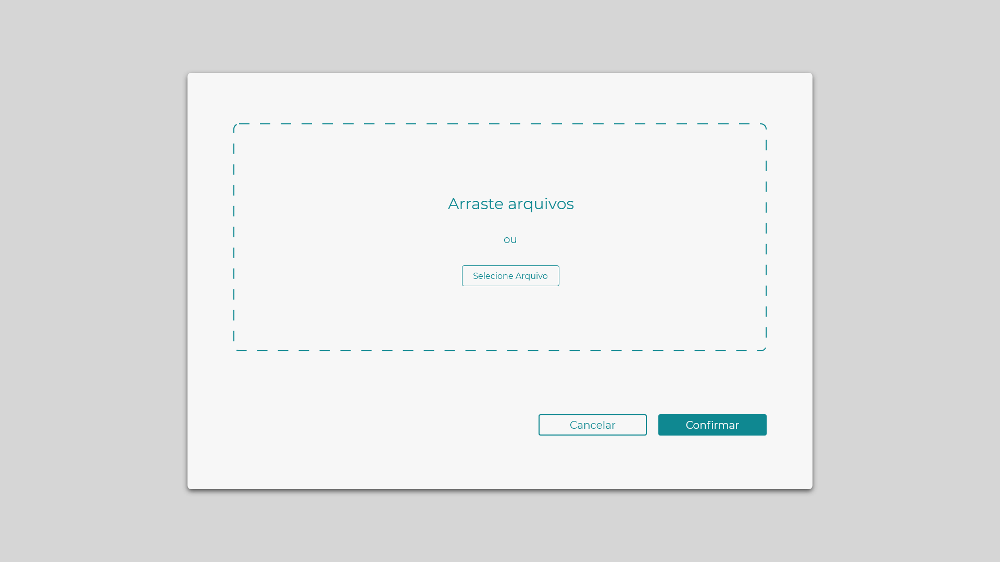
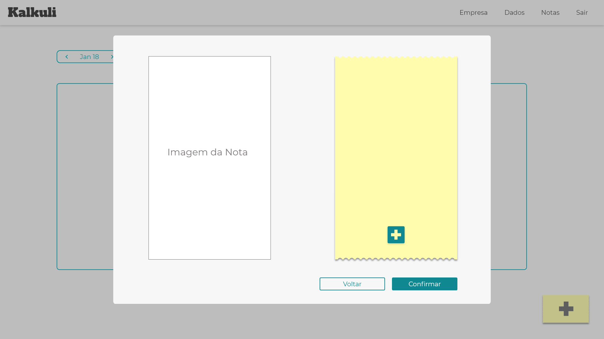
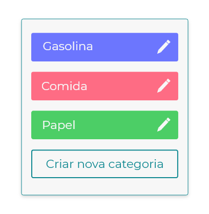
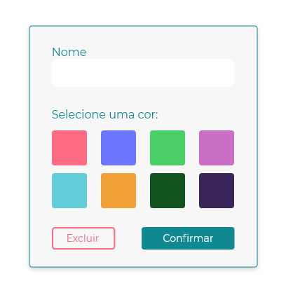
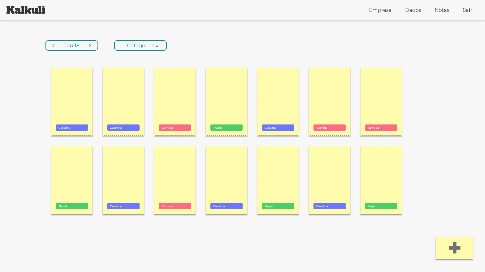

***

<iframe src="https://docs.google.com/presentation/d/e/2PACX-1vS_z4bQOm9_qKgVuHQS4a_tIkbRM9pbICNcL-CFYMxazqNgOCm2V3cjsssLRcBv4oypNf-uaRwY7T4j/embed?start=true&loop=true&delayms=3000" frameborder="0" width="960" height="569" allowfullscreen="true" mozallowfullscreen="true" webkitallowfullscreen="true"></iframe>

## Protótipo de Alta Fidelidade

  O protótipo foi desenvolvido utilizando a ferramente 
  <a href="https://www.adobe.com/br/products/xd.html">
    <i>Adobe XD</i>
  </a> e pode ser conferido da íntegra 
  <a class="dark-btn" href="https://xd.adobe.com/view/db64571f-82f7-4449-53f2-e2c0db4b3bdb-ad55/">aqui</a>

### - Homepage

### - Dashboard

### - Selecionar o pdf

### - Comparação 

### - Tags

### - Criar nova tag

### - Área de notas

