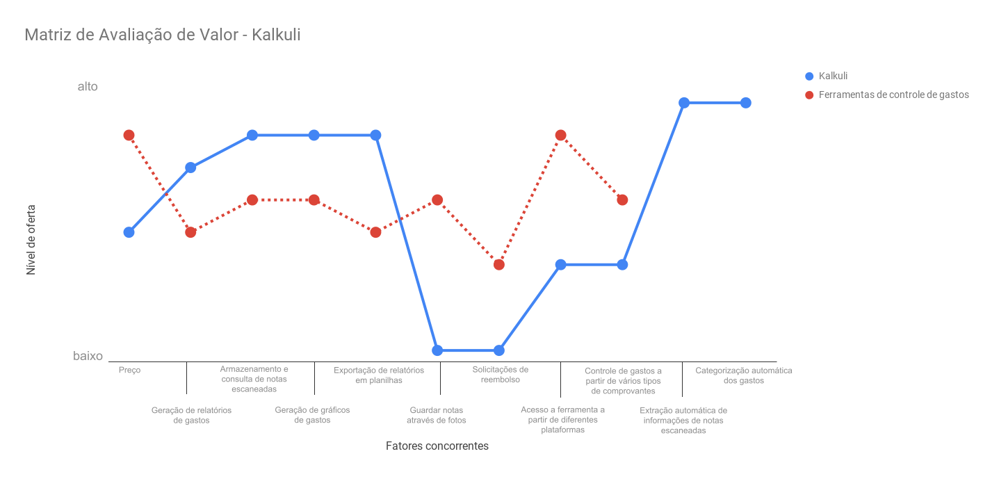

## Estratégia da Matriz de Avaliação de Valor

A proposta da Matriz de Avaliação de Valor é buscar a situação do mercado no setor de investimento do produto e explicitar os pontos em que a concorrência investe e também mudar o ponto de vista da inserção do projeto no mercado. Dessa forma, não é para ser visto como concorrente direto das outras opções do mercado, e sim como um mercado inexplorado, assim, a concorrência se torna irrelevante.

Partindo dessa ideia, podemos começar a pensar na proposta de valor do projeto, que consiste no benefício intangível que define o por que das pessoas comprarem o produto. Em um mercado sem diferenciação, o preço acaba sendo vendido como vantagem. No nosso contexto, a proposta de valor é a praticidade no controle de gastos e, como a estratégia do Oceano Azul propõe, a ideia é que a vantagem do Kalkuli seja também a liderança em custos.

## Elaboração da Matriz de Avaliação de Valor do Kalkuli

Foram definidos todos os atributos que determinam o preço do produto baseado no mercado em que se deseja inserir o Kalkuli e, como parte da estratégia do Oceano Azul, cada um dos atributos foram enquadrados dentro da matriz elevar, diminuir, eliminar e criar:

- Preço: diminuir
- Geração de relatórios de gastos: elevar
- Solicitações de reembolso: eliminar
- Guardar notas através de fotos: eliminar
- Extração automática de informações de notas escaneadas: criar
- Armazenamento e consulta de notas escaneadas: elevar
- Categorização automática dos gastos: criar
- Geração de gráficos de gastos: elevar
- Acesso a ferramenta a partir de diferentes plataformas: diminuir
- Controle de gastos a partir de vários tipos de comprovantes: diminuir
- Exportação de relatórios em planilhas: elevar

De acordo com o nível de oferta de cada atributo, foram traçados dois gráficos: do Kalkuli e das outras ferramentas disponíveis no mercado. Assim, a matriz se apresenta dessa forma:

## Referências

KIM, Chan; MAUBORGNE, Renée. MATRIZ DE AVALIAÇÃO DE VALOR. Disponível em: <a href="https://pt.blueoceanstrategy.com/tools/strategy-canvas">https://pt.blueoceanstrategy.com/tools/strategy-canvas</a>. Acesso em: 24 set. 2018.

OLIVEIRA, Leandro. Curva de Valor: Saiba como definir sua estratégia e se diferenciar da concorrência. Disponível em: <a href="https://capitalsocial.cnt.br/curva-de-valor/">https://capitalsocial.cnt.br/curva-de-valor/</a>. Acesso em: 26 set. 2018.

