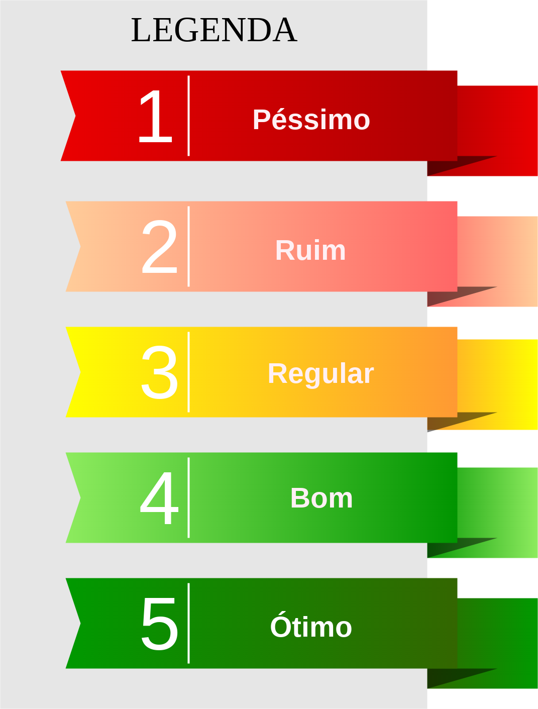

***

## Indicadores de Qualidade do Processo

Durante o projeto, decisões serão tomadas orientadas a dados, sendo assim, é necessário que a equipe colete métricas que transpareçam a qualidade do código e das práticas adotadas, fornecendo embasamento para tomada de decisões estratégicas.

  

O <i>scrum</i> traz a ideia de "ponto", unidade de medida que fornece uma estimativa sobre o esforço necessário para implementar uma história ou entregar eu algum outro tipo de trabalho, como artefatos ou treinamentos.

  

### _Burndown_   

Uso de <i>burndown</i> para obter a quantidade de pontos queimados pelo tempo da <i>sprint</i>.
Transparece o trabalho da equipe durante a <i>sprint</i>, e a frequência com que as historias são entregues.

  

Auxílio do <a href="https://www.zenhub.com/blog/burndown-charts-in-github/"><i>ZenHub</i></a> para definir a pontuação de cada <i>issue</i>, que automaticamente gera o gráfico de <i>burndown</i> com auxílio das <i>pipelines</i>.

  

### [_Velocity_]()  

Mostra a produtividade da equipe por <i>sprints</i>, através da soma dos pontos queimados por todas as <i>sprints</i> dividido pelo total das <i>sprints</i>.
Ajuda a planejar proximas <i>sprints</i>

Auxílio do <a href="https://www.zenhub.com/blog/track-your-speed-of-work-with-agile-velocity-charts/"><i>ZenHub</i></a> para rastrear a velocidade da equipe, <i>sprint</i> a <i>sprint</i>.

  

### [Quadro de Conhecimento](https://docs.google.com/spreadsheets/d/19OGoemAfy_4nSFBbycD4kIoBFJwUjbXB7vxuQi8HLqY/edit#gid=1094896728)

Evolui a cada <i>sprint</i>, e propicia a visualização da evolução técnica da equipe, e possíveis pontos de risco com tecnologias adotadas.

### [_Burndown_ de Riscos](https://docs.google.com/spreadsheets/d/1PYjMMXbWRgKwY5oZH5ekg4VbqTYYfdJImHmxCLH62xI/edit#gid=0)   

Ajuda a monitorar os riscos do projeto, através do produto entre probabilidade e impacto, que, preenchido a cada <i>sprint</i>, fornece uma visão geral para atacar os maiores riscos buscando a produtividade máxima da equipe.

  

## Indicadores de Qualidade do Código 

### [SonarQube](https://www.sonarqube.org/features/clean-code/)

O <i>SonarQube</i> é uma plataforma de código aberto para inspeção contínua da qualidade de código para realizar revisões automáticas com análise estática de código para detectar <i>bugs</i>, <i>code smells</i> e vulnerabilidades de segurança em mais de 20 linguagens de programação.

O <i>Sonar</i> oferece relatórios sobre código duplicado, padrões de codificação, testes unitários, cobertura de código, complexidade de código, comentários, <i>bugs</i> e vulnerabilidades de segurança.

  

O <i>Sonar</i> pode registrar o histórico de métricas e fornece gráficos de evolução, também fornece análise e integração totalmente automatizadas com ferramentas de integração contínua.

 