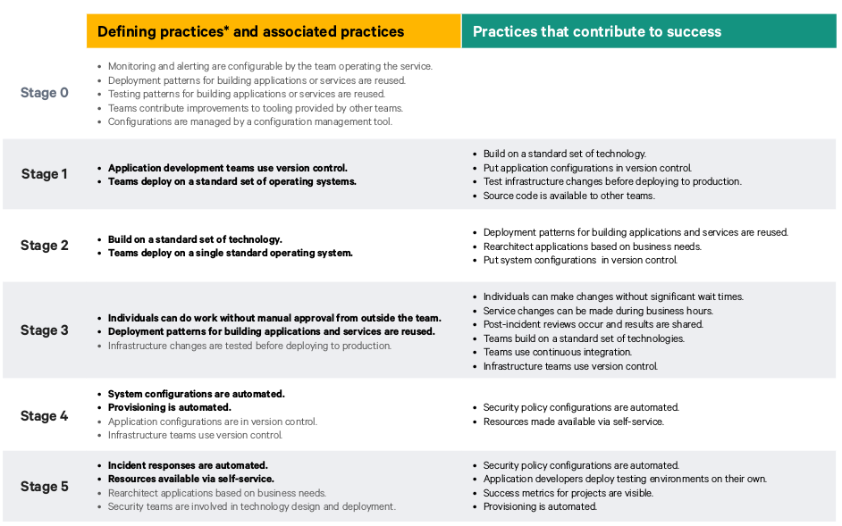

# Introdução

Puppet é uma empresa de TI voltada para a área de de infraestrutura de softwares. Possui como principal produto o Puppet Enterprise, software que lida com o ciclo de vida de infra. 

Também é responsável por realizar, anualmente, a maior pesquisa na áreas de DevOps do planeta. Em 2018 a pesquisa foi voltada para mapear os estágios de maturidade de empresas na área de DevOps, levantando práticas e atividades que devem ser realizadas para que um projeto atinja tal nível de maturidade.

Abaixo podemos observar o Modelo de Maturidade e as práticas relacionadas a cada uma das etapas. Note que as práticas em negrito são definidoras, ou seja, obrigatórias para um projeto se encontre neste nível de maturidade:

 
# Estágio 0: Construa a Fundação

Os times integrantes do projeto (Desenvolvimento, DevOps, Testes e etc) estão começando a entender a importância da colaboração e padronização. Assim, são utilizadas tecnologias e processos que ajudem a compartilhar ideias, métricas e conhecimento.

### Práticas Definidoras

Neste estágio inicial não há praticas definidoras, apenas associadas.

### Práticas Associadas

- [ ] **Monitoramento e alerta são configuráveis pela equipe que opera o serviço.** Atualmente os sistemas de monitoramente e alerta não são configuráveis de acordo com as limitações do Heroku, plataforma que disponibiliza o ambiente de produção. 

- [X] **Reutilizar padrões de implantação para aplicações ou serviços de construção.** A implantação é padronizada de acordo com o [Guia de Deploy](deploy.md).

- [ ] **Reutilizar padrões de teste para construção aplicações ou serviços.** O time desenvolvimento procura utilizar testes realizado como base para a criação de novos testes, porém não existe um padrão definido para realização de testes.

- [X] **Equipes contribuem com melhorias para ferramentas fornecidas por outras equipes.** Não há equipes diferentes para que esta prática seja corretamente aplicada. Porém extendendo este conceito para pareamento, há contribuição de diferentes duplas para a mesma ferramenta.

- [X] **Configurações são gerenciadas por ferramentas de gerenciamento de configuração.** Docker é utilizado com este intuito.

 
# Estágio 1: Simplifique a Pilha de Tecnologia

Neste nível os desenvolvedores já adotaram controle de versionamento e começaram a enxugar os seus sistemas para reduzir sua complexidade. Utilizar uma gama tecnologias diferentes para o mesmo objetivo demanda muito esforço, desacelerado os avanços do negócio, então nesta fase um padrão de tecnologias a ser utilizado deve ser definido.

### Práticas Definidoras
- [X] **As equipes de desenvolvimento de aplicativos usam o controle de versão.** O Git e Github são utilizados com este intuito.

- [X] **Deploy realizado em um conjunto de sistemas operacionais padrão.** Não houve necessidade de realizar a implação em um conjunto de SOs diferentes, sendo realizado apenas em um, o Linux.

### Práticas Associadas
Não há práticas associadas.

 
# Estágio 2: Padrozinar e Reduzir Variáveis

Ao final do primeiro estágio, as empresas já começaram a definir tecnologias padrões para serem utilizadas. Agora devemos pensar: Todos os serviços utilizam a mesma arquitetura? Todos utilizam a mesma fila de mensagem? Os mesmo componentes? Todos utilizam o mesmo sistema operacional?

Uma vez que os padrões e componentes estão padrozinados, não haverá gasto de tempo reaprendendo como diferentes serviços operam, falham, se recuperam ou evoluem.

### Práticas Definidoras
- [X] **Construa em um conjunto padrão de tecnologia.** No projeto todos os microsserviços são construídos utilizando Flask e o front utilizando ReactJs.

- [X] **Deploy realizado em apenas um de sistema operacional padrão.** O SO padrão é o Linux.

### Práticas Associadas
Não há práticas associadas.

 
# Estágio 3: Expandidon Práticas DevOps

Com a base pronta, times de sucesso reutilizam padrões de deploy e mudanças de de infraestrutura são testadas antes de serem aplicadas em produção. Essas práticas trazem confiança e presivibilidade para o sistema.  

### Práticas Definidoras
- [X] **Indivíduos podem trabalhar sem aprovação manual fora da equipe.** Como apresentado no [Guia de Contribuição](CONTRIBUTING.md), o processo demanda aprovação interna, não externa.

- [X] **Padrões de implantação para criação de aplicativos e serviços são reutilizados.** O deploy de diferentes microsserviços é realizado seguindo os mesmos passos, como pode ser visto no [Guia de Deploy](deploy.md).

### Práticas Associadas
- [ ] **As alterações de infraestrutura são testadas antes de serem implementadas na produção.** Seria necessário um ambiente de homologação, o qual não foi feito ainda.

 
# Estágio 4: Entrega de Infraestrutura Automatizada

Este estágio é marcado por sistemas de configurações e provisão atomáticos. Estes dois passos são de suma importancia para possibilitar a reprodução de um sistema semelhante ao de produção para desenvolvedores e analistas de qualidade.  

### Práticas Definidoras
- [X] **Automatize as configurações do sistema.** Atualmente os serviços possuem um sistema de configuração que dependendo do ambiente que se encontra (desenvolvimento ou produção). Dessa forma os serviços ajustam atributos do sistema automaticamente.

- [ ] **Provisionamento Automatizado.** Ainda não há nenhum tipo de provisionamento automático. Uma opção pode ser a população automática dos bancos no deploy. 

### Práticas Associadas
- [ ] **Configurações da aplicação possuem controle de versionamento.** Não, atualmente o projeto não possui configurações versionaveis ou auditaveis.

- [X] **Times de Infraestrutura utilizam controle de versionamento.** Não só a infra como os artefatos possuem controle de versionamento. O controle é feito de forma bem rudimentar, utilizando o git.

 
# Estágio 5: Prover Recursos Self-Service

Recursos self-service são facilitadores que permitem as pessoas de sua organização trabalharem sem dependerem de outras (para que configurações necessárias sejam feitas, chaves de licença sejam obtidas, entre outros).  

### Práticas Definidora

- [ ] **Respostas a incidentes são automatizadas.** Mais conhecido como Teorias do Caos, é forçar erros acontecerem para criar maneiras automatizadas de mitigá-las. Não ocorre ainda.

- [ ] **Prover Recursos Self-Service.** Não implementado.

### Práticas Associadas

- [X] **Rearquiteturar aplicações baseadas nas necessidades de negócios.** A arquitetura é readequada de acordo com o surgimento de novas necessidades, vide issue 177.

- [X] **Times de segurança estão envolvidos nos processos desenvolvimento e entrega.** Não há times especializados em segurança, sendo assim os responsáveis já fazem parte do time de desenvolvimento.

  
## Referências

>Puppet. State of DevOps Report 2018. Disponível em: <a href="https://puppet.com/resources/whitepaper/state-of-devops-report"><https://puppet.com/resources/whitepaper/state-of-devops-report></a>. Acesso em: 29 de outubro de 2018.