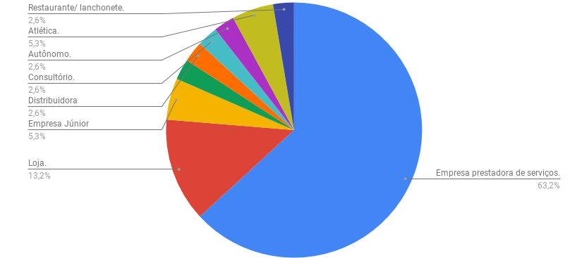
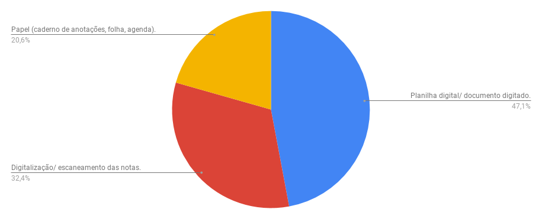
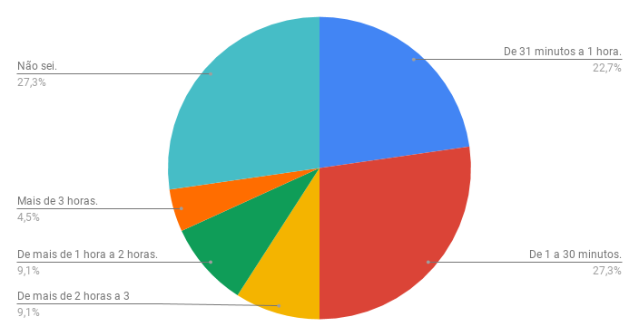
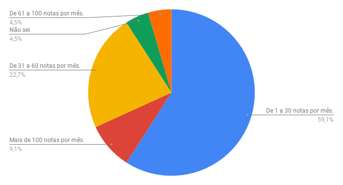
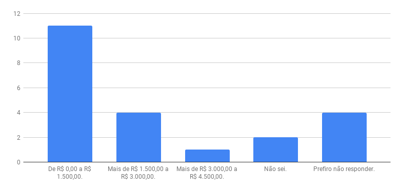
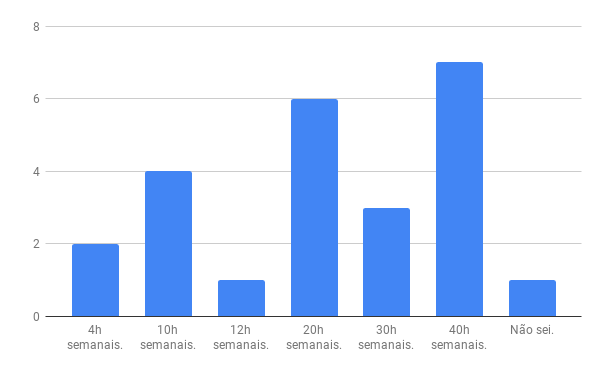
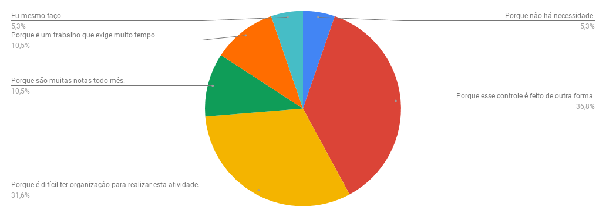
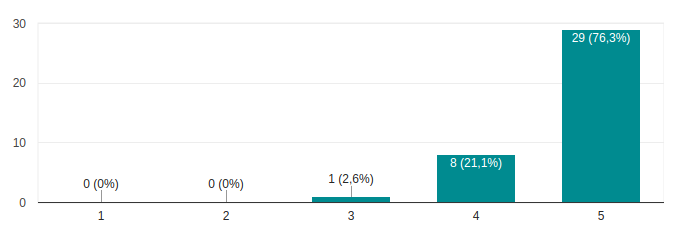
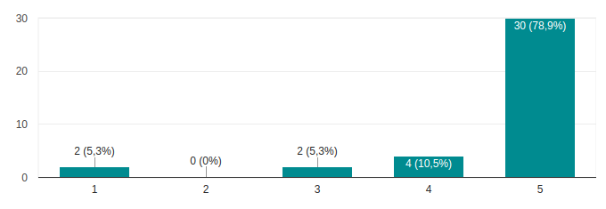

***

## Descrição dos Questionários    

Os questionários foram aplicados com o intuito de investigar quais são os problemas e os maiores interesses do mercado onde o projeto deseja se inserir. Ele foi aplicado a um público específico para que o tratamento dos problemas fosse iniciado diretamente com quem lida com os problemas.

Assim, o questionário foi dividido em quatro seções: uma para saber o perfil de quem está respondendo (em que tipo de empresa trabalha, qual a função e se realizam controle de gastos e se existe um controle de gastos a partir de notas fiscais); uma para saber, se o controle de gastos não for feito, os motivos para que ele não seja feito; uma para saber como é feito o controle, caso o seja, quanto tempo é gasto fazendo e quanto a pessoa responsável por isso recebe; e outra para saber quais funcionalidades e o quanto elas seriam úteis para facilitar o trabalho destas pessoas.

O objetivo dessas seções é entender se o motivo de algumas empresas não fazerem esse tipo de controle é algo que podemos resolver, o que podemos melhorar e quanto as pessoas estariam dispostas a pagar por isso levando em conta quanto custa a hora do funcionário responsável por esta atividade.

## Resultados
Quantidade de respostas obtidas: 38
### Identificação do Perfil
#### Qual o tipo de empresa/ comércio/ entidade sobre o qual você vai responder este questionário?

#### Qual a sua relação com a entidade sobre a qual você está respondendo?
As relações identificadas foram sócios, proprietários, diretores, assessores financeiros, consultores, coordenadores financeiros, etc.

#### Existe um controle periódico (semanal, mensal, bimestral...) de gastos da empresa a partir de notas fiscais?

 de gastos da empresa a partir de notas fiscais?")

A partir das respostas identificadas nessa pergunta, o o questionário foi direcionado para quem não faz controle e quem faz controle.

### Fazem controle de gastos
#### Como é feito o controle das notas fiscais na empresa?
Nesta pergunta, a pessoa que estava respondendo ao questionário podia marcar mais de uma opção sobre a forma como é realizado o controle das notas.

#### Quem é a pessoa responsável por fazer o registro dessas notas fiscais?
Esta pergunta serviu para saber se a pessoa que estava respondendo podia saber mais ou não sobre como é realizado esse controle. Sendo ela mesma que faz o controle, por exemplo, ela sabe mais do que se for outra pessoa.

#### Quanto tempo, em média, leva a atividade de registrar as notas?

#### Qual o volume de notas registradas mensalmente?

#### Qual o salário mensal do funcionário responsável pelo registro das notas fiscais da empresa, mesmo que seja você?

#### Qual a jornada de trabalho semanal do funcionário responsável pelo registro das notas fiscais da empresa, mesmo que seja você?

### Não fazem controle de gastos
#### Por que não existe esse controle de gastos na empresa?
Nesta pergunta, a pessoa que estava respondendo ao questionário podia marcar mais de uma opção sobre o motivo de não ter um controle de notas fiscais.

### Funcionalidades desejáveis
#### O quanto você acha necessário fazer um controle das notas fiscais no contexto da empresa que você possui ou trabalha?
1 - Completamente desnecessário

5 - Muito necessário

#### O quão útil seria poder guardar essas notas digitalmente para consulta a qualquer momento?
1 - Completamente inútil

5 - Muito útil

#### O quão útil seria para a empresa que as notas fossem digitalizadas e convertidas para uma planilha em formato de texto de forma automática?
1 - Completamente inútil

5 - Muito útil

#### Seria interessante saber o quanto a empresa gasta todo mês com diferentes tipos de gasto (por exemplo transporte, impostos, alimentação)?
1 - Nada interessante

5 - Muito interessante

?")

***
<a href="https://docs.google.com/forms/d/1t0AohwUj6e-ikev9QKGMcQeosk0mJSiXGMbIOzQbruo/edit?usp=sharing">Link para o questionário na íntegra.</a>