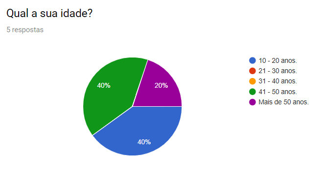
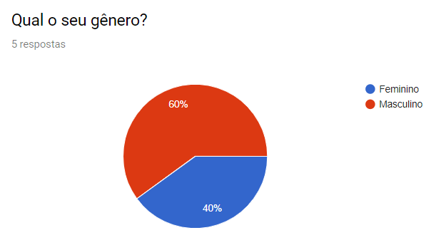
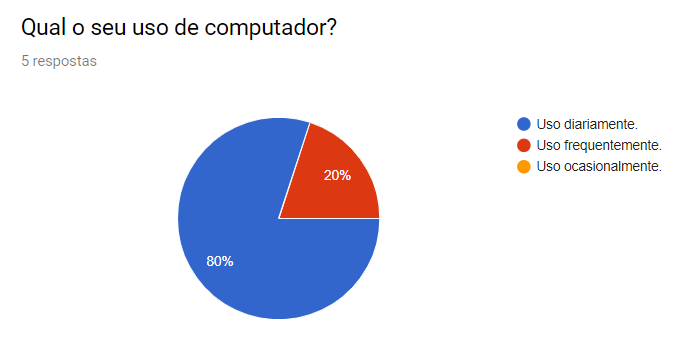
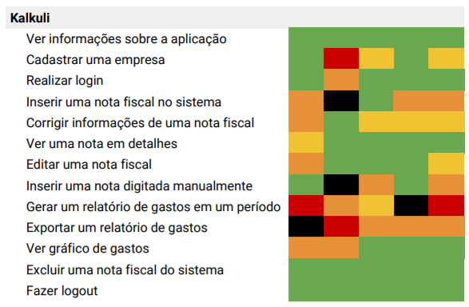

***  

Para realizar os testes de usabilidade, foram definidas tarefas principais a serem realizadas no sistema. O foco dos testes é avaliar a usabilidade do sistema baseada no desempenho dos usuários ao executar as tarefas, sumarizando os resultados de forma que eles possam servir para redefinir requisitos e melhorar a experiência do usuário, tornando o sistema o mais intuitivo possível. Além disso, os testes serviram para decidir se as funcionalidades na versão em que os voluntários estão testando estão prontas para serem colocadas em produção. 

Os testes foram conduzidos com uma preparação prévia, no [ambiente de homologação](https://kalkuli-front-end-hom.herokuapp.com/). As tarefas a serem avaliadas são:

- Ver informações sobre a aplicação
- Cadastrar uma empresa
- Realizar login
- Inserir uma nota fiscal no sistema
- Corrigir informações de uma nota fiscal
- Ver uma nota em detalhes
- Editar uma nota fiscal
- Inserir uma nota digitada manualmente
- Gerar um relatório de gastos em um período
- Exportar um relatório de gastos
- Ver gráfico de gastos
- Excluir uma nota fiscal do sistema
- Fazer logout

## Usuários

### Idade

### Gênero

### Uso de Computador

## Cenário
Os cenários foram escritos de forma que a condução dos testes não sugerisse explicitamente o que os usuários têm que fazer. Os usuários receberam uma breve explicação do que é o sistema e o que pode ser feito com ele antes dos testes. Foi solicitado aos usuários que dissessem suas ações em voz alta para que o condutor do teste pudesse saber o que eles estão pensando ao executar as tarefas.

### Preparação
- O ambiente de homologação foi aberto em sua página principal
- A máquina onde o usuário realizará os testes possui notas escaneadas em uma pasta
- Para facilitar, as informações de cadastro de empresa serão fornecidas ao usuário

### Execução
**1.** Você precisa de uma aplicação para gerenciar os gastos da sua empresa e encontrou o Kalkuli. Procure no site o que ele pode fazer.

**2.** Agora, você quer cadastrar sua empresa para fazer o controle das notas fiscais. Faça o cadastro da empresa.

**3.** Feito o seu cadastro, agora você quer ter acesso ao sistema para poder guardar suas notas. Use seus dados para entrar.

**4.** Coloque uma nova nota no sistema para começar a fazer o controle dos seus gastos.

**5.** Encontre uma nota com os seguintes detalhes [o condutor especifica aqui alguns detalhes da nota que o usuário precisa encontrar] para ver todas as suas informações. Corrija o valor dela para R$ 25,00.

**6.** Você tem uma nota escrita à mão e precisa que ela esteja no sistema. Insira esta nota.

**7.** Agora que você tem algumas notas, você quer gerar um relatório para mostrar a alguém da empresa. Gere este relatório e envie-o em uma planilha.

**8.** Você quer fazer uma análise rápida de como estão os gastos da empresa no último ano. Procure algo que te ajude a fazer isso.

**9.** Você percebeu que uma das notas não é da sua empresa, por isso não deveria estar no sistema. Apague uma das notas.

**10.** Finalizado o que você tinha para fazer, saia da sua conta para que outra pessoa possa usar.

## Resultados
Para resumir os resultados dos testes de usabilidade, foi usada uma estratégia de manter os resultados em um mapa de calor. As cores indicam a dificuldade relacionada a cada tarefa para cada usuário, onde

- **Verde** indica que o usuário completou a tarefa facilmente.
- **Amarelo** indica que o usuário teve alguma (mas não muita) dificuldade na tarefa.
- **Laranja** se o usuário teve algum problema na tarefa.
- **Vermelho** se o usuário teve dificuldades severas para completar a tarefa.
- **Preto** se o usuário não conseguiu descobrir como realizar a tarefa e desistiu.

### O que deu certo?
Os usuários demonstraram facilidade em se cadastrar e em realizar o login. Conseguiram entender bem o propósito da aplicação sem nenhum contato prévio, e souberam se guiar através das principais funcionalidades, indicando que a posição da navbar e a separação das áreas das funcionalidades está intuitiva.

Na maior parte da aplicação, mesmo com alguns problemas de ambiente no momento de realizar ações que podiam demorar algum tempo, existe feedback, ou seja, o usuário sabe que a ação que ele solicitou está sendo executada mesmo que ela possa demorar. Os feedbacks de que as ações foram completadas com ou sem sucesso também demonstraram-se efetivos.

### Quais foram os desafios?
Em um primeiro momento, o fluxo de cadastro vertical causou confusão ao usuário no momento de confirmar a senha, e não ficou claro para alguns usuários que alguns campos do cadastro são opcionais. No momento do login alguns usuários tiveram dúvidas sobre qual e-mail deveriam usar para realizar o login - o deles mesmos ou o da empresa.

Ao adicionar uma nota e inserir detalhes, duas coisas foram observadas: os usuários não entenderam que os campos eram obrigatórios e alguns não entenderam que para conseguir escrever nos campos era necessário clicar no ícone do lápis. Os formatos dos campos não estão bons, embora existam placeholders, não existem máscaras que formatem sozinhas os valores dentro dos campos.

Além disso, alguns bugs foram detectados, o que dificultou ainda mais a completude das tarefas. Tais bugs foram: gerar um relatório (o botão responsável pela ação atualmente redireciona para a tela errada), ao criar uma nova categoria e retornar para o preenchimento da nota os campos que antes estivessem preenchidos voltam apagados.

A opção "salvar relatório" causou confusão nos usuários, que pensaram que salvar consistia em salvar na máquina e não na plataforma.

